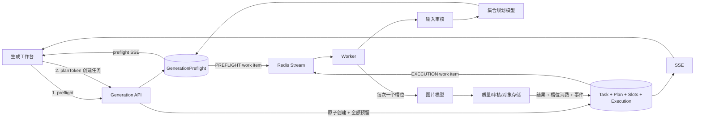

# 多图片生成与失败续生成技术设计

## 1. 设计目标与边界

本设计把图片生成从“一个任务一次产出一批结果”调整为“一个任务拥有 1-4 个稳定结果槽位，Worker 严格串行填充槽位”。每个槽位是增量展示、质量验证、结果持久化、计费和恢复的最小业务单元。

关键约束：

- 所有请求先完成不计费的集合预规划，再创建正式任务；
- 一份任务只使用一份冻结集合计划和一套任务级输出参数；
- 已成功槽位不可变，继续操作只处理缺失槽位；
- 图片成功、额度消费、槽位状态和结果事件必须在同一数据库事务中提交；
- 旧单图任务继续按结算版本 1 读取和对账，新任务使用结算版本 2；
- 不修改已经执行的迁移文件，不删除已有任务、结果或账本事实。

本设计不支持槽位级尺寸、模型、参考素材或价格，不支持用户直接编辑槽位 Prompt，也不扩展 4 张以上。

## 2. 总体架构



### 2.1 规划职责保持在 Worker

现有真实规划模型、参考素材加载、输入审核和模型 readiness 均属于 Worker。为避免 API 引入长耗时模型调用和重复 AI 配置，preflight 作为一种非计费工作项进入现有 Redis Stream：

- 共享不可变契约、队列 work-item envelope、Schema 校验和 Prompt 对齐规则放入 `common`；
- API 负责同步参数/素材归属校验、选择并快照计价规则、创建 preflight、发布 `PREFLIGHT` 工作项、提供 preflight 查询/SSE 和消费 token 创建任务；
- Worker 的 `CollectionPreflightProcessor` 负责输入审核、真实集合规划、数量/槽位校验、smart 输出解析并持久化冻结计划；
- Worker 执行正式 `EXECUTION` 工作项时只读取已冻结计划，不再为任务二次规划；
- API 继续不依赖 Spring AI，规划模型和图片模型 readiness 仍由 Worker 负责。

队列消息统一升级为 `GenerationWorkItem` 版本化 envelope，至少包含 `schemaVersion`、`kind: PREFLIGHT | EXECUTION`、`targetId` 和投递幂等信息。`PREFLIGHT.targetId` 指向 preflight，`EXECUTION.targetId` 指向 execution，消费者按 kind 分派。现有 YAML 中的 API URL、模型和密钥测试数据原样保留，不清理、替换或迁移已有值。

## 3. 领域与状态模型

### 3.1 核心实体

| 实体 | 责任 | 生命周期 |
| --- | --- | --- |
| `GenerationPreflight` | 保存规范化输入、异步规划状态、冻结集合计划和价格快照 | 排队/规划后 10 分钟可用，随后消费、取代或过期 |
| `GenerationTask` | 用户可见的生成请求与任务级参数 | 跨首次执行和继续执行长期存在 |
| `GenerationPlan` | 正式任务的冻结集合计划副本 | 与任务一对一，不在继续时改写 |
| `GenerationResultSlot` | 一个稳定有序的目标图片位置 | 成功后不可逆；失败/取消可在继续时重置 |
| `GenerationExecution` | 一次“首次生成”或“继续缺失”的额度预留与队列执行批次 | 每次操作一个，任务同一时刻最多一个活动批次 |
| `GenerationResult` | 已审核并持久化的成功图片 | 与 `(taskId, index)` 唯一对应 |

`GenerationExecution` 是必要的结算边界。首次生成和继续缺失都可能针对同一个任务预留额度；如果只在任务上记录一个预留金额，无法区分哪次操作应释放多少额度，也无法阻止两个继续请求并发执行。

### 3.2 槽位状态

```text
WAITING -> GENERATING -> SUCCEEDED
                    \-> FAILED
WAITING/GENERATING  -> CANCELLED
FAILED/CANCELLED/WAITING --继续缺失--> WAITING
```

- `SUCCEEDED` 永不重置；
- 某槽位 `FAILED` 时，后续槽位保持 `WAITING`，用于展示“尚未生成”；
- 用户取消时，所有未成功槽位变为 `CANCELLED`；
- 继续缺失把所有非成功槽位重置为 `WAITING`，仍按原序号串行处理。

### 3.3 任务状态

| 场景 | 任务状态 |
| --- | --- |
| 创建或继续已入队 | `QUEUED` |
| Worker 已领取活动执行批次 | `GENERATING` |
| 全部槽位成功 | `SUCCEEDED` |
| 至少一张成功、仍有缺失槽位 | `PARTIALLY_SUCCEEDED` |
| 没有成功图片且当前槽位最终失败 | `FAILED` |
| 用户取消活动执行批次 | `CANCELLED` |

继续缺失允许 `PARTIALLY_SUCCEEDED`、`FAILED`、`CANCELLED` 重新进入 `QUEUED`。任务事件历史保留每次终态，任务当前错误字段在继续时清空，`completedAt` 重新置空。

## 4. 图片集合计划

新增共享契约：

```java
record ImageCollectionPlan(
    String schemaVersion,
    CollectionMode mode,
    SharedCollectionContext shared,
    List<ResultSlotPlan> slots,
    double confidence,
    List<String> unknowns) {}

enum CollectionMode { VARIATIONS, DIMENSIONAL, SEQUENCE }

record ResultSlotPlan(
    int index,
    String label,
    String role,
    String intent,
    List<String> contentScope,
    List<String> variationConstraints,
    PromptPackage prompt,
    SlotAcceptance acceptance) {}
```

### 4.1 共享与槽位级约束

- `shared` 保存用户事实、核心主体、受众、视觉系统、连续性和任务级图片角色；
- `slots.size()` 必须等于最终 `imageCount`，索引必须连续且从 0 开始；
- 每个槽位 Prompt 必须包含自身职责，同时引用共享约束；
- `VARIATIONS` 可改变构图、镜头或光线，但不得改变核心意图；
- `DIMENSIONAL` 必须为每个显式维度建立一一对应槽位；
- `SEQUENCE` 必须证明槽位集合覆盖原始内容，并禁止跨槽位补造事实；
- 所有 Prompt 通过现有对齐校验，`DRIFTED` 或事实缺失返回澄清结果。

### 4.2 示例

“某个景色春夏秋冬各一张”形成 `DIMENSIONAL`，共享地点、主体、视角和风格，四个槽位分别冻结春、夏、秋、冬 Prompt。

“总结图 + 流程 1/2/3”形成 `SEQUENCE`，总结槽位覆盖整体关系，步骤槽位只展开对应输入、动作和输出；共享术语、配色、图标和版式规则。

## 5. HTTP 契约

### 5.1 Options

`GET /dream_web/generation/options` 增加：

```json
{
  "imageCounts": {
    "defaultMode": "AUTO",
    "min": 1,
    "max": 4,
    "values": [1, 2, 3, 4]
  }
}
```

单张费用仍由 resolution option 的 `unitCost` 返回，前端预计费用为解析后的数量乘单价。

### 5.2 集合预规划

`POST /dream_web/generation/preflights`

```json
{
  "idempotencyKey": "preflight-web-uuid",
  "draftKey": "composer-draft-uuid",
  "sessionId": "optional-session-id",
  "mode": "AUTO",
  "prompt": "为某个流程生成总结图和流程1、2、3",
  "imageIds": [],
  "ratio": "16:9",
  "resolution": "2K",
  "width": 2048,
  "height": 1152,
  "imageCountMode": "AUTO",
  "imageCount": null
}
```

首次响应先返回异步状态：

```json
{
  "id": "preflight-id",
  "status": "QUEUED",
  "eventsUrl": "/dream_web/generation/preflights/preflight-id/events"
}
```

前端连接 preflight SSE，收到 `preflight.ready` 后调用 `GET /dream_web/generation/preflights/{id}`。就绪响应为：

```json
{
  "status": "READY",
  "planToken": "opaque-single-use-token",
  "expiresAt": "2026-09-01T10:10:00Z",
  "collectionMode": "SEQUENCE",
  "targetImageCount": 4,
  "slots": [
    {"index": 0, "label": "总结", "role": "SUMMARY"},
    {"index": 1, "label": "流程 1", "role": "PROCESS_STEP"}
  ],
  "resolvedOutput": {"ratio": "16:9", "resolution": "2K", "width": 2048, "height": 1152},
  "unitCost": 1,
  "estimatedCost": 4,
  "warnings": []
}
```

需要澄清是一个可解析业务结果，返回 `status=NEEDS_CLARIFICATION`、稳定 reason code、槽位候选和用户可操作说明，不返回 `planToken`。请求格式、图片归属或输出参数非法仍使用 4xx。

API 顺序：请求校验 -> 素材归属校验 -> 规范化影响计费的模型/分辨率等参数 -> 选择并快照 pricing rule/version/unitCost -> 创建/重放 preflight 和 `preflight.queued` 事件 -> 发布 `PREFLIGHT` work item。Worker 顺序：领取 preflight -> 标记 PLANNING 并写事件 -> 读取素材 -> 输入审核 -> 集合规划 -> 数量/槽位/Prompt 校验 -> 在已冻结计价档内完成 smart 尺寸解析 -> 原子标记 READY、写 `readyAt`/`expiresAt = readyAt + 10 minutes` 和 `preflight.ready` 事件。Worker 不得改变计价选择字段；若规划结果要求跨计价档规格，则转为澄清或失败结果。

API 在读取 READY preflight 时签发包含 preflightId、userId、inputHash 和 expiresAt 的签名 `planToken`；token 不持久化，可重复读取同一未消费计划并重新得到等价有效 token，但数据库行只允许原子消费一次。

同一个 `draftKey` 提交不同 `inputHash` 时，新 preflight 将旧的未消费记录标记为 `SUPERSEDED`，使旧 token 立即失效。Preflight SSE 事件包括 `preflight.queued`、`preflight.planning`、`preflight.ready`、`preflight.needs_clarification` 和 `preflight.failed`，不复用必须关联 task 的 `GenerationTaskEvent`。

### 5.3 正式创建

`POST /dream_web/generation/tasks`

```json
{
  "idempotencyKey": "create-web-uuid",
  "planToken": "opaque-single-use-token"
}
```

服务端先按正式幂等键查已有任务；若存在则直接重放响应。否则在一个事务内锁定并校验 token、创建会话/任务/计划/槽位/首次执行批次、预留完整额度、标记 token 已消费并写入 `task.queued`。

额度不足时事务整体回滚，token 保持可用到过期，用户补充额度后可以再次创建。

### 5.4 继续、取消和全部重新生成

- `POST /dream_web/generation/tasks/{taskId}/continue`，body 只含幂等键；锁定任务，计算非成功槽位，创建 `CONTINUATION` 执行批次并只预留缺失费用；
- `POST /dream_web/generation/tasks/{taskId}/cancel` 保持路径不变，作用于当前活动执行批次；
- 全部重新生成不新增特殊后端关联接口。前端以原任务输入重新调用普通 preflight + create，两步仍由一次用户操作串联，因此新任务无 `sourceTaskId`。

并发继续返回已有同幂等请求，其他活动执行冲突返回 `TASK_EXECUTION_ACTIVE`。

### 5.5 任务详情

任务响应保留顶层 `results` 兼容字段，并新增：

```json
{
  "imageCount": 4,
  "unitCost": 1,
  "estimatedCost": 4,
  "consumedCost": 2,
  "successfulCount": 2,
  "missingCount": 2,
  "currentSlotIndex": null,
  "collectionMode": "SEQUENCE",
  "slots": [
    {"index": 0, "label": "总结", "role": "SUMMARY", "status": "succeeded", "result": {}},
    {"index": 1, "label": "流程 1", "role": "PROCESS_STEP", "status": "succeeded", "result": {}},
    {"index": 2, "label": "流程 2", "role": "PROCESS_STEP", "status": "failed", "errorCode": "..."},
    {"index": 3, "label": "流程 3", "role": "PROCESS_STEP", "status": "waiting"}
  ]
}
```

现有 `totalCost` 在版本 2 中继续表示完整预计费用，API 同时以更明确的 `estimatedCost` 暴露该值；实际扣费必须读取 `consumedCost`。

### 5.6 错误码

| 错误码 | 含义 |
| --- | --- |
| `GENERATION_COLLECTION_NEEDS_CLARIFICATION` | 缺少事实或槽位划分不明确 |
| `GENERATION_COUNT_CONFLICT` | 手动数量与结构化槽位数量冲突 |
| `GENERATION_COUNT_LIMIT` | 最终槽位数不在 1-4 |
| `GENERATION_MIXED_OUTPUT_UNSUPPORTED` | 同任务要求混合规格 |
| `GENERATION_PREFLIGHT_EXPIRED` | token 已过期 |
| `GENERATION_PREFLIGHT_CONSUMED` | token 已被其他创建请求消费 |
| `GENERATION_PREFLIGHT_IDEMPOTENCY_CONFLICT` | 同预规划键对应不同输入 |
| `TASK_EXECUTION_ACTIVE` | 任务已有活动执行批次 |
| `TASK_NO_MISSING_SLOTS` | 任务不存在可继续槽位 |

## 6. 数据库设计

所有变更使用新的时间戳迁移。

### 6.1 GenerationPreflight

新增表及 `GenerationPreflightEvent`：

- `id`, `userId`, optional `sessionId`；
- `status`: `QUEUED | PLANNING | READY | NEEDS_CLARIFICATION | FAILED | CONSUMED | EXPIRED | SUPERSEDED`；
- `idempotencyKey`, `draftKey`, `inputHash`, 临时 `inputJson`；
- `planJson`, `planSchemaVersion`, `imageCount`；
- 已解析 ratio/resolution/width/height；
- `pricingRuleId`, `pricingRuleVersion`, `unitCost`, `estimatedCost`；
- `errorCode`, `errorDetails`, nullable `readyAt`/`expiresAt`, `consumedAt`, `taskId`, timestamps；只有 Worker 成功提交 READY 时才写 `readyAt`，并令 `expiresAt = readyAt + 10 minutes`。

唯一约束：`(userId,idempotencyKey)` 和非空 `taskId`。Token 由 API 签名签发且不持久化；消费和正式创建在同一事务内完成。`GenerationPreflightEvent(preflightId,id)` 提供可靠 SSE 游标。过期、取代或已消费记录 24 小时后清理，正式计划已经复制到 `GenerationPlan`。

### 6.2 GenerationTask

- 将 `imageCount = 1` CHECK 替换为 `BETWEEN 1 AND 4`；
- 新增 `settlementVersion SMALLINT NOT NULL DEFAULT 1`，新任务写 2；
- 新增 `preflightId`, `consumedCost INTEGER NOT NULL DEFAULT 0`；
- 保留 `totalCost` 作为完整预计费用和价格快照，不随部分结果变化；
- `consumedCost` 必须在 0 与 `totalCost` 之间。

### 6.3 GenerationPlan

新增 `collectionJson JSONB` 和 `collectionMode`。版本 2 任务以 `collectionJson` 为权威计划，现有 requirement/structure/visual/prompt 列保留以读取旧任务。`schemaVersion` 使用 `collection-v2`。

### 6.4 GenerationResultSlot

新增表，主键 `(taskId,slotIndex)`：

- `label`, `role`, `intentSummary`, `promptHash`；
- `status`: `WAITING | GENERATING | SUCCEEDED | FAILED | CANCELLED`；
- `resultId`, `activeExecutionId`, `slotAttempt`；
- `errorCode`, `errorMessage`, `startedAt`, `completedAt`, timestamps。

`slotIndex` 必须为 0-3；`resultId` 唯一并关联 `GenerationResult`。数据库继续保留 `GenerationResult(taskId,index)` 唯一约束，形成双重幂等保护。

### 6.5 GenerationExecution

新增表：

- `id`, `taskId`, `kind: INITIAL | CONTINUATION`；
- `status: QUEUED | GENERATING | SUCCEEDED | FAILED | CANCELLED`；
- `idempotencyKey`, `slotIndexes JSONB`；
- `reservedAmount`, `consumedAmount`, `releasedAmount`；
- 价格规则快照、队列消息、attempt 字段、错误和 timestamps。

增加部分唯一索引，保证每个 task 同时只有一个 `QUEUED/GENERATING` execution。统一队列 envelope 的 `kind=EXECUTION` 且 `targetId=executionId`，不再仅以 taskId 表示一次执行。

### 6.6 Iteration 与账本

- `GenerationIteration` 增加 `slotIndex`、`slotAttempt`、`executionId`，唯一键调整为 `(taskId,slotIndex,slotAttempt,iteration)`；
- `QuotaLedgerEntry` 增加 nullable `executionId`、`slotIndex`；
- `RESERVE/RELEASE` 绑定 execution，`CONSUME` 同时绑定 execution 和 slot；
- 现有账本类型不变，不创建新的扣费枚举。

### 6.7 旧任务兼容

不批量重写旧任务账本。`settlementVersion=1` 的任务：

- API 从现有 `GenerationResult` 合成单个只读槽位；
- 使用旧任务级对账规则；
- 不开放“继续缺失”，旧重试继续创建新任务或在上线时统一引导全部重新生成。

所有新请求统一写版本 2。待旧活动任务排空后再开启版本 2 写入。

## 7. Worker 严格串行执行

### 7.1 主循环

```text
claim execution
load frozen plan + slots
for slotIndex in execution.slotIndexes ordered:
  skip if slot is already SUCCEEDED
  atomically mark slot GENERATING
  generate exactly n=1 with slot prompt
  validate technical output
  evaluate slot intent + shared constraints
  run output moderation
  persist object and thumbnail
  atomically commit result + slot consume + result event
on all slots complete: finish execution and task SUCCEEDED
```

图片模型请求新增 `slotIndex`、`slotAttempt` 和该槽位的 `PromptPackage`。OpenAI-compatible 请求始终发送 `n=1`。供应商 request id 使用稳定的 task/execution/slot/attempt 组合；供应商是否支持幂等不作为本地恰好一次结算的前提。

### 7.2 槽位质量验证

现有 `LoopEngine` 只做解码校验，无法保证“春、夏、秋、冬”或流程步骤语义。版本 2 恢复受限的槽位级质量评估：

- 技术硬约束：可解码、尺寸、比例、MIME；
- 槽位硬约束：角色/维度/步骤内容与 `SlotAcceptance` 一致；
- 集合共享约束：主体、关键事实、风格和参考素材关系不漂移；
- 可修复问题在同一槽位内生成 `RefinementPatch`，达到上限才最终失败；
- 质量循环不重复扣费。

### 7.3 成功事务

对象写入发生在数据库事务之前；随后一个事务必须：

1. 按 task、execution、slot、quota account 的固定顺序加锁；
2. 验证 execution 活动且 slot 仍为 `GENERATING`；
3. 插入 `GenerationResult`；
4. 以 `consume:{taskId}:slot:{index}` 消费 `unitCost`；
5. 标记 slot 成功，递增 execution/task 的 consumed amount；
6. 写 `task.result.succeeded` 事件；
7. 若最后一个槽位成功，结束 execution 和 task。

事务因取消、重复消息或唯一约束未获得所有权时不消费额度，Worker 清理刚写入的对象。

### 7.4 最终失败事务

自动恢复耗尽后：

1. 当前 slot 标记 `FAILED`，后续 slot 保持 `WAITING`；
2. execution 标记 `FAILED`；
3. 释放 `reservedAmount - consumedAmount - releasedAmount`，幂等键为 `release:{executionId}`；
4. 有成功槽位时 task 为 `PARTIALLY_SUCCEEDED`，否则为 `FAILED`；
5. 写 `task.slot.failed` 和任务终态事件；
6. 不再调用后续槽位。

### 7.5 取消竞态

取消事务按 task、execution、未成功 slots、quota account 的固定顺序加锁并改变状态，再释放剩余预留和写事件。Worker 成功事务必须再次检查 execution 状态；取消先提交时，迟到结果不能落库或消费，外部对象被清理。成功先提交时，该槽位已成为不可变成功事实，取消只作用于剩余槽位。

## 8. 额度与对账

### 8.1 幂等键

| 流水 | 幂等键 |
| --- | --- |
| 首次/继续预留 | `reserve:{executionId}` |
| 槽位成功消费 | `consume:{taskId}:slot:{slotIndex}` |
| 执行失败/取消释放 | `release:{executionId}` |

任务内一个槽位最多成功一次，因此消费键跨继续批次保持不变。继续批次只为非成功槽位建立预留。

### 8.2 不变量

对每个版本 2 execution：

```text
reservedAmount = consumedAmount + releasedAmount       (终态)
reservedAmount >= consumedAmount + releasedAmount      (活动态)
```

对每个任务：

```text
consumedCost = succeededSlotCount * unitCost
succeededSlotCount = GenerationResult count = unique slot CONSUME count
0 <= consumedCost <= totalCost
```

### 8.3 对账改造

当前对账按 task status 推断单笔全额 `CONSUME/RELEASE`，会把部分成功错误修成整单消费，必须在启用版本 2 前改造：

- 版本 1 继续使用旧分支；
- 版本 2 按 execution 聚合 `RESERVE/RELEASE`，按成功 slot 检查 `CONSUME`；
- `QuotaAccount.reserved` 的期望值是所有活动 execution 未结算余额之和；
- 修复动作同时更新账户快照和账本，不允许只补 ledger 行；无法证明安全时记录 BLOCKED；
- 新 finding details 包含 executionId/slotIndex/reason code，不包含 Prompt。

## 9. SSE 与前端状态

### 9.1 事件

新增事件：

- `task.execution.queued`
- `task.slot.started`
- `task.slot.retrying`
- `task.result.succeeded`
- `task.slot.failed`
- `task.execution.released`

保留任务级 `task.succeeded`、`task.partially_succeeded`、`task.failed`、`task.cancelled`。事件 payload 只包含 taskId、executionId、slotIndex、resultId、计数、金额、错误码和计划版本；不包含完整 Prompt、token 或供应商响应。

事件行和业务变更同事务提交，SSE 仍使用单调 event id 和 `Last-Event-ID`。前端继续以任务详情为权威投影：收到槽位事件后刷新 task；`task.result.succeeded` 和释放事件同时刷新 quota，避免本地自行计算账本。

### 9.2 Pinia 状态

- `GenerationDraft` 增加 `imageCountMode` 和 nullable `imageCount`；
- `submit()` 内部执行 preflight -> create，保持一个用户动作和一个 submitting 状态；
- 预规划使用独立幂等指纹，输入变化使旧 token 失效；
- 正式创建响应丢失时复用 create key；
- `continueMissing(taskId)` 与 `regenerateAll(task)` 分开，禁止共用含糊的 `retry()`；
- SSE 事件使用集中式事件名称和刷新策略，避免组件读取未类型化 payload。

### 9.3 工作台布局

生成参数弹层增加“自动、1、2、3、4”分段控件。任务创建后按 plan slot 建立稳定网格：

- 桌面 2 列，单图 1 列；移动端 1 列，禁止横向溢出；
- 每个槽位使用固定 aspect-ratio 容器，标签和状态绝对定位或预留稳定区域；
- 成功图替换占位时不改变轨道尺寸；
- 当前失败显示错误，后续等待显示“尚未生成”，取消槽位显示“已取消”；
- 汇总显示 `已完成 x/N`、`已扣 consumedCost`、`预计 estimatedCost`；
- 主按钮为“继续生成缺失图片”，次操作为“全部重新生成”。

## 10. 并发与故障矩阵

| 场景 | 保护方式 | 结果 |
| --- | --- | --- |
| 重复 preflight | `(userId,idempotencyKey)+inputHash` | 相同输入重放，不同输入冲突 |
| 重复正式创建 | task 正式幂等键优先查询 + token 行锁 | 返回同一任务，不重复消费 token |
| 两个 continue | task 行锁 + 活动 execution 部分唯一索引 | 只创建一个批次 |
| 队列重复投递 | execution attempt key + slot/result 唯一约束 | 跳过成功槽位 |
| Worker 在供应商成功后崩溃 | 稳定 request id + 本地 slot 幂等 | 可能重复供应商计算，但不重复结果或扣费 |
| SSE 重连/重复事件 | 单调 event id + task 服务端投影 | 不重复插入前端结果 |
| 取消与成功竞争 | execution/slot/quota 行锁 | 先提交者决定该槽位是否成功，账本一致 |
| 对象已写但 DB 提交失败 | OutputPipeline cleanup | 删除孤立对象；清理指标可追踪 |

## 11. 安全、日志与可观测性

- `planToken` 是 API 签发的短期签名 token，绑定 preflight/user/input/expiry；数据库只以 preflight 行的 `consumedAt` 实现单次消费，不保存可用 token；
- preflight 校验 session、素材归属、MIME 和大小后才读取图片；
- 输入审核在内容进入规划模型前执行，输出审核逐槽位执行；
- preflight 临时输入在消费/过期 24 小时后清理，正式任务沿用现有留存策略；
- 日志字段：taskId、preflightId、executionId、slotIndex、attempt、collectionMode、reasonCode、耗时和金额；
- 禁止记录用户完整 Prompt、图片内容、token、凭据、完整 provider payload 和可访问 URL；
- 指标至少覆盖 preflight 延迟/澄清率、每任务目标数、槽位成功/失败/重试、首图耗时、整组耗时、部分成功率、每槽位消费、执行释放和对账异常；
- Worker readiness 继续同时覆盖规划模型、图片模型、队列、存储和数据库；API 不增加 Spring AI 依赖。

## 12. 迁移、发布与回滚

### 12.1 发布顺序

1. 上线追加迁移和版本 1/2 双读数据访问，保持版本 2 写入关闭；
2. 上线新对账逻辑，验证版本 1 结果不变；
3. 上线 API preflight、token、正式创建和 continue，但保持前端功能开关关闭；
4. 上线可执行版本 2 execution/slot 的 Worker；
5. 使用测试账户先启用单图，再启用 2-4 图；
6. 上线前端数量控件、槽位网格和两个重新生成操作；
7. 观察额度、部分成功和孤立对象指标后逐步放量。

### 12.2 安全回滚

数据库迁移保持不回退。出现问题时：

1. 关闭新 preflight/版本 2 task 创建；
2. 保持版本 2 Worker 运行，排空所有活动 execution 或由运维事务化取消并释放；
3. 确认无活动版本 2 execution 后回退前端/API 写入口；
4. 旧任务仍由版本 1 读取和对账，版本 2 历史保持只读可见。

不能在存在活动版本 2 execution 时直接回退到旧 Worker或旧对账器，否则可能丢失槽位结果或错误整单结算。

## 13. 测试设计

### 13.1 规划/API

- 自动/手动 1-4、纯数字冲突、结构槽位冲突、超过 4、混合规格；
- `VARIATIONS`、四季 `DIMENSIONAL`、总结与流程 `SEQUENCE`；
- 事实缺失、低置信度、图片角色歧义和输入审核拒绝均不创建任务/流水；
- `PREFLIGHT | EXECUTION` envelope 分派、preflight 事件可靠重放、价格快照先于入队；
- token 从 `readyAt` 起 10 分钟过期、输入变更、单次消费、创建响应丢失重放、余额不足回滚；
- smart ratio 在 preflight 冻结，正式任务不再二次解析。

### 13.2 Worker/持久化

- 严格串行且供应商每次 `n=1`；
- 每张成功立即持久化、消费和写事件；
- 第 2/4 张失败后第 3、4 张未调用；
- retryable error、queue redelivery、Worker restart 跳过成功槽位；
- 质量修复不计费，修复耗尽进入部分成功；
- 取消先赢/成功先赢两种并发测试；
- 对象写入后事务失败执行 cleanup；
- continue 只处理缺失，重复 continue 只创建一个 execution。

### 13.3 额度与对账

- 初始 reserve 4、成功两张 consume 2、失败 release 2；
- continue reserve 2、最终 consume 2，任务总消费仍为 4；
- 全部重新生成作为新任务独立 reserve/consume；
- 版本 1/2 双分支、缺失 slot consume、execution release、reserved/account drift；
- 重复 ledger idempotency key 不改变账户。

### 13.4 前端/E2E

- preflight 自动串联、澄清详情、数量控件和预计费用；
- 1/2/3/4 槽位在 `1440x900`、`1024x768`、`390x844` 和 `320x568` 无溢出或重叠；
- SSE 逐张替换、断线重连、quota 刷新、部分失败、取消、继续和全部重新生成；
- 真实 E2E 使用 API、PostgreSQL、Redis、存储、Worker 和真实模型，不以 fixture 宣称多图链路通过。

## 14. 关键决策

- [ADR 0001](../../../docs/adr/0001-reserve-full-multi-image-cost-and-settle-per-slot.md)：整单预留、逐槽位结算；
- [ADR 0002](../../../docs/adr/0002-freeze-one-image-collection-plan-per-task.md)：每任务冻结一份集合计划；
- [ADR 0003](../../../docs/adr/0003-preflight-collection-plan-before-task-creation.md)：任务创建前完成集合预规划。
