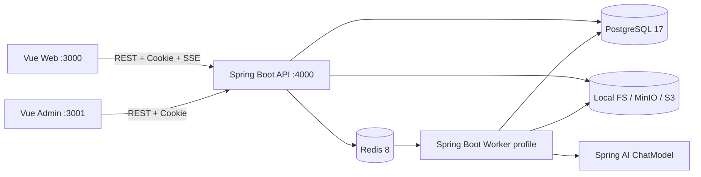

# 01 总体架构与工程边界

## 1.1 目标部署拓扑



API 和 Worker 采用同一 Maven 多模块工程、两个运行 profile。API 只负责同步 HTTP、事务和队列投递；Worker 只负责异步任务执行、图片处理、结果落盘和额度结算。两者共享 `common`、`persistence` 和契约模块，但不共享进程状态。

## 1.2 目标目录

```text
frontend/
├── web/                     # 用户端 Vue 3 + Vite 5
└── admin/                   # 管理端 Vue 3 + Vite 5
backend/
├── pom.xml                  # Maven parent
├── common/                  # domain、DTO、错误码、状态机
├── persistence/             # MyBatis Mapper、Redis、S3 adapter
├── api/                     # Spring MVC API profile
└── worker/                  # Worker profile、AI、图片、对账
docs/design/                 # 本分册
bak/                         # 原实现，只读
```

### Maven 模块职责

| 模块 | 允许依赖 | 禁止职责 |
| --- | --- | --- |
| `common` | JDK、Jackson、Bean Validation API | 数据库、Redis、HTTP、Spring Bean |
| `persistence` | common、Spring JDBC/MyBatis、Redis、S3 SDK | Controller、页面业务 |
| `api` | common、persistence、Spring MVC/Security | 直接调用模型供应商 |
| `worker` | common、persistence、Spring AI、图像库 | 对外暴露用户 HTTP API |

## 1.3 运行模式

| Profile | 进程 | 启用组件 |
| --- | --- | --- |
| `api` | API 服务 | MVC、鉴权、上传、SSE、队列 producer |
| `worker` | Worker 服务 | Redis consumer、ChatModel、审核、图像、对账 |
| `test` | 测试 | Testcontainers 或 fixture adapter，不连接生产资源 |
| `mock` | API/Worker 可叠加 | 演示验证码、确定性图片 provider、本地对象存储 |

API 和 Worker 必须使用同一 `schemaVersion`、数据库迁移版本和费用规则版本。启动时记录应用版本、Git SHA、profile 和 schema version，便于排查跨服务不一致。

## 1.4 横切规范

- 时间统一使用 UTC 存储和 ISO-8601 传输；页面按中文/英文 locale 展示。
- 金额、图片数量、attempt 次数和额度均使用整数，禁止浮点计费。
- 所有写接口要求 request id；生成提交还要求用户级幂等键。
- 统一错误响应为 `code/message/details/requestId`，不返回堆栈或供应商密钥。
- 日志只写 taskId、sessionId、userId 哈希或脱敏手机号；prompt 和手机号不得完整写入 INFO 日志。
- 健康检查拆为 liveness（进程）和 readiness（PostgreSQL/Redis/对象存储）。

## 1.5 外部依赖替换边界

Prisma Client、BullMQ Node client、Sharp 不能直接在 Java 中运行。保持 PostgreSQL/Redis/S3 的协议和业务数据不变，Java 侧采用：

| Node 组件 | Java 组件 | 兼容要求 |
| --- | --- | --- |
| Prisma repository | MyBatis 3 + Spring JDBC | SQL 结果、事务和锁条件与旧 repository 一致 |
| BullMQ | Spring Data Redis Streams | 队列业务名、消息字段、attempt 和幂等语义一致；切换期运行 bridge |
| Sharp | ImageIO + TwelveMonkeys + Thumbnailator | 尺寸、EXIF 旋转、WebP、缩略图和校验值一致 |

## 1.6 依赖与版本锁定

使用 Maven Wrapper 和 dependency management 锁定 Spring Boot 4.0、Spring AI 2.0.0-M5、MyBatis、S3 SDK、Redis、图像库版本。首次脚手架必须用 OpenAI-compatible WireMock 完成编译和一条真实 `ChatModel.call` 集成测试，确认 milestone 与 Boot 4 的 BOM 兼容后才能扩展业务。
