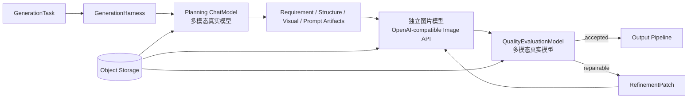

# 图片生成真实规划与质量评估设计

## 1. 目标与边界

本设计把图片生成的规划、图片质量评估和循环优化切换为生产模型链路。运行时不再根据 `mock` 模式、模型开关或异常情况降级到确定性实现；规划模型、图片模型和质量评估必须完成真实供应商配置，否则 Worker 启动失败，任务也不得伪造成功。

本次范围包括：

- 使用真实多模态 `ChatModel` 完成需求理解、内容结构规划、视觉约束和 Prompt 构造；
- 使用真实多模态 `ChatModel` 对生成图片执行技术、结构、文字、视觉和安全评估；
- 使用真实模型输出 `EvaluationReport` 和 `RefinementPatch`，由 Loop Engine 控制有限重试；
- 参考图从对象存储读取实际图片字节，作为规划、评估和图片生成模型的多模态输入；
- 删除 Worker 图片生成模块中的确定性规划、占位图片、确定性审核和旧 ChatModel 图片 Provider；
- 测试不再使用 WireMock/Mockito 模拟外部模型，联调由人工使用真实供应商配置完成。

不在本次范围内的是短信验证码、前端灵感接口失败回退、数据库/Redis/对象存储的本地实现；这些不属于本模块的图片模型 Mock。

## 2. 生产架构



规划模型和图片模型使用独立的 URL、密钥、模型名、超时和重试配置。质量评估复用规划侧的多模态 `ChatModel`，但使用独立系统指令和严格 JSON 协议；不得把图片模型当成评估模型，也不得把 ChatModel 当成图片生成模型。

## 3. 真实规划模型

`ChatPlanningModel` 继续实现四个规划阶段，但每次调用都构造真实多模态 `UserMessage`：

- 文本输入包含模式、用户描述、上一阶段结构化 Artifact 和适用的约束；
- `EDIT_IMAGE` 加载目标图 A；
- `RECOMPOSE_IMAGE` 加载目标图 A 和参考图 B，并明确两者角色；
- 图片通过 `Media` 携带对象存储中的实际字节和 MIME，不把 upload ID 当作图片内容传给模型；
- 响应只允许严格 JSON，未知字段、缺少必填字段、非法枚举、超长文本和低置信度按阶段错误处理。

规划模型失败时只允许按配置重试；达到上限后任务失败并释放额度，禁止使用默认值或确定性规划结果继续执行。

## 4. 真实质量评估模型

新增 `QualityEvaluationModel` 端口和 `ChatQualityEvaluationModel` 实现。每次评估把以下内容发送给多模态模型：

- 当前 `PromptPackage`、RequirementBrief、StructurePlan、VisualSpec；
- 当前迭代编号、图片模型身份和输出数量；
- 每张生成图片的实际字节；
- 编辑/重构任务的目标图 A、参考图 B（如存在）。

模型必须返回：

```json
{
  "accepted": false,
  "score": 0.72,
  "violations": ["TEXT_OVERLAP"],
  "repairable": true,
  "evidence": ["headline is partially occluded"],
  "evaluatorVersion": "quality-v1",
  "refinement": {
    "instruction": "Apply the requested repair while preserving approved content.",
    "targetSections": ["layout", "textPolicy"],
    "changes": ["increase whitespace around headline"],
    "preserve": ["user supplied facts", "aspect ratio"],
    "reasonCodes": ["TEXT_OVERLAP"]
  }
}
```

服务端仍执行硬性技术校验：图片可解码、MIME/大小/尺寸合法、输出数量正确。模型评估不能绕过这些硬性校验，也不能通过降低安全阈值强制接受结果。

## 5. Loop Engineering

每轮顺序固定为：真实图片模型生成 -> 服务端技术校验 -> 真实多模态质量评估 -> 持久化迭代 -> 接受或生成修订 Patch。

- 评估达到 `accept-score` 且无硬性违规：接受并进入输出管线；
- `repairable=true` 且未超过 `max-loop-iterations`：把模型返回的 Patch 作为下一轮输入；
- 同一违规原因连续出现、模型输出非法、审核拒绝或达到上限：任务失败或按既有部分成功语义终止；
- 每轮使用幂等键 `taskId:iteration:promptHash`，不重复扣额度；
- 任何规划、图片生成、评估、存储错误均产生脱敏事件并释放额度。

## 6. 参考图与供应商请求

Worker 通过 `ReferenceImageMapper` 查询当前用户拥有的上传记录，再由共享 `ObjectStorage` 读取 `objectKey`。查询不到、已删除、MIME 不支持或读取失败均是不可恢复任务错误。

OpenAI-compatible 图片请求中的 `input_images` 使用受大小限制的 Base64 Data URL。禁止把数据库 ID、未校验远程 URL 或对象存储内部路径直接发送给供应商。供应商返回的 URL 仅允许 HTTPS、禁止私网地址，并经过大小、MIME 和解码检查。

## 7. 配置与启动约束

以下配置必须显式提供：

```text
AI_PLANNING_ENABLED=true
AI_PLANNING_BASE_URL=...
AI_PLANNING_API_KEY=...
AI_PLANNING_MODEL=...
AI_IMAGE_ENABLED=true
AI_IMAGE_BASE_URL=...
AI_IMAGE_API_KEY=...
AI_IMAGE_MODEL=...
AI_IMAGE_ENDPOINT=/v1/images/generations
```

缺失配置或 `AI_*_ENABLED=false` 时，Worker 启动直接失败。删除 `local-mock-*` 默认值和 `MOCK_GENERATION_DELAY_MS`，不保留生产 Mock 开关。

## 8. 删除与人工验收

删除以下运行时代码：

- `DeterministicPlanningModel`；
- `DeterministicMockProvider`；
- `DeterministicMockContentModerator`；
- `OpenAiCompatibleGenerationProvider` 旧 ChatModel 图片实现；
- 仅用于供应商替身的 WireMock 测试、依赖和生成模块 Mock 测试。

保留纯业务的数据库、对象存储、额度和输出管线测试；不再添加新的外部模型替身测试。人工验收需要使用真实规划模型、真实图片模型和真实多模态评估模型，覆盖三种输入模式、参考图角色、模型失败、评估不通过、修订成功和循环上限场景。
