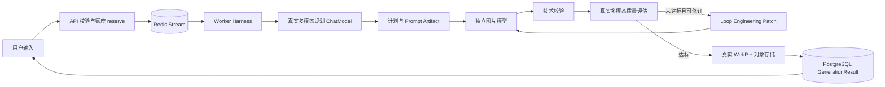

# 前台用户端与 Worker 未实现功能真实实现方案

## 1. 文档目的

本文把 `docs/design/10-unimplemented-and-acceptance.md` 中的前台用户端 4 项和 Worker 与模型 5 项拆成可直接执行的开发设计。目标是完成真实生产链路，而不是让测试或演示环境伪造成功。

本文涉及 9 项工作：

| 编号 | 范围 | 目标 |
| --- | --- | --- |
| F-01 | 前台 | 真实 PostgreSQL、Redis、对象存储、Worker 和模型生成端到端回归 |
| F-02 | 前台 | 生成工作台全尺寸视觉基线和中英文长文本回归 |
| F-03 | 前台/API | 参考图上传使用与 Worker 一致的真实 WebP writer |
| F-04 | 前台 | 与 `bak/apps/web` 持续进行页面、主题和响应式一致性验收 |
| W-01 | Worker | 真实 PostgreSQL、Redis、SFTP/local 集成回归 |
| W-02 | Worker/模型 | 真实供应商异常、图片下载和请求 ID 脱敏人工联调 |
| W-03 | Worker/运营 | 生产内容审核队列、申诉和审计闭环 |
| W-04 | Worker/存储 | SFTP 客户端完整配置和失败场景集成验证 |
| W-05 | Worker/运维 | 任务、模型、图片处理、对象清理和对账指标告警 |

`bak/` 只读。所有实现只允许修改 `dream_web/`、`dream_service/` 和 `docs/`。

## 2. 强制实现约束

1. 禁止 `Mock*`、`Deterministic*`、`local-mock-*`、固定图片、固定成功响应和基于异常的确定性降级。
2. 禁止使用 WireMock、Mockito 或自定义 HTTP Stub 作为外部模型/短信/对象存储供应商替身。Mockito 仅可用于与外部供应商无关的纯业务单元测试；本方案新增的供应商验证全部使用真实配置人工联调。
3. 图片规划、质量评估使用真实多模态 `ChatModel`；图片生成使用独立的 OpenAI-compatible Image API，两个模型的地址、密钥、模型名、超时和重试配置必须隔离。
4. 测试环境的 PostgreSQL、Redis 和 SFTP 使用真实进程或 Testcontainers 服务；local 模式使用真实共享目录，不使用内存伪实现替代持久化语义。
5. 缺少真实模型配置或模型开关关闭时，Worker 必须启动失败；不得把规划模型当图片模型调用。
6. 每个任务必须保持额度恒等式：`reserved = consumed + released`。规划、生成、评估、存储、审核任一步失败都必须产生终态事件并释放未消费额度。

## 3. 生产链路



规划阶段输出 `RequirementBrief`、`StructurePlan`、`VisualSpec`、`PromptPackage`；每个 Artifact 版本化、脱敏后持久化。循环阶段输出 `EvaluationReport` 和 `RefinementPatch`，不直接修改用户输入。

## 4. F-01 真实生成端到端回归

### 4.1 实现边界

复用现有 `GenerationController`、`GenerationService`、`GenerationQueuePublisher`、Redis Stream consumer、`GenerationHarness`、`GenerationOutputPipeline` 和额度服务。新增的是可重复的真实环境启动编排、数据准备和回归用例，不新增第二套生成流程。

真实链路必须包含：

- API 通过 Cookie 会话校验用户和参考图归属；
- PostgreSQL 写入任务、计划、迭代、事件、结果和额度流水；
- Redis Stream 发布、消费、pending reclaim、ACK 和重复投递处理；
- 真实规划 ChatModel 完成四个规划阶段；
- 真实图片模型生成 URL/Base64/Data URL 图片；
- 真实质量评估模型决定接受或修订；
- ImageIO/WebP writer 生成主图和缩略图并写入 local 或真实 SFTP 存储；
- SSE 推送阶段事件，断线后按 `Last-Event-ID` 恢复；
- 成功消费额度，失败/取消释放额度，重试不重复扣费。

### 4.2 回归场景

| 场景 | 操作 | 必须验证 |
| --- | --- | --- |
| 成功 | 文生图，单图 | 五阶段事件、结果、CONSUME、SSE 终态 |
| 部分成功 | 多图，其中一张供应商输出无效 | 合格图片保留、失败图片清理、PARTIALLY_SUCCEEDED |
| 失败 | 真实模型返回不可重试错误 | FAILED、RELEASE、脱敏 errorCode |
| 取消 | 生成和循环中分别取消 | Worker 不再写结果，不重复释放额度 |
| 重试 | 真实临时错误后重试 | attempt、backoff、死信边界 |
| SSE 断线 | 消费中断开连接后重连 | 不丢阶段事件，不越权读取任务 |
| 重复投递 | 同一 Redis 消息被两个消费者处理 | 条件抢占、幂等结果和额度唯一 |

### 4.3 验收环境

使用一次性真实 PostgreSQL、Redis 8 和测试 SFTP 服务（local 模式使用共享目录）；模型服务使用人工提供的真实 OpenAI-compatible 规划/评估和图片模型配置。E2E 不拦截 `/dream_web/**` 请求，不注入前端 fixture，不替换模型 HTTP 客户端。

## 5. F-02 视觉基线与长文本回归

### 5.1 基线矩阵

生成工作台固定采集以下 viewport：`1440x900`、`1024x768`、`800x1024`、`390x844`。每个尺寸至少覆盖：空会话、已输入提示词、参考图上传、排队、规划中、循环评估中、成功结果、失败和取消状态。

每个状态同时采集中文和英文版本，字体加载完成后截图。截图使用 viewport 截图，禁止通过 full-page 拼接改变固定导航位置。

### 5.2 回归规则

- API 使用真实测试数据库中的固定业务数据，不用 `src/api/fixtures.ts` 作为生产或 E2E 数据源；fixture 仅保留给独立静态组件测试，不能模拟任务结果。
- Playwright 在每个断点检查文本不溢出、不遮挡、不改变按钮宽度和时间线布局。
- 检查浅色、深色、系统主题、`prefers-reduced-motion`，并与 `bak/apps/web` 同尺寸对比。
- 视觉差异超过阈值时必须定位到 DOM、CSS token、资源或断点变化后再更新基线；禁止直接放宽阈值。

### 5.3 开发产物

新增 `dream_web/tests/e2e/generation-workspace.spec.ts`、截图目录和中英文长文本数据集。每次前台样式变更必须同时更新桌面、平板、移动和两种语言基线，并在 PR 中说明差异。

## 6. F-03 参考图真实 WebP 上传

### 6.1 统一 writer

把 WebP 编码、EXIF 方向、像素上限、cover crop、SHA-256 和缩略图逻辑收敛到 `common` 的 `WebpImageWriter`。Worker 结果和 API `UploadService` 必须注入同一个接口实现，禁止各自维护编码分支。

```java
public interface WebpImageWriter {
  EncodedImage normalize(InputStream input, ImagePolicy policy);
}
```

`EncodedImage` 至少包含 WebP 字节、宽高、SHA-256、主图和缩略图元数据。writer 依赖缺失、输入无法解码或输出无法再次解码时抛出明确的 `IMAGE_CODEC_UNAVAILABLE` 或 `IMAGE_DECODE_FAILED`，API 返回 4xx/5xx 稳定错误，不回退原始文件。

### 6.2 上传流程

1. API 校验登录态、文件大小、原始 MIME、扩展名和像素上限。
2. writer 读取实际字节，纠正 EXIF 方向并转换为 WebP。
3. 先写临时对象，再在 PostgreSQL 创建 `ReferenceUpload`；数据库失败时删除临时对象。
4. 生成公开内容 URL 时只返回资源 ID，内容读取再次校验用户归属。
5. Worker 通过同一 writer 读取参考图；不存在 writer 时启动失败或任务明确失败，禁止上传 PNG/JPEG 直接绕过规范化。

### 6.3 验收

覆盖旋转 EXIF、透明 PNG、超大像素、损坏文件、WebP writer 缺失、对象部分写入和重复上传。验证数据库记录的 MIME、尺寸、hash 与实际对象字节一致。

## 7. F-04 与 `bak/apps/web` 一致性

建立逐路由核对表：`/inspiration`、`/inspiration/:slug`、`/login`、`/generate`、`/generate/:sessionId`。每条路由记录 DOM 层级、文案、图标、图片资源、浅色/深色 token、移动断点、键盘焦点和 reduced-motion 行为。

实现要求：

- 前台路由保留 `/dream_web/*` API 前缀，页面路由和资源前缀不混用；
- 灵感详情的“用作参考图”必须先上传/解析为 `referenceImageId`，不能只保存 URL；
- 快速编排器的“添加参考图”必须真正调用上传 API，并在提交前显示上传失败原因；
- 点赞、关注、通知、更新日志和额度显示若无后端契约，页面必须显示不可用状态，不能伪造已成功；
- 样式优先复用现有 token，禁止修改 `bak` 或通过隐藏元素绕过视觉差异。

## 8. W-01 真实基础设施集成回归

### 8.1 组件

使用真实 PostgreSQL 17、Redis 8 和 SFTP 服务。测试启动时执行正式迁移；不使用 H2、内存 Redis 或本地 Map 替代持久化语义。

### 8.2 关键场景

- pending 消息超过 `reclaim-idle` 后被第二个 Worker 认领，原消费者不能继续写入；
- 取消竞态发生在规划、图片生成、评估和对象写入四个边界，最终只允许一个终态；
- 重复投递由 `taskId + iteration + promptHash` 和 `(taskId,index)` 唯一约束消除；
- 事务在结果写入、额度消费、事件写入任一处失败时回滚，并由补偿任务恢复；
- 已写主图但缩略图失败时清理已写对象，重试不产生孤儿对象；
- Worker 重启后可恢复 Stream、数据库状态和待处理任务。

## 9. W-02 真实供应商人工联调

### 9.1 供应商配置

规划/评估 ChatModel 与图片模型分别配置 `BASE_URL`、`API_KEY`、`MODEL`、`TIMEOUT` 和 `MAX_ATTEMPTS`。联调环境通过 Secret 注入，日志只保留 `traceId`、`taskId`、阶段、耗时、HTTP 状态和脱敏 `providerRequestId`。

### 9.2 人工用例

| 用例 | 结果 |
| --- | --- |
| 正常 JSON 规划和图片 URL | 解析、下载、WebP、评估、落盘成功 |
| 连接超时 | 按阶段重试，达到上限后稳定失败并 RELEASE |
| 429 | 读取 Retry-After 或指数退避，不重复扣费 |
| 5xx/空响应 | 分类为可重试供应商错误，最终进入 dead-letter |
| 401/403/参数错误 | 不重试，记录脱敏错误，任务失败 |
| 图片 URL 非 HTTPS、私网地址、超大或 MIME 错误 | 下载拒绝并清理临时对象 |
| 供应商返回 request ID | 日志和事件只保留脱敏值，禁止写入密钥、完整响应或 Prompt |

不创建 WireMock、Mockito provider stub 或本地确定性模型。真实供应商不可用时，联调任务失败，不改为“测试通过”。

## 10. W-03 内容审核运营闭环

### 10.1 审核状态

Worker 真实输入/输出多模态审核结果进入 `ModerationReviewCase`，状态为 `PENDING`、`APPROVED`、`REJECTED`、`APPEALED`、`RESOLVED`。审核拒绝默认释放额度并阻断发布；审核模型不可用时 fail-closed。

### 10.2 数据与接口

新增迁移：

- `ModerationReviewCase(id, taskId, resultId, stage, status, reasonCode, evidenceJson, model, modelVersion, createdAt, resolvedAt)`；
- `ModerationAppeal(id, caseId, userId, reason, status, createdAt, resolvedAt)`；
- `ModerationAuditEvent(id, caseId, actorId, action, beforeJson, afterJson, createdAt)`。

管理端新增队列查询、详情、人工通过/拒绝、申诉处理和审计查询接口，所有写入由服务端 RBAC 控制。人工结论必须保留模型原始结论的脱敏摘要、操作者和时间，不允许覆盖历史记录。

### 10.3 验收

真实模型拒绝、人工复核通过、用户申诉、申诉驳回、重复操作和管理员越权均需通过真实 PostgreSQL 契约和 E2E 验证。

## 11. W-04 SFTP 客户端

### 11.1 配置和客户端

SFTP 客户端使用 host、port、username、password 或私钥认证，可选 `known_hosts` 严格主机密钥校验；连接和文件操作使用独立超时与有界重试。凭据只从环境变量/Secret 读取，API 不生成或返回签名 URL。

### 11.2 集成场景

- host、username、认证方式或严格校验所需 known_hosts 缺失时 readiness 未就绪；
- 主图、缩略图、参考图写入、读取和删除均使用真实 SFTP；
- 写入中断、网络超时、权限拒绝和对象不存在返回稳定错误；
- 部分写入失败执行有界清理，清理失败写入指标和 dead-letter，不吞异常；
- presigned URL 不包含内部路径和长期凭据，过期后不能读取。

## 12. W-05 指标和告警

使用 Spring Boot Actuator + Micrometer 暴露 Prometheus 指标，禁止只写日志代替监控。指标至少包括：

| 指标 | 类型 | 标签 |
| --- | --- | --- |
| `dreamspace_worker_queue_pending` | gauge | stream, group |
| `dreamspace_generation_attempt_total` | counter | stage, outcome, error_code |
| `dreamspace_generation_dead_letter_total` | counter | error_code |
| `dreamspace_model_request_duration_seconds` | timer | provider, model, stage |
| `dreamspace_image_processing_duration_seconds` | timer | operation |
| `dreamspace_object_cleanup_failure_total` | counter | storage, operation |
| `dreamspace_quota_reconciliation_blocked_total` | gauge | reason |
| `dreamspace_moderation_pending` | gauge | stage |

告警规则：pending 持续增长、dead-letter 增量异常、模型 P95 超时、图片处理 P95 超时、清理失败、对账 `BLOCKED` 大于 0、审核队列超 SLA。指标标签不得包含用户手机号、Prompt、图片 URL、API key 或完整供应商 request ID。

## 13. 配置变更

Worker 必须显式配置以下真实依赖：

```yaml
spring:
  ai:
    openai:
      base-url: ${AI_PLANNING_BASE_URL:}
      api-key: ${AI_PLANNING_API_KEY:}
      timeout: ${AI_PLANNING_TIMEOUT:PT30S}
      chat:
        options:
          model: ${AI_PLANNING_MODEL:}
          temperature: ${AI_PLANNING_TEMPERATURE:0.2}

dream-space:
  ai:
    planning:
      enabled: ${AI_PLANNING_ENABLED:true}
      max-attempts: ${AI_PLANNING_MAX_ATTEMPTS:2}
    image:
      enabled: ${AI_IMAGE_ENABLED:true}
      base-url: ${AI_IMAGE_BASE_URL:}
      api-key: ${AI_IMAGE_API_KEY:}
      model: ${AI_IMAGE_MODEL:}
      endpoint: ${AI_IMAGE_ENDPOINT:/v1/images/generations}
  storage:
    mode: ${OBJECT_STORAGE_MODE:local}
    local-directory: ${LOCAL_STORAGE_DIR:D:/softDesign/dream-space/storage}
    sftp:
      host: ${SFTP_HOST:}
      port: ${SFTP_PORT:22}
      username: ${SFTP_USERNAME:}
      password: ${SFTP_PASSWORD:}
      private-key-file: ${SFTP_PRIVATE_KEY_FILE:}
      known-hosts-file: ${SFTP_KNOWN_HOSTS_FILE:}
      root-directory: ${SFTP_ROOT_DIRECTORY:/dream-space}
```

启动校验必须检查 `local|sftp` 模式、规划/评估多模态模型配置和独立图片模型配置；SFTP 模式还必须检查连接和认证配置。失败时返回明确配置错误。`WorkerStartupProbe` 需要改为真正的 readiness contributor，任一必需模型健康检查失败时不能报告 ready。

## 14. 测试策略

测试分三层：

1. 纯业务单元测试：Schema、状态机、额度、幂等、URL 安全和 Patch 合并；不模拟外部供应商响应。
2. 真实基础设施集成测试：Testcontainers PostgreSQL、Redis，并使用测试 SFTP 服务验证远程对象操作；local 模式验证共享目录。
3. 真实供应商人工联调：使用真实模型密钥覆盖 W-02 全部异常矩阵，保留脱敏报告、请求 ID、耗时和结果摘要，不提交密钥、完整 Prompt 或图片。

前台 Playwright 通过真实 API、真实 Worker 和真实数据库运行；不拦截生成请求、不使用网络 fixture 伪造 SSE 或结果。视觉测试只断言页面呈现，模型结果使用已审核的真实联调任务。

## 15. 实施顺序

1. 先完成 F-03 统一 WebP writer 和 SFTP/local 参考图读取。
2. 完成 W-01、W-04 基础设施容器和迁移回归。
3. 完成 W-02 真实供应商人工联调和错误分类。
4. 完成 F-01 SSE、取消、重试和额度全链路回归。
5. 完成 W-03 审核运营闭环。
6. 完成 W-05 指标、告警和 readiness。
7. 完成 F-02 视觉基线与 F-04 `bak` 一致性验收。

## 16. 完成定义与回滚

只有以下条件全部满足，9 项工作才算完成：真实模型和真实基础设施通过验收；成功、部分成功、失败、取消、重试、断线恢复和重复投递场景通过；审核、对象存储和额度补偿无数据漂移；所有指标和告警可观测；前台四个 viewport 与 `bak` 通过；无外部供应商 Mock 代码、依赖或配置。

发布采用旧服务保留一个回滚周期。发现任务状态、额度、对象清理或审核数据异常时，停止新任务投递，保留已完成任务读取，切回旧 Worker，完成数据对账后再恢复投递。不得通过重新启用 Mock 作为回滚方案。
