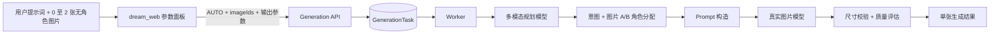

# 图片生成参数与图片角色自动识别详细设计

## 1. 文档目的

本设计用于指导图片生成功能的下一阶段开发，解决两个问题：

1. 用户可以在生成工作台选择图片比例、分辨率，并查看或调整最终宽高尺寸；
2. 前台不再把上传图片标记为图片 A 或图片 B，图片角色由多模态规划模型结合用户提示词和图片内容自动识别。

本期固定每个任务只生成 1 张图片，不展示图片张数控件，也不接受 `imageCount` 客户端参数。未来如需一次生成多张图片，应另行设计额度、并发、部分成功和结果排序规则。

本文优先级高于以下旧设计：

- `11-image-generation-harness-loop.md` 中“比例、分辨率由模型推理且不作为前台结构化输入”的描述；
- `11-image-generation-harness-loop.md` 和 `12-real-image-planning-evaluation.md` 中由前台直接提交 `targetImageId`、`referenceImageId` 的描述。

## 2. 设计结论

- 生成意图仍统一提交 `mode: AUTO`，前台不展示文生图、调整图片、图片重构模式。
- 比例、分辨率和尺寸是用户明确选择的硬约束，优先级高于规划模型推断结果。
- 前台最多允许上传 2 张图片，只维护无业务角色的 `imageIds` 有序集合，不出现“图片 A”“图片 B”标签。
- Worker 将图片以 `INPUT_IMAGE_1`、`INPUT_IMAGE_2` 发送给多模态规划模型。
- 规划模型在 `RequirementBrief` 中输出生成意图和图片角色分配；图片 A 表示待修改主体，图片 B 表示参考素材。
- 上传顺序不得作为 A/B 判断依据。模型无法可靠区分时终止规划并返回可操作错误，不得静默猜测。
- 图片模型调用和质量评估必须使用规划阶段确认后的角色分配、比例、分辨率及尺寸。
- 本功能调用真实规划模型和真实图片模型，不增加 mock、WireMock 或供应商替身。

## 3. 总体数据流



## 4. 前台交互设计

### 4.1 工作台布局

保留当前生成工作台的整体视觉风格和底部 Composer，在输入区域增加“生成参数”按钮。按钮使用参数或滑杆图标，点击后在 Composer 上方展开参数浮层；桌面端使用定宽浮层，移动端使用底部抽屉。

参数面板按以下顺序排列：

1. 选择比例；
2. 选择分辨率；
3. 尺寸；

不显示“选择生成数量”。附件按钮仍位于输入框左侧，用户看到的名称为“素材 1”“素材 2”，不显示 A/B 含义。

### 4.2 比例选择

支持以下选项：

| 值 | 显示名称 | 方向 |
| --- | --- | --- |
| `smart` | 智能 | 由规划模型选择标准比例 |
| `21:9` | 21:9 | 横向超宽 |
| `16:9` | 16:9 | 横向 |
| `3:2` | 3:2 | 横向 |
| `4:3` | 4:3 | 横向 |
| `1:1` | 1:1 | 方形 |
| `3:4` | 3:4 | 纵向 |
| `2:3` | 2:3 | 纵向 |
| `9:16` | 9:16 | 纵向 |
| `custom` | 自定义 | 修改宽高后自动进入，不单独占据预设按钮 |

每个比例按钮由简化画布图标和文字组成。选中状态使用白色或主题表面色底板、细边框和轻阴影，不改变当前项目的中性黑白主色风格。

行为规则：

- 默认值为 `1:1`；
- 选择标准比例后，根据当前分辨率自动计算宽高；
- 选择“智能”时，宽高输入显示“由 AI 确定”并禁用，任务提交 `width: null`、`height: null`；
- 用户直接修改宽高且关闭比例锁定时，比例自动变为 `custom`；
- 从 `custom` 切回标准比例时重新计算宽高。

### 4.3 分辨率选择

本期支持：

| 值 | 显示名称 | 最大边 | 单张额度系数 |
| --- | --- | ---: | ---: |
| `2K` | 高清 2K | 2048 px | 1 |
| `4K` | 超清 4K | 4096 px | 2 |

额度系数必须由 `/generation/options` 返回，前台不能硬编码。不存在真实活动配置时，不显示“限免 3 次”等营销标签。

行为规则：

- 默认 `2K`；
- 切换分辨率时按当前比例重新计算宽高；
- 自定义比例下切换分辨率时等比缩放，使较长边等于新分辨率最大边；
- 4K 是否可用由 API options 返回。供应商不支持 4K 时前台禁用并显示服务端提供的原因；
- 任务提交后，任务历史展示实际分辨率和实际宽高。

### 4.4 尺寸选择

尺寸区域包含：

- 宽度 `W` 数字输入；
- 比例锁定按钮；
- 高度 `H` 数字输入；
- 单位 `PX`。

校验规则：

- 最小边：512 px；
- 2K 最大边：2048 px；
- 4K 最大边：4096 px；
- 宽高必须为 64 的整数倍；
- 2K 最大像素数：`2048 * 2048`；
- 4K 最大像素数：`4096 * 4096`；
- 不允许 0、负数、小数、空值或超过当前分辨率级别；
- 失焦时将合法范围内的数值归一到最近的 64 倍数；
- 输入超限时不自动截断用户原值，显示错误并禁用提交，避免静默改变需求。

标准比例尺寸算法：

```text
横向比例：width = resolution.maxEdge
          height = roundTo64(width * ratioHeight / ratioWidth)

纵向比例：height = resolution.maxEdge
          width = roundTo64(height * ratioWidth / ratioHeight)

1:1：width = height = resolution.maxEdge
```

比例锁定规则：

- 默认锁定；
- 锁定时修改一边，另一边按当前比例同步更新；
- 计算结果超过当前分辨率上限时拒绝修改并显示原因；
- 解锁后允许分别修改宽高，比例状态变为 `custom`；
- `smart` 模式不提供比例锁定和尺寸编辑。

### 4.5 附件交互

- 最多上传 2 张图片；
- 上传后按选择时间显示“素材 1”“素材 2”；
- 支持单独删除和重新上传；
- 删除素材 1 后，素材 2 可以在显示层顺延为素材 1，但业务层只依赖图片 ID，不赋予 A/B 角色；
- 提交前不要求用户指定哪张需要修改、哪张用于参考；
- 提示词占位文案应提示用户明确描述素材关系，例如“保留红色产品主体，参考另一张图的版式和配色”。

## 5. 前端状态与类型契约

### 5.1 GenerationDraft

```ts
export type GenerationMode = "AUTO";
export type GenerationRatio =
  | "smart" | "21:9" | "16:9" | "3:2" | "4:3"
  | "1:1" | "3:4" | "2:3" | "9:16" | "custom";
export type GenerationResolution = "2K" | "4K";

export interface GenerationDraft {
  mode: "AUTO";
  prompt: string;
  imageIds: string[];
  ratio: GenerationRatio;
  resolution: GenerationResolution;
  width: number | null;
  height: number | null;
}
```

`sizeLocked` 仅属于前台交互状态，不写入 API、会话草稿或数据库。服务端通过 `ratio`、`width`、`height` 判断最终约束。

本期不得在 `GenerationDraft`、`GenerationTaskRequest` 中出现：

- `targetImageId`；
- `referenceImageId`；
- `imageCount`。

### 5.2 Options

```json
{
  "modes": ["AUTO"],
  "ratios": [
    {"value": "smart", "label": "智能"},
    {"value": "1:1", "label": "1:1"}
  ],
  "resolutions": [
    {
      "value": "2K",
      "label": "高清 2K",
      "maxEdge": 2048,
      "maxPixels": 4194304,
      "unitCost": 1,
      "enabled": true,
      "disabledReason": null
    }
  ],
  "dimensions": {"minEdge": 512, "step": 64},
  "referenceImages": {
    "max": 2,
    "maxBytes": 10485760,
    "mimeTypes": ["image/jpeg", "image/png", "image/webp"]
  }
}
```

前端根据 options 渲染能力，不在组件内复制后端上限。单张预计额度为所选分辨率的 `unitCost`。

## 6. API 设计

### 6.1 创建任务请求

固定比例示例：

```json
{
  "idempotencyKey": "web-uuid",
  "sessionId": "session-id",
  "mode": "AUTO",
  "prompt": "保留红色产品主体，参考另一张图的杂志版式和蓝白配色",
  "imageIds": ["upload-1", "upload-2"],
  "ratio": "16:9",
  "resolution": "2K",
  "width": 2048,
  "height": 1152
}
```

智能比例示例：

```json
{
  "idempotencyKey": "web-uuid",
  "mode": "AUTO",
  "prompt": "生成适合手机信息流发布的竖版活动海报",
  "imageIds": [],
  "ratio": "smart",
  "resolution": "2K",
  "width": null,
  "height": null
}
```

### 6.2 API 校验顺序

1. 校验 `mode` 只能是 `AUTO`；
2. 校验提示词长度 1–4000；
3. 校验 `imageIds` 数量 0–2、去重、归属当前用户且未删除；
4. 校验比例和分辨率在 options 能力范围内；
5. `smart` 必须同时满足宽高为空；
6. 非 `smart` 必须同时提供宽高；
7. 校验 64 倍数、最小边、最大边、最大像素数；
8. 标准比例校验宽高误差不超过一个 step；
9. 校验幂等键；
10. 按分辨率预留单张额度并创建任务。

服务端是约束的最终裁决者，不能信任前端计算。错误码：

| 错误码 | 场景 |
| --- | --- |
| `GENERATION_RATIO_INVALID` | 比例不支持或比例与尺寸冲突 |
| `GENERATION_RESOLUTION_INVALID` | 分辨率不支持或当前不可用 |
| `GENERATION_DIMENSION_INVALID` | 宽高为空、越界或不满足步长 |
| `GENERATION_IMAGES_INVALID` | 图片数量、重复或归属错误 |
| `GENERATION_IMAGE_ROLE_AMBIGUOUS` | 模型无法可靠识别 A/B |

### 6.3 任务响应

`GenerationTask` 返回以下确定字段：

```json
{
  "mode": "AUTO",
  "ratio": "16:9",
  "resolution": "2K",
  "width": 2048,
  "height": 1152,
  "imageCount": 1,
  "imageIds": ["upload-1", "upload-2"]
}
```

`imageCount` 可以在任务只读响应中保留为服务端事实并固定为 1，但不能出现在前台草稿和创建请求中。

## 7. 图片 A/B 自动识别

### 7.1 角色定义

| 角色 | 含义 | 下游用途 |
| --- | --- | --- |
| `TARGET_A` | 待修改、保留主体或作为生成基础的图片 | 编辑、重绘、保留结构/主体 |
| `REFERENCE_B` | 提供风格、配色、构图或内容参考的图片 | 参考约束，不默认复制受保护元素 |
| `UNUSED` | 当前提示词未要求使用的素材 | 不传给图片生成模型 |

生成意图与角色允许以下组合：

| 图片数量 | 合法结果 |
| ---: | --- |
| 0 | `TEXT_TO_IMAGE`，无角色 |
| 1 | `EDIT_IMAGE + TARGET_A`，或 `TEXT_TO_IMAGE + REFERENCE_B` |
| 2 | `RECOMPOSE_IMAGE + TARGET_A + REFERENCE_B`；如果提示词明确只使用其中一张，另一张可为 `UNUSED` |

不得仅根据图片数量强制决定意图。

### 7.2 多模态规划输入

Worker 按稳定但无语义的标签发送图片：

```text
userPrompt=<用户原始描述>
requestedRatio=16:9
requestedResolution=2K
requestedWidth=2048
requestedHeight=1152
attachedImages=[INPUT_IMAGE_1, INPUT_IMAGE_2]
```

系统提示明确要求：

- 结合用户对“第一张、第二张、红色产品、蓝色海报、原图、参考图”等描述和图片视觉内容判断；
- 不得把 `INPUT_IMAGE_1` 固定等同于 A；
- 先识别用户希望修改的对象，再识别提供风格或内容参考的对象；
- 用户描述与图片内容冲突时，以明确的用户关系描述为优先，但记录冲突；
- 只输出简短可审计依据，不输出思维链；
- 无法可靠判断时设置 `needsClarification=true`。

### 7.3 RequirementBrief 新契约

```json
{
  "intent": "RECOMPOSE_IMAGE",
  "imageAssignments": [
    {
      "imageId": "upload-2",
      "role": "TARGET_A",
      "confidence": 0.95,
      "reasonCode": "PROMPT_TARGET_MATCH"
    },
    {
      "imageId": "upload-1",
      "role": "REFERENCE_B",
      "confidence": 0.91,
      "reasonCode": "PROMPT_STYLE_REFERENCE_MATCH"
    }
  ],
  "imageType": "product-poster",
  "industry": "消费电子",
  "coreSubject": "红色产品",
  "displayGoal": "重新设计宣传海报",
  "constraints": ["16:9", "2048x1152", "保留产品主体"],
  "confidence": 0.93,
  "needsClarification": false
}
```

Java 类型：

```java
public enum InputImageRole { TARGET_A, REFERENCE_B, UNUSED }

public record ImageAssignment(
    String imageId,
    InputImageRole role,
    double confidence,
    String reasonCode) {}
```

### 7.4 服务端业务校验

规划模型输出后必须执行以下校验：

- assignment 中的 `imageId` 必须来自任务 `imageIds`；
- 每个上传图片必须且只能出现一次；
- `TARGET_A` 最多一个，`REFERENCE_B` 最多一个；
- `EDIT_IMAGE` 必须有一个 `TARGET_A`；
- `RECOMPOSE_IMAGE` 必须同时有 `TARGET_A` 和 `REFERENCE_B`；
- 两个角色不能指向同一图片；
- 任一实际使用角色 confidence 低于 0.70 时标记歧义；
- `needsClarification=true` 或角色不满足意图时，以 `GENERATION_IMAGE_ROLE_AMBIGUOUS` 失败，释放额度；
- 不允许使用上传顺序补全缺失角色。

角色分配保存在 `GenerationPlan.requirementJson`，并通过任务计划查询接口提供给用户所属会话。普通任务列表只显示“AI 已识别素材关系”，不默认暴露模型内部推理文本。

## 8. 规划与 Prompt 优先级

约束优先级从高到低：

1. API 已校验的用户比例、分辨率和尺寸；
2. 用户自然语言中的主体、保留项、风格和图片关系；
3. 规划模型推断的行业、展示目标、受众、结构和视觉偏好；
4. 系统默认值。

规划模型不能覆盖明确的输出参数。`StructurePlan.canvas` 和 `PromptPackage.modelInput` 必须使用最终输出参数：

```json
{
  "aspectRatio": "16:9",
  "resolution": "2K",
  "width": 2048,
  "height": 1152,
  "targetImageId": "upload-2",
  "referenceImageId": "upload-1"
}
```

`targetImageId`、`referenceImageId` 只允许出现在 Worker 已验证的内部计划和图片模型请求中，不再属于前端/API 输入契约。

## 9. 图片模型适配

`ImageGenerationRequest` 增加最终输出约束和已验证图片角色：

```java
public record ImageGenerationRequest(
    WorkerTaskSnapshot task,
    PromptPackage prompt,
    String targetImageId,
    String referenceImageId,
    String ratio,
    String resolution,
    Integer width,
    Integer height,
    RefinementPatch refinement,
    int iteration) {}
```

OpenAI-compatible 供应商差异由 `OpenAiCompatibleImageGenerationModel` 处理：

- 供应商支持 `width`/`height` 时直接发送精确尺寸；
- 仅支持 `size` 时发送 `${width}x${height}`；
- 仅支持比例和质量档位时映射 `ratio`、`2K/4K`，并在响应后执行尺寸校验；
- 供应商不支持请求尺寸时在启动能力检查或 API options 中禁用对应组合；
- 不得默默改为供应商默认尺寸；
- 返回图片尺寸与请求不一致且超出 64 px 容差时，本轮结果判定为 `OUTPUT_DIMENSION_MISMATCH`，可按模型策略重试一次。

质量评估器必须把比例、尺寸以及图片角色保留情况作为硬约束，不能通过较高视觉评分掩盖尺寸或主体错误。

## 10. 数据库设计

当前 `GenerationTask` 已有 `ratio`、`resolution`、`imageCount`，需要新增或调整：

| 字段 | 类型 | 约束 | 说明 |
| --- | --- | --- | --- |
| `imageIds` | JSONB | NOT NULL，默认 `[]` | 无业务角色的输入图片 ID |
| `width` | INTEGER | nullable | `smart` 规划前可为空 |
| `height` | INTEGER | nullable | `smart` 规划前可为空 |
| `imageCount` | INTEGER | NOT NULL，默认 1，CHECK=1 | 本期固定单图 |

迁移策略：

1. 为 `GenerationRatio` 增加 `custom` 数据库值；
2. 增加 `imageIds`、`width`、`height`；
3. 将 `imageCount` 默认值设为 1，并增加 `CHECK ("imageCount" = 1)`；
4. 当前项目不考虑历史任务兼容，业务代码停止读写 `targetImageId`、`referenceImageId`；
5. 确认没有运行中的旧任务后，用后续清理迁移删除两个旧角色列；
6. 已执行迁移文件保持不可变，只新增时间戳迁移。

对于 `smart`：规划完成后 Worker 应将模型选择的标准比例和最终宽高回写任务，保证任务详情、图片模型调用和结果检查使用同一事实。建议新增 Mapper 条件更新：仅允许任务处于 `GENERATING` 且当前 ratio 为 `smart` 时写入一次。

## 11. 额度与幂等

- 本期任务固定生成 1 张；
- 2K 默认消耗 1 点，4K 默认消耗 2 点，具体值由 options 提供；
- Harness 内部质量循环不重复扣用户额度；
- 幂等比较必须覆盖 `prompt`、`imageIds`、`ratio`、`resolution`、`width`、`height`；
- 相同幂等键但任一字段不同，返回 `GENERATION_IDEMPOTENCY_CONFLICT`；
- 规划失败、角色歧义、供应商拒绝或最终失败均释放已预留额度。

## 12. 代码改造范围

### 12.1 dream_web

- `src/api/client.ts`：扩展 GenerationOptions、GenerationDraft 和任务响应类型；
- `src/stores/generation.ts`：保存比例、分辨率、宽高和 `imageIds`；删除上传时的 target/reference 分支；
- `src/features/generation/GenerationWorkspaceView.vue`：增加参数浮层、比例/分辨率/尺寸控件和无角色附件列表；
- `src/styles.css`：增加参数浮层、比例图标、分段控件、尺寸输入和移动端抽屉样式；
- 提取纯函数 `generationDimensions.ts`：比例解析、尺寸计算、64 对齐和校验，避免组件内散落算法。

### 12.2 dream_service/api

- `GenerationService.Draft`、`TaskRequest`：替换为 `imageIds + ratio + resolution + width + height`；
- `GenerationService.Options`：返回比例、分辨率、尺寸和费用能力；
- 校验图片归属、参数组合、尺寸和单图额度；
- 幂等比较增加新字段；
- `GenerationMapper` 插入任务时直接写入全部稳定输入，避免创建后多次补字段。

### 12.3 dream_service/common

- 扩展 `GenerationRatio.CUSTOM`；
- 扩展 `GenerationTaskRecord` 字段；
- 新增迁移和数据库约束；
- MyBatis JSONB 使用现有 `JsonNodeTypeHandler`，不使用字符串拼接解析 `imageIds`。

### 12.4 dream_service/worker

- `WorkerTaskSnapshot` 使用 `imageIds`、比例、分辨率和尺寸；
- `ReferenceImageLoader` 按输入图片列表读取图片；
- `ChatPlanningModel` 使用无角色媒体标签并输出 `ImageAssignment`；
- `RequirementBrief` 增加角色分配；
- `RequirementUnderstandingStage` 增加角色业务校验；
- `PromptConstructionStage` 把用户输出参数作为硬约束；
- `OpenAiCompatibleImageGenerationModel` 映射精确尺寸和已验证角色；
- `ChatQualityEvaluationModel` 增加尺寸、比例及角色一致性检查。

## 13. 测试设计

### 13.1 前端

- 每个标准比例在 2K/4K 下的宽高计算；
- 横向、纵向、方形和 64 对齐；
- 锁定/解锁、自定义比例和错误状态；
- `smart` 禁用宽高；
- options 禁用 4K；
- 最多两个附件且不显示 A/B；
- 提交请求不存在 `imageCount`、`targetImageId`、`referenceImageId`；
- 桌面、平板和移动端无溢出、遮挡和按钮跳动。

### 13.2 API

- 合法的所有比例和两档分辨率；
- 非 64 倍、越界、像素超限、比例冲突；
- smart 与宽高互斥；
- 0/1/2 张图片归属和去重；
- 请求携带 `imageCount` 或旧角色字段时因未知字段失败；
- 单图额度、释放和幂等冲突。

### 13.3 Worker

- 0 张图片识别文生图；
- 1 张图片识别目标 A 或参考 B；
- 2 张图片按提示词而不是上传顺序识别 A/B；
- 调换上传顺序后角色结果保持语义一致；
- 低置信度、重复角色、陌生图片 ID 和缺失角色失败；
- 用户尺寸覆盖模型建议；
- smart 比例回写一次；
- 图片模型输出尺寸不匹配进入重试或失败。

真实模型的语义识别与图片生成由人工联调，不使用供应商 mock 替代。自动化测试聚焦本地确定性校验、契约解析和业务约束。

## 14. 实施顺序

1. 新增数据库迁移和 common 领域字段；
2. 修改 API options、草稿、任务提交、校验、额度和幂等；
3. 修改 Worker 输入快照、图片角色识别 Schema 和业务校验；
4. 修改 Prompt、图片模型请求和输出尺寸校验；
5. 修改前端类型、Store、尺寸纯函数和参数面板；
6. 补充前后端自动化测试；
7. 应用数据库迁移；
8. 使用真实规划模型验证图片角色识别；
9. 使用真实图片模型验证所有启用的比例、分辨率和尺寸组合；
10. 人工完成桌面和移动端验收。

## 15. 验收标准

- 生成页不存在意图模式和图片 A/B 手动选择；
- 用户可选择 9 个比例预设或通过尺寸进入自定义比例；
- 用户可选择服务端启用的 2K/4K；
- 宽高联动、范围、步长和错误提示符合本设计；
- 页面不存在图片张数控件，创建请求不包含 `imageCount`；
- 每个任务只生成并保存 1 张最终图片；
- 0–2 张上传图片均以无角色素材展示；
- 多模态模型根据提示词和图片内容识别意图及 A/B，调换上传顺序不改变语义角色；
- 角色歧义时任务明确失败并释放额度，不按顺序猜测；
- 用户明确选择的比例、分辨率和尺寸贯穿规划、Prompt、图片模型调用、质量评估和任务响应；
- 所有新增能力使用真实模型，未引入 mock 业务实现；
- `bak/` 不发生修改。
