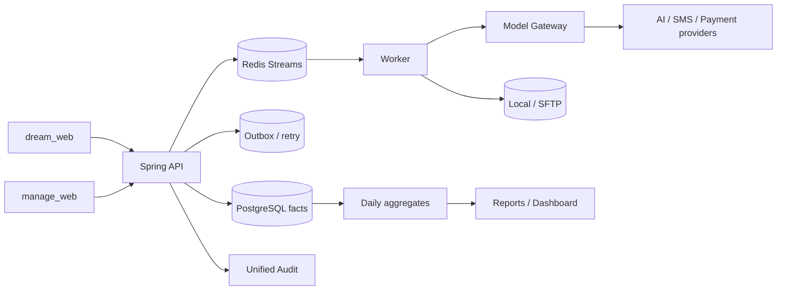

# 未实现功能补齐设计

## 1. 文档目的

本文以仓库基线提交 `f3ea8c6` 为准，把源码审计得到的未实现或部分实现能力整理为一份可执行的后续设计。此次审计快照日期为 `2026-08-30`。本文只描述目标、边界、接口、数据、迁移、实施顺序和验收，不修改业务实现，也不把单元测试中的 mock 当作生产能力。

已有设计分册仍然有效，但分工不同：

- [10 未实现功能与开发验收清单](./10-unimplemented-and-acceptance.md) 是上线阻断项和质量门禁清单；
- [13 前台用户端与 Worker 未实现功能真实实现方案](./13-frontend-worker-real-implementation.md) 详细说明真实基础设施和图片链路；
- [18 用户账单、用户管理、计费规则与支付订单设计](./18-billing-user-management-and-payments.md) 定义交易事实和额度语义；
- [19 管理端运营能力详细设计](./19-admin-operations-capabilities.md) 定义管理治理领域模型。

本文补充三件事：以当前源码重新校准完成状态，指出跨分册的依赖关系，并把尚未落地的功能收敛为可以逐阶段交付的设计。

### 1.1 状态口径

- **已实现**：后端、数据和主要页面均能工作，剩余仅为真实环境验收或常规增强。
- **部分实现**：已有接口、数据结构或页面，但端到端流程、页面写操作、权限、生产一致性或测试仍缺一环。
- **未实现**：当前没有可用的生产领域实现或完整入口；静态配置、指标或 disabled 按钮不算实现。

源码优先于历史文档。比如管理员账号、角色、审核、账单和用户列表在当前提交中已经有部分 API 或页面，但页面仍有断链和只读骨架；反之，`LoopEngine` 虽然存在 `ChatQualityEvaluationModel` 类，运行时却没有注入和调用评估器。

### 1.2 审计范围与证据口径

- 审计范围包括 `dream_service/api`、`dream_service/worker`、`dream_service/common`、`dream_web/src`、`manage_web/src`、数据库迁移、CI 和 `.trellis/tasks`；`*.vite`、`target`、`node_modules` 等构建产物不作为功能证据。
- 当前源码基线为 `f3ea8c6`；本文件记录的是该基线的实现状态，不把设计文档中的目标状态直接当作已交付能力。
- “接口存在”只证明有入口，不证明页面可达、权限完整、事务幂等或真实供应商可用；只有端到端链路和验收证据齐全才可标记为已实现。
- `ObjectStorage.createSignedGetUrl` 在本地/SFTP 实现中抛出 `UnsupportedOperationException` 是已知边界：当前 API 通过受权二进制代理读取对象，不把签名 URL 作为前台契约。
- `GenerationWorkerStore` 的默认 no-op 方法仅用于兼容测试替身；生产实现由 `JdbcGenerationWorkerStore` 提供，不能把该默认实现单独计为生产缺口。
- 当前 `f3ea8c6` 工作树不包含 `bak/`（历史提交曾删除其内容），因此迁移基线中的旧源码和截图无法在本地复核；这属于兼容性证据缺失和切流阻塞，不把它误判为某个业务功能已经完成。

## 2. 当前缺口总览

| 编号 | 能力 | 当前状态 | 当前证据 | 主要缺口 | 优先级 |
| --- | --- | --- | --- | --- | --- |
| G-01 | 短信验证码 | 未实现 | `AuthService.sendCode` 校验手机号后直接返回 `AUTH_CODE_PROVIDER_UNAVAILABLE` | `SmsSender`、供应商验收、IP/手机号限流和故障重试 | P0 |
| G-02 | 真实质量评估与修订循环 | 部分实现 | `LoopEngine` 只做图片可解码校验，并固定 `score=1.0`、`semanticValidation=false` | 注入 `QualityEvaluationModel`，持久化评估和 `RefinementPatch`，按预算循环 | P0 |
| G-03 | 4K/模型能力一致性 | 部分实现 | API `GenerationService` 返回 4K 可用；灵感详情的 fallback 将 4K 设为 `enabled=false` | 能力由服务端统一返回，前端不能维护第二套分辨率事实 | P1 |
| G-04 | 灵感详情互动、通知和用户设置 | 未实现 | 点赞/关注按钮 disabled；更多无处理器；通知和更新日志 disabled；水印只有本地 `ref` | 持久化点赞、关注、通知、更新日志和水印策略，并处理未登录/撤销/幂等 | P1 |
| G-05 | 用户支付闭环 | 部分实现 | 用户端创建订单时固定传 `provider: "mock"`；无支付参数/二维码/支付状态轮询 | 真实 provider adapter、支付参数、订单详情和回调状态展示 | P0 |
| G-06 | 支付可靠性 | 未实现 | webhook 接口信任 body 的 `signatureVerified`；退款生成 `mock-refund-*` | 真实验签、商户校验、outbox、对账、死信和退款异步重试 | P0 |
| G-07 | 额度批次和高风险调整 | 部分实现 | 只能正向 `GRANT`；负数明确返回 `CREDIT_DEBIT_UNSUPPORTED` | `CreditLot`、调整申请/复核/拒绝/执行和可解释的扣回策略 | P0 |
| G-08 | 管理端用户详情 | 部分实现 | `AdminUsersView` 链接到 `/users/{id}`，路由没有该子路由；API 的 `user/userLedger` 未被页面使用 | 六个详情标签页、启停、撤销会话、额度调整和聚合下钻 | P0 |
| G-09 | 管理员账号和角色工作台 | 部分实现 | 后端有账号/角色 API；页面只有管理员启停、角色权限勾选 | 新建/邀请、角色分配、撤销会话、角色创建/编辑和高风险确认 | P0 |
| G-10 | 计费规则和产品工作台 | 部分实现 | 规则页只 GET 列表；产品页只有上下架；后端规则匹配不含完整模型/尺寸条件 | 编辑、预览、冲突证明、版本复制/回滚、产品新建和版本化价格 | P0 |
| G-11 | 统一审计 | 部分实现 | Billing/Moderation 分开写表；审计页固定加载首 30 条 | 统一查询模型、操作者/动作/结果/时间/requestId 筛选、导出和敏感字段策略 | P0 |
| G-12 | 模型/供应商注册表与路由 | 未实现 | Worker 供应商、模型、重试来自 YAML；没有数据库注册表、路由版本和熔断降级 | Provider/Model/Route/Invocation/Health 领域模型和 Worker 快照 | P1 |
| G-13 | 财务报表和运营看板 | 未实现 | 只有订单/流水明细和 Micrometer 运行指标 | 日聚合、收入/退款/成本/毛利、导出、KPI 趋势和业务下钻 | P1/P2 |
| G-14 | 在线系统配置 | 未实现 | 配置只来自 YAML/`DreamSpaceProperties` | 配置定义、版本、预览、发布、回滚、动态刷新和节点回执 | P2 |
| G-15 | 安全与契约门禁 | 部分实现 | 已有基础 Cookie/RBAC/校验；缺 IP 限流、CSRF、完整 JSON Schema/OpenAPI 契约，且模型/供应商原始响应预览仍会写入日志 | 统一错误、输入 schema、跨站防护、日志脱敏和真实数据库契约测试 | P0 |
| G-16 | 生产运维与切流 | 未实现 | CI 已有构建和可跳过 E2E；无 Compose、备份恢复和双栈回滚演练 | 镜像、备份、对象生命周期、告警、BullMQ bridge、灰度和回滚 | P0 |
| G-17 | 生成结果格式契约统一（PNG/WebP） | 部分实现（实现与历史契约不一致） | `GenerationOutputPipeline` 与本地测试实际写 `.png`/`image/png`；迁移基线及设计 03/04/05 仍约定 `.webp`；设计 17 才定义 PNG 迁移和旧 WebP 兼容 | 冻结唯一规范并同步契约、fixture、API MIME、下载和对象生命周期；验证历史 WebP 双读及扩展名/MIME 一致 | P1 |

以下产品能力属于明确的后续产品边界，不纳入本轮平台补齐：视频生成、画布编辑、局部重绘、批量资产管理、社区发布和完整社交图谱（例如关注流、评论、私信），以及完整版权工作流。灵感详情页的最小点赞/关注、通知和用户偏好仍属于本轮 G-04；它们只记录平台内的基础互动，不等同于建设社区产品。上述独立产品必须在平台治理能力稳定后单独立项，不能通过当前 disabled 按钮隐式实现。

G-17 不是说 PNG 编码器尚未开发：当前生产管线已经写 PNG。它表示规范来源尚未收敛；在规范冻结前，不能把旧 WebP 文档、数据库中的历史 MIME、前端下载扩展名和新 PNG 对象混为同一完成状态。

### 2.1 已确认不纳入缺口的能力

这些能力在当前源码中已有可用的领域实现或明确的兼容边界；剩余工作主要是生产环境验收，不应重复列为“从零开发”：

| 能力 | 当前结论 | 仍需关注 |
| --- | --- | --- |
| 密码 + 图形验证码登录、邮箱注册 | 已有 API、哈希、协议同意和会话 Cookie | SMTP/验证码真实环境、限流和故障演练仍需验收 |
| 生成会话、草稿、额度 reserve/consume/release、任务/SSE | API、持久化和前端工作台已存在 | 真实 PostgreSQL/Redis/Worker/模型链路及移动端回归仍需验收 |
| 参考图上传、WebP 规范化、归属校验和结果代理读取 | API 与 Worker 的存储适配器已存在 | 对象存储中断、清理重试和 SFTP 故障注入仍需验收；签名 URL 不属于当前契约 |
| 生成结果 PNG 写入、历史 WebP 读取 | `GenerationOutputPipeline`、`PngImageWriter`、对象键策略和 API 二进制代理已存在 | G-17 仍需冻结文档规范，并用新 PNG 与历史 WebP fixture 验证扩展名、魔数、MIME、下载和清理 |
| 内容审核案件、申诉和处理 API | 数据表、服务和管理端详情入口已存在 | 真实审核模型、数据库集成和运营批量流程仍需验收 |
| 管理员认证、数据库 RBAC、用户/订单/规则基础 API | 后端迁移、服务和部分页面已存在 | 页面写操作、聚合详情、精确权限和真实基础设施测试仍未闭环 |

### 2.2 关键源码证据索引

以下行号用于复核本次矩阵；源码移动后应在下一次审计中更新：

| 结论 | 证据入口 |
| --- | --- |
| 短信验证码未接入 | `dream_service/api/src/main/java/com/dreamspace/api/service/AuthService.java:49-53`；`AdminAuthService.java:23-28` |
| 质量评估 wiring 与循环未生效 | `dream_service/worker/src/main/java/com/dreamspace/worker/generation/LoopEngine.java:16-45`；`GenerationWorkerConfiguration.java:69-76` |
| 支付仍为 mock/请求体验签 | `dream_web/src/views/AccountView.vue:31`；`PaymentWebhookController.java:15-21`；`BillingService.java:225-233,288-308` |
| 前台详情互动、通知和水印为占位 | `dream_web/src/layouts/InspirationShell.vue:16,36,45,48`；`InspirationDetailView.vue:27,289` |
| 管理端用户详情断路由、规则/审计只读 | `manage_web/src/router/index.ts:25-34`；`AdminUsersView.vue:8`；`AdminPricingRulesView.vue:1-6`；`AdminAuditEventsView.vue:1-7` |
| 模型/报表/配置/运维缺少完整领域入口 | `docs/design/19-admin-operations-capabilities.md:31-42`；`.trellis/tasks/08-16-operations-cutover/prd.md` |
| 模型原始响应和提示信息存在日志泄露风险 | `dream_service/worker/src/main/java/com/dreamspace/worker/generation/ChatPlanningModel.java:98-161`；`ChatQualityEvaluationModel.java:113-117`；`ChatContentModerator.java:54-58`；`OpenAiCompatibleImageGenerationModel.java:70-89` |
| 生成结果格式与历史契约冲突 | `dream_service/worker/src/main/java/com/dreamspace/worker/generation/GenerationOutputPipeline.java:3-4,19-26,56-83`；`dream_service/worker/src/test/java/com/dreamspace/worker/generation/GenerationOutputPipelineLocalTest.java:48-53`；`dream_service/api/src/main/java/com/dreamspace/api/service/GenerationService.java:223-228`；`dream_service/api/src/main/java/com/dreamspace/api/controller/GenerationController.java:106-112`；`dream_web/src/features/generation/GenerationWorkspaceView.vue:132,181`；`docs/migration-baselines/data-contracts.md:44-50`；`docs/design/03-backend-api.md:84`；`docs/design/04-worker-ai.md:39-40,90`；`docs/design/05-data-and-infrastructure.md:43-45`；`docs/design/17-generation-page-optimization.md:13,41-55,63` |

### 2.3 发现但需产品确认的认证闭环

邮箱注册目前会创建 `phone = NULL` 的邮箱-only 用户并立即建立会话；但 `AuthService.PasswordLoginRequest`、`passwordLogin` 和 `LoginView.vue` 仍只接受手机号，并通过 `findUserByPhone` 查找账号。用户退出登录或会话过期后，没有邮箱密码再次登录的入口；账户页和管理端用户/订单查询也主要依赖手机号，邮箱-only 用户会显示为通用掩码且难以检索。

这不是把既有手机号登录契约擅自改成邮箱登录的理由：`08-25-email-registration` 明确写着“手机号登录继续可用”，而 `08-18-user-password-captcha-login` 又把密码登录定义为手机号入口。它们与“邮箱作为唯一身份、支持邮箱-only 账号”之间存在未决的产品契约冲突，因此暂不把它计入 G-01 至 G-17 的已确认矩阵。若产品确认邮箱-only 账号必须可持续登录，应单独建立 **G-18 邮箱账号再次登录闭环（P0）**，至少覆盖：

1. 密码登录请求支持经过同一规范化策略的手机号或邮箱，错误码保持不可枚举；
2. 登录页、密码重置/找回策略、账户标识和管理端搜索/详情展示邮箱掩码；
3. 为邮箱登录、手机号登录、邮箱-only 账号和历史短信账号分别补充迁移后 PostgreSQL、契约和 E2E 验收；
4. 明确是否允许绑定手机号、改绑邮箱及其会话撤销/审计语义，未决前不能通过前端别名或本地状态绕过。

## 3. 设计目标与约束

### 3.1 必须保持的事实源

1. `QuotaLedgerEntry` 是额度事实源，`QuotaAccount` 是锁定后的投影；生成任务继续遵守 `reserve -> consume/release`。
2. `BillingOrder`、`PaymentTransaction` 和 `Refund` 是金额侧事实，不把支付金额直接写入额度快照。
3. 任务状态、阶段事件、SSE cursor、`(taskId,index)` 结果幂等键和用户/管理员 Cookie 隔离保持不变。
4. 已提交任务快照保存计费规则和模型路由，规则或路由发布后不重写历史任务。
5. 所有供应商密钥只通过环境变量或 Secret 引用注入，数据库、日志、审计和前端响应不得出现明文。
6. `bak/` 只读；现有 YAML 测试配置值是项目测试数据，不能因为本设计而删除或替换。
7. 生成结果允许新 PNG 与历史 WebP 并存读取；默认写入后缀和对外 MIME 必须由 G-17 冻结的单一契约决定，不能由前端或存储适配器各自推断。

### 3.2 横切质量要求

- 所有写操作使用幂等键或版本/`If-Match`，并在数据库事务中写审计；冲突统一返回 `409 RESOURCE_VERSION_CONFLICT`。
- 依赖不可用时必须 fail-closed：短信/支付/模型/审核不可用不能伪造成功，Worker readiness 不能报告可用。
- 错误响应只暴露稳定 `code` 和用户可理解的 message；供应商原始响应、Prompt、验证码、Cookie 和密钥不出现在日志。
- 每项能力都要同时有契约测试、业务单元测试、真实基础设施集成测试和关键链路 E2E；缺少真实供应商时只能标记“未验收”。

## 4. 目标架构



运行时分成六个边界：

| 边界 | 责任 | 不负责 |
| --- | --- | --- |
| User Experience | 灵感、生成、账户、通知和本地交互 | 直接修改额度或订单状态 |
| Admin Operations | 用户、管理员、规则、审核、审计和运营查询 | 绕过领域服务写事实表 |
| Model Gateway | 供应商、模型、路由、健康、重试、熔断、成本事实 | 生成任务状态机和用户扣费 |
| Payment Gateway | 创建支付、验签、退款、回调幂等和 provider 对账 | 直接发放点数 |
| Runtime Configuration | 版本化业务策略和动态刷新 | 数据库/Redis/存储地址和密钥明文 |
| Audit & Analytics | 统一审计、日聚合、报表和看板 | 取代应用日志或 Prometheus |

## 5. 生成与模型能力补齐

### 5.1 质量评估和 Loop Engine

当前 `LoopEngine` 必须改为以下顺序，不能以技术解码结果代替语义评估：

```text
图片模型 -> 技术校验 -> QualityEvaluationModel
         -> 记录 EvaluationReport
         -> accepted: 输出落盘
         -> repairable && 未超预算: RefinementPatch -> 下一轮
         -> 其他: 失败/部分成功并释放未消费额度
```

目标构造器和 Bean：

```java
LoopEngine(
    GenerationWorkerStore store,
    ImageGenerationModel imageModel,
    QualityEvaluationModel evaluator,
    int maxIterations,
    double acceptScore)
```

每轮必须持久化 `taskId、iteration、promptHash、provider、model、providerRequestId、score、accepted、violations、repairable、evaluatorVersion、refinement`。幂等键为 `taskId:iteration:promptHash`，重试不得重复扣点。

评估器输入包含四类规划 Artifact、当前图片字节、任务硬约束、迭代编号及目标/参考图；输出严格 JSON。服务端无论评估结果如何都继续执行图片数量、MIME、解码、尺寸和安全校验。达到 `accept-score` 且无硬性违规才允许进入 `GenerationOutputPipeline`。

`max-loop-iterations` 和 `accept-score` 必须真正参与控制；评估器不可用、输出非法、同一违规连续出现或循环超预算时，写终态事件、清理已写对象并释放额度。评估模型和规划模型可以复用 ChatModel 连接，但系统指令、指标标签和超时必须隔离。

实现时还必须修正 Spring wiring：当前 `GenerationWorkerConfiguration` 没有提供 `QualityEvaluationModel` Bean，`loopEngine` Bean 只传入 `maxLoopIterations`，因此运行时仍不会执行语义评估。应新增独立 evaluator Bean，并将 `acceptScore` 与 `maxLoopIterations` 一并传入；缺少评估模型配置时 Worker 启动或 readiness 必须失败，不能静默退回技术完整性分数。

### 5.2 模型注册、路由和健康

新增领域表（字段可按现有迁移命名规范落地）：

| 表 | 关键字段 | 约束 |
| --- | --- | --- |
| `AiProvider` | `id、code、name、baseUrl、secretRef、status` | code 唯一；不保存密钥明文 |
| `AiModel` | `id、providerId、name、capabilitiesJson、status` | 能力 Schema 校验；供应商删除受历史引用保护 |
| `ModelRoute` | `id、stage、version、status、conditionsJson` | `DRAFT/PUBLISHED/RETIRED`；版本不可原地修改 |
| `ModelRouteTarget` | `routeVersionId、modelId、priority、weight` | 权重、能力和循环降级校验 |
| `ProviderHealthSnapshot` | `providerId、modelId、stage、status、latencyMs、errorCode、checkedAt` | 可覆盖的短期投影 |
| `ModelInvocation` | `taskId、attemptId、stage、routeVersionId、providerId、modelId、status、latencyMs、costMinor` | 追加写；用于成本和可靠性分析 |

路由选择顺序：stage 和请求能力匹配 -> 排除停用/熔断/并发已满目标 -> 同优先级按 taskId 稳定哈希加权 -> 保存 route/provider/model 快照 -> 调用模型。连接失败、超时、429、5xx 按指数退避并在候选目标间降级；401/403、能力不支持、输入审核拒绝和参数错误不能通过换模型掩盖。熔断状态放在 Redis，Redis 故障时使用进程内退化但仍受任务总尝试上限约束。

管理页面提供供应商、模型、健康和调用事实查询；凭据只显示“已绑定/轮换”，不提供明文查看。YAML 继续作为空数据库或迁移期 bootstrap/fallback，数据库发布路由后不能静默回落到未知默认模型。

### 5.3 4K 和价格能力单一来源

`GenerationService.options()`、灵感详情和生成工作台都只消费同一个服务端能力响应。响应中的 `enabled、disabledReason、maxEdge、maxPixels、unitCost` 来自当前已发布模型能力和 `PricingRule`，前端不得硬编码 4K 是否可用。提交时再次由服务端校验能力和规则，防止篡改前端请求绕过限制。

### 5.4 生成结果格式契约统一

当前生产管线和测试已经使用 `PngImageWriter`，将结果和缩略图写为 `.png`/`image/png`；`ObjectKeyPolicy`、Local/SFTP 存储也已允许新 PNG 与历史 WebP。问题在于旧的迁移基线、后端/Worker 设计分册和知识库仍把 WebP 写成唯一结果格式，而设计 17 才补充了 PNG 迁移说明。该冲突必须在上线前通过一个明确的契约决策消除，不能由调用方猜测扩展名。

建议将设计 17 作为当前候选规范，并完成以下兼容动作：

1. 更新 HTTP、数据、Worker 和知识库契约，明确新写入为 PNG、历史 WebP 只读兼容，并在 OpenAPI、fixture、类型定义和下载命名中使用同一规则；
2. 结果读取以数据库 `mimeType` 和受控对象键为准，扩展名、魔数和响应 `Content-Type` 必须一致；当前 `GenerationService.result`/存储适配器按对象键推导 MIME、前端下载又固定 `.png`，需改为经过校验的持久化 MIME/响应类型，并按实际类型命名下载文件；历史 WebP 与新 PNG 各做一次 API 代理、缩略图、下载和权限回归；
3. 对象生命周期、孤儿清理、备份恢复和迁移脚本同时覆盖两种后缀；不得为了“统一”批量重写历史对象或改变既有结果 ID；
4. 若产品最终选择继续使用 WebP，则反向切换 Writer、对象键、MIME、前端下载和全部测试，禁止在未决状态下产生第三种隐式格式。

在决策完成前，G-17 的状态保持“部分实现（契约未收敛）”，不把已有 PNG 编码实现重复计为缺失功能。

## 6. 认证、支付和额度

### 6.1 短信与注册消息

新增 `SmsSender` 端口和供应商实现，保留当前挑战哈希、过期和消费语义。`POST /dream_web/auth/codes` 与 `/manage_web/auth/codes` 的流程为：

1. 规范化手机号并计算客户端/IP 限流键；
2. 通过 Redis 滑动窗口限制手机号、IP、账号和全局供应商 QPS；
3. 创建一次性挑战并只保存哈希；
4. 调用真实短信供应商，成功返回 `challengeId`，失败删除挑战并返回 `AUTH_CODE_PROVIDER_UNAVAILABLE`；
5. 供应商超时/429/5xx 按有限重试和 `Retry-After` 处理，不能返回验证码内容。

部署未配置供应商时保持明确 503，不引入演示码。邮件注册路径已经有 SMTP 抽象，仍需在真实 SMTP 环境验证频率限制、失败回滚和敏感字段脱敏。

### 6.2 支付 Provider Adapter

用户端新增支付准备和状态查询：

| 方法 | 路径 | 说明 |
| --- | --- | --- |
| `POST` | `/dream_web/account/orders` | 创建订单，保留幂等键和产品快照 |
| `POST` | `/dream_web/account/orders/{orderNo}/payment` | 请求 provider 支付参数/二维码引用 |
| `GET` | `/dream_web/account/orders/{orderNo}` | 订单、支付和退款状态 |
| `POST` | `/dream_web/account/orders/{orderNo}/cancel` | 取消未支付订单 |
| `POST` | `/internal/billing/webhooks/{provider}` | provider 原始回调，服务端验签 |

后端定义：

```java
interface PaymentProvider {
  PaymentIntent createPayment(BillingOrder order);
  VerifiedWebhook verifyWebhook(HttpRequest request, byte[] rawBody);
  RefundResult refund(BillingOrder order, RefundRequest request);
}
```

Controller 不再接收或信任 `signatureVerified` 布尔字段。适配器负责签名、商户号、订单号、金额、币种和 provider transaction 校验；原始 payload 只保存脱敏/加密引用。支付成功事务内写 `PaymentTransaction`、订单状态和 `GRANT(sourceType=ORDER)`，唯一事件键保证重复回调只发放一次。

退款改为 `REQUESTED -> PROCESSING -> SUCCEEDED/FAILED`：先写本地退款事实和 outbox，再异步调用 provider；未消费订单可自动全额退款，已消费额度进入人工审核或 CreditLot 扣回流程，不允许静默造成负数。

### 6.3 Outbox、对账和死信

新增 `BillingOutboxEvent`、`PaymentWebhookDeadLetter` 和 `BillingReconciliationRun`。支付回调、退款请求和额度发放在同一数据库事务内产生 outbox；后台 worker 负责发送、重试、退避和死信。每日对账比较 provider 订单、PaymentTransaction、BillingOrder 和额度 GRANT，差异进入人工队列并告警。所有任务按 `providerEventId`、`orderNo` 和业务幂等键可重入。

### 6.4 CreditLot 与额度调整审批

首期仍可保留无期限总账，但为有效期和退款追缴预留：

| 表 | 关键字段 | 说明 |
| --- | --- | --- |
| `CreditLot` | `id、userId、sourceType、sourceId、granted、available、expiresAt` | 按最早过期优先扣减 |
| `CreditAdjustment` | `id、userId、amount、reason、status、requestedBy、approvedBy、executedAt、idempotencyKey` | `PENDING/APPROVED/REJECTED/EXECUTED` |

小额正向赠送可按策略自动批准；大额赠送、所有扣减和退款追缴需要第二管理员复核。最终仍只调用 `QuotaTransactionService` 写不可变流水，调整申请本身不能直接更新 `QuotaAccount`。

## 7. 用户端补齐

### 7.1 灵感详情互动、通知和设置

新增最小数据模型：`InspirationLike(userId,inspirationId)`, `InspirationFollow(userId,authorId)`, `Notification`, `ChangelogEntry`, `UserPreference`。唯一键保证点赞/关注幂等，撤销使用软删除或事件记录，不直接修改历史审计。

建议接口：

| 方法 | 路径 | 权限/说明 |
| --- | --- | --- |
| `POST/DELETE` | `/dream_web/inspirations/{id}/like` | 登录用户幂等点赞/取消 |
| `POST/DELETE` | `/dream_web/inspirations/{id}/follow` | 登录用户关注/取消 |
| `GET` | `/dream_web/notifications` | 只读自己的通知，cursor 分页 |
| `POST` | `/dream_web/notifications/{id}/read` | 幂等已读 |
| `GET` | `/dream_web/changelog` | 已发布更新日志 |
| `GET/PATCH` | `/dream_web/account/preferences` | 水印等用户偏好 |

详情页的 Follow、Like、More 必须有加载、未登录、请求中、成功、失败和撤销状态；接口不可用时显示真实不可用状态，不能只改数字。水印偏好应在生成提交快照中记录，并由 Worker 输出阶段决定是否应用，不能由布局组件中的本地 `ref` 充当事实源。

### 7.2 用户账单交互

账户页购买按钮先创建订单，再展示支付准备结果和状态；订单列表可打开详情、取消未支付订单、轮询或通过 SSE/刷新显示支付和退款状态。provider 不写死为 `mock`；mock 只能在明确的测试 profile 中由后端注入。

## 8. 管理端补齐

### 8.1 用户详情工作台

新增路由 `/users/:id` 和聚合接口 `GET /manage_web/users/{id}`，返回概览、额度四元组、任务/订单摘要、会话状态和审计摘要；各标签页独立分页，避免一次查询加载全部历史。详情页可执行启用/禁用、撤销全部会话和额度调整，并显示原因、影响范围、版本冲突和结果。

`AdminUsersView` 的查看链接必须只指向已注册路由；服务端继续按 `users:read/write` 校验，前端隐藏入口不能作为授权依据。手机号、邮箱、支付凭证和模型请求内容在详情和审计中脱敏。

### 8.2 管理员、角色和权限

保留当前数据库 RBAC 和权限码，补齐页面能力：

- 管理员列表：新建/邀请、启停、编辑显示名、角色分配、撤销会话、版本冲突重试；
- 角色列表：创建自定义角色、编辑描述/状态、权限矩阵替换；系统角色只读；
- 所有高风险动作需要原因、二次确认，并保护“最后一个 ADMIN”不可被停用或降权；
- 权限缓存以 `adminId + permissionRevision` 为键，变更后撤销受影响会话并回源数据库。

### 8.3 规则、产品和审核

- 计费规则页面增加草稿创建/编辑、价格预览、模型/分辨率/宽高区间冲突检测、发布、下线、复制历史版本和回滚；ACTIVE/RETIRED 规则不可原地改写。
- 规则匹配按 operation -> 精确模型 -> 精确分辨率 -> 宽高闭区间 -> 时间窗口排序；同等特异度多命中返回 `PRICING_RULE_AMBIGUOUS`。
- 产品页面增加草稿创建和版本化价格；被订单引用的产品只允许复制新版本，不能修改金额和点数快照。
- 审核队列当前已有查询、详情、申诉和处理 API；补齐真实 PostgreSQL/审核模型 E2E、处理备注、批量风险提示和不可变审计，不把模型结论覆盖为人工结论。

### 8.4 统一审计

新增统一 `AuditEvent` 写入器，迁移期兼容读取 `BillingAuditEvent` 与 `ModerationAuditEvent`，最终统一字段：

`id, requestId, actorId, actorType, action, resourceType, resourceId, outcome, reason, beforeJson, afterJson, createdAt`。

查询支持时间范围、操作者、动作、资源、结果、requestId 和 subject；导出采用异步任务、短期下载授权和审计记录。敏感字段在写入前按字段白名单脱敏，禁止保存 Cookie、验证码、密码、支付签名和完整 Prompt。

## 9. 报表、配置和运维

### 9.1 日聚合、报表与导出

新增 `DailyGenerationAggregate`、`DailyBillingAggregate`、`DailyModelCostAggregate` 和 `ReportExportJob`。聚合以固定业务时区按事实发生时间归属，D+0 增量、次日重算 D-2..D；每次运行记录窗口、watermark、rowCount 和 checksum，允许重入。

首期报表范围：订单收入、退款、售出/赠送/消耗点数、生成成功率、供应商成本和估算毛利。金额和点数分栏展示，报表必须能回溯到订单、额度流水和 ModelInvocation，不能用 Prometheus counter 代替财务事实。导出大结果使用后台任务、过期链接和 `reports:export` 权限。

### 9.2 运营看板

提供 `/manage_web/operations/overview` 聚合 API 和管理页，分为用户、生成、财务、模型可靠性、审核/风险五类卡片。每张卡片给出统计窗口、数据延迟和下钻链接；无数据时显示“暂无数据/延迟”，不能伪造 0。运行时指标来自 Micrometer，业务指标来自日聚合和事实查询，两者不混合。

### 9.3 在线配置中心

新增 `SystemConfigDefinition`、`SystemConfigVersion`、`ConfigReleaseReceipt`：定义类型、JSON Schema、默认值、环境、负责人、动态性和敏感级别。发布流程为草稿 -> 预览校验 -> `PUBLISHED` -> 节点拉取/回执；非动态配置只在重启后生效，失败回滚到最后一个已验证版本。数据库、Redis、SFTP 地址和任何密钥不进入在线配置中心。

### 9.4 安全、镜像和切流

补齐以下工程能力：

1. API 全局 requestId、Origin/Referer/CSRF 检查、Redis IP/账号/接口限流和统一 JSON Schema 校验；
2. manage_web task、reconciliation、inspiration、billing、RBAC Controller 的 OpenAPI 与真实 PostgreSQL 契约测试；
3. 统一模型/供应商日志策略：只允许 `taskId、stage、status、responseLength、responseShape、errorCode` 和脱敏 request ID，删除 `responsePreview`、完整 Prompt、`expansionReason` 和供应商原始 body；
4. API/Worker/两个前端的 Docker 镜像和本地 Compose profile；数据库定期备份、恢复演练、对象生命周期和孤儿对象清理；
5. 若迁移期仍存在 Node BullMQ 生产者，提供只做消息格式转换的 bridge；Java Worker 不直接依赖 Node 业务实现；
6. 双栈灰度按路由和租户切流，监控错误率、延迟、额度差异和队列积压；回滚只切回旧服务，不回写或删除已产生的事实数据。

## 10. 迁移和实施顺序

### Phase 0：契约冻结与观测基线（P0）

- 冻结新增接口、错误码、权限码、事件和数据脱敏规则；
- 冻结 G-17 的结果格式规范，更新旧 WebP 契约并建立 PNG/历史 WebP 双读 fixture；
- 为当前“有 API 无页面”的用户/管理员/规则/产品/审计功能补充契约 fixture；
- 修正 4K 能力单一来源，给 Loop Engine 增加 evaluator 注入测试；
- 建立真实 PostgreSQL、Redis、local/SFTP、SMTP 和支付 sandbox 的启动说明。

### Phase 1：正确性和高风险操作（P0）

- 接入短信 provider、IP/手机号限流、CSRF 和 JSON Schema；
- 完成质量评估/修订循环和真实生成 E2E；
- 完成用户详情、管理员账号/角色页面、规则/产品写页面和统一审计查询；
- 引入支付 adapter、真实验签、支付准备接口和退款 outbox；
- 先交付 Compose、备份恢复和最小告警，阻断不满足条件的切流。

### Phase 2：模型运营和计费可靠性（P1）

- 建立供应商/模型注册表、健康探测、路由发布、熔断和降级；
- Worker 保存 route/provider/model/invocation 快照和成本事实；
- 完成 CreditLot、额度调整审批、支付对账、webhook 死信和退款重试；
- 完成真实 provider 的 timeout、429、5xx、401/403、URL 下载和请求 ID 脱敏验收。

### Phase 3：数据产品和用户体验（P1/P2）

- 日聚合、财务报表、异步导出和运营看板；
- 在线配置发布、回滚和节点回执；
- 点赞、关注、通知、更新日志和水印服务端偏好；
- 管理端移动/平板可访问性和完整截图基线。

### Phase 4：独立产品立项

视频、画布、局部重绘、资产管理、社区和版权工作流独立评审，不与上述平台治理迁移混在同一数据库版本或切流窗口中。

### 10.1 依赖关系

```text
契约/审计/安全基线
      |
      +--> 用户与管理员工作台
      +--> 支付 adapter + outbox
      +--> 质量评估循环
                    |
                    +--> 模型注册表与路由
                                      |
                                      +--> 日聚合/报表/看板
```

支付对账依赖统一审计和事实快照；模型路由依赖供应商注册表；看板依赖日聚合和统一 requestId。没有这些前置条件时，不应先做仅展示的“假看板”或“假支付成功页”。

### 10.2 与 Trellis 任务的追踪矩阵

下表把缺口映射到当前任务树。任务状态只表示规划/执行状态，不等同于功能验收；`prd.md` 中仍有未勾选的验收项时，缺口仍保持未完成。

| 缺口 | 现有任务 | 当前任务状态 | 实施动作与退出条件 |
| --- | --- | --- | --- |
| G-01 短信验证码 | 无独立任务 | — | 新建短信供应商、限流和故障重试任务；真实供应商 sandbox 与未配置 503 验收通过后关闭 |
| G-02 质量评估循环 | `08-17-image-generation-harness-loop` | `in_progress` | 重新以源码为准核验；任务说明中的“评估器已完成”与 `LoopEngine` 实际行为冲突，必须补 evaluator 注入、修订和额度释放测试 |
| G-03 4K 能力一致性 | `08-19-image-generation-parameters-role-inference` | `in_progress` | 将能力响应单一来源和前端 fallback 修正纳入任务验收，覆盖 2K/4K 能力变化 |
| G-04 详情互动、通知、水印 | 无独立任务 | — | 新建用户端社交/通知/偏好任务；接口、持久化、撤销、未登录和刷新恢复 E2E 全部通过 |
| G-05/G-06 支付生产化 | `08-24-billing-user-management-payments`、`08-27-account-billing-redesign` | `in_progress` | 前者明确把真实支付凭据列为 out of scope，后者只覆盖账户页呈现；另建支付 adapter/outbox/对账任务，真实签名和退款 sandbox 通过后关闭 |
| G-07 额度调整审批 | `08-25-admin-credit-adjustment-approval` | `planning` | 完成双人复核、CreditLot/扣减策略和并发额度恒等式测试 |
| G-08/G-11 用户详情与统一审计 | `08-25-admin-user-detail-unified-audit` | `planning` | 先交付聚合详情和统一查询，再开放高风险写操作；筛选、分页、脱敏和审计回读通过 |
| G-09 管理员与角色工作台 | `08-25-admin-account-role-management` | `in_progress` | 补齐页面未使用的创建、角色替换和会话撤销入口，并完成 Docker/并发/最后 ADMIN 验收 |
| G-10 规则与产品工作台 | `08-25-admin-pricing-rule-workbench` | `planning` | 完成规则冲突证明、预览、版本复制/回滚和产品版本化页面 |
| G-12 模型注册与路由 | `08-25-admin-provider-model-registry`、`08-25-admin-model-routing-worker` | `planning` | 先完成注册表，再接入路由/熔断/降级；两项任务必须共享 route 快照和成本事实契约 |
| G-13 报表与看板 | `08-25-admin-cost-daily-aggregates`、`08-25-admin-financial-reports-export`、`08-25-admin-operations-dashboard` | `planning` | 按“调用事实 -> 日聚合 -> 报表/看板”顺序交付，并通过 checksum、下钻和延迟标识验收 |
| G-14 在线配置 | `08-25-admin-system-configuration` | `planning` | 完成 Schema 校验、发布回执、动态性边界和可审计回滚 |
| G-15 安全与契约门禁 | `08-16-quality-regression`、`08-16-auth-inspiration-api` | `review` | 将 CSRF、IP/账号限流、JSON Schema、OpenAPI 和真实数据库契约列为阻断检查，不以已有单元测试代替 |
| G-16 运维与切流 | `08-16-operations-cutover`、`08-16-legacy-retirement` | `planning` | Compose、备份恢复、bridge、灰度、回滚演练和审批证据齐全后才能退休旧栈 |
| G-17 结果格式契约 | `08-24-generation-page-visual-refresh`、`docs/design/17-generation-page-optimization.md` | `in_progress` / 设计已提交 | 新建契约同步任务；冻结 PNG 或 WebP 单一写入规范，验证历史双读、MIME/魔数、下载和对象生命周期后关闭 |

当前任务树还存在两个治理问题：一是 G-01、G-04、G-05/G-06、G-15 的完整实现没有独立可追踪任务；二是 G-01、G-02、G-05、G-06、G-08、G-09、G-10、G-15、G-16 在本设计中属于 P0，但对应任务元数据多数仍为 `P2`（G-16 对应任务为 `P1`，G-15 的质量回归任务为 `P0`，但验收仍未完成）。G-17 还缺少独立的契约同步任务，不能只依赖设计 17 的历史提交。开始编码前应先补建任务或调整优先级，并在任务 `prd.md`、`design.md`、`implement.md` 中引用本文件的 G 编号。

### 10.3 新任务的完成门槛

每个 G 编号只能在以下证据全部存在时关闭：

1. 源码、迁移和配置变更已关联到该 G 编号，且没有依赖未关闭的前置 G 编号；
2. API/数据契约、业务单元测试、真实基础设施集成测试和关键链路 E2E 均有可复现记录；
3. 前端能力具备加载、空、错误、无权限、处理中和成功/撤销状态，管理端写操作刷新后可回读；
4. 观测指标、告警、脱敏检查、回滚步骤和责任人已经记录；
5. 对外供应商不可用时系统保持 fail-closed，不能用 mock、固定成功响应或前端本地状态替代生产事实。

## 11. 验收标准

### 11.1 功能与数据

- 短信供应商未配置、超时或限流时返回稳定错误，不产生可用挑战；成功发送的挑战只能消费一次。
- 质量评估未达标时至少执行一次真实评估；可修订结果在循环预算内生成下一轮；超限终态释放额度且不落孤儿对象。
- 真实支付回调重复 10 次只产生一笔 PaymentTransaction 和一次 ORDER GRANT；金额、币种、签名或商户号不匹配不改变余额。
- 用户详情、管理员、规则、产品和审计页面的写操作在刷新后仍可从数据库读回，并显示原因、操作者和版本。
- 规则发布存在重叠或歧义时拒绝；历史任务仍展示提交时规则和模型路由快照。
- 新任务结果的对象后缀、魔数、数据库 MIME 和 API `Content-Type` 始终一致；历史 WebP 结果仍可读取、预览和下载，下载文件名为 `.webp` 而非被误标为 `.png`，且不会被批量改写。
- 点数满足 `total = available + reserved + used`；额度调整和退款不会因重试重复发放或扣减。

### 11.2 安全与一致性

- 普通用户 Cookie 不能访问管理接口；VIEWER 写请求均为 403；所有资源读取按归属校验。
- CSRF、Origin、IP/账号限流和 JSON Schema 在 API 层统一执行；错误响应和审计快照不包含秘密或完整敏感输入。
- Worker 日志和指标不包含完整 Prompt、模型原始响应、`responsePreview`、验证码、Cookie、密钥或未脱敏供应商响应；日志脱敏扫描在 CI 中阻断违规提交。
- Provider URL 仅允许配置的 HTTPS 目标，禁止私网/路径逃逸；对象存储部分写入有清理和重试记录。
- 管理员角色/权限变化和账号停用立即撤销受影响会话，不能停用最后一个 ADMIN。

### 11.3 测试与运维

- 单元、契约、Testcontainers PostgreSQL/Redis/SFTP、真实 SMTP/支付 sandbox 和真实模型人工联调分别有结果记录；不能以 `RUN_REAL_E2E` 默认跳过作为通过。
- 前台和管理端在 `1440x900、1024x768、800x1024、390x844` 完成中英文、浅/深色、加载/空/错/成功状态截图和可访问性回归。
- 备份可恢复到一次性环境；对象生命周期和孤儿清理可演练；Prometheus/业务看板指标含窗口、延迟和告警阈值。
- 灰度期间可在不修改历史事实的情况下切回旧 Node 栈或上一版本 Java 服务，回滚演练至少完成一次。

## 12. 风险与待决策项

1. 短信和支付 provider 的具体供应商、区域合规、费用和 SLA 需要产品/运维确认；设计只定义 adapter 契约。
2. CreditLot 的有效期、FIFO/最早过期策略和已消费订单退款追缴规则需要财务确认；在确认前只开放未消费全额退款。
3. 模型路由的权重、熔断阈值和成本字段依赖真实供应商计费口径；上线前必须用 sandbox/账单对账校准。
4. 通知、点赞、关注和更新日志涉及隐私保留期限、撤回语义和审核策略，不能只在前端增加本地状态。
5. 当前历史文档中的“已实现”可能描述了之前的目标状态；每次阶段完成后应回写 `10`、`13`、`19` 的状态和验收证据，保持本文件与源码一致。
6. PNG/WebP 的规范选择会影响对象生命周期、客户端缓存和下载兼容；在 G-17 决策前不得让不同服务各自决定默认后缀。
