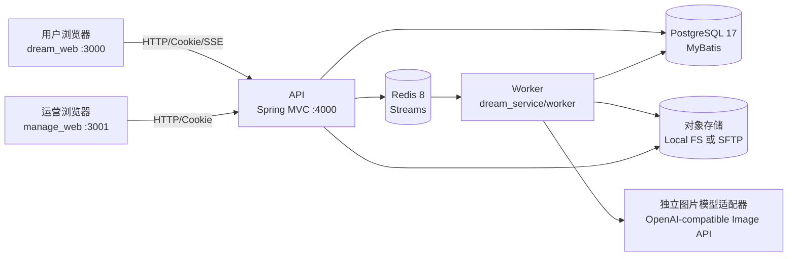

# Dream Space 当前系统设计方案

> 依据当前仓库源码整理，基线提交：`6a5a953`。本文描述现状，不替代产品需求、上线方案或安全规范。

## 1. 系统定位与边界

Dream Space 是面向中文用户的 AI 图片创作平台，主链路为“浏览灵感 -> 复用提示词/参数 -> 提交图片生成 -> 查看、预览和下载结果”。系统同时提供运营管理端，用于维护公开灵感内容、查询生成任务和查看额度对账。

当前已经覆盖：公开灵感瀑布流、作品详情、手机号验证码登录协议与会话、生成会话与草稿、参考图上传、图片生成任务、Redis Streams 异步处理、额度预留/消费/返还、SSE 任务事件、结果图片访问与下载、用户账户与额度流水、支付订单/回调幂等、可配置生成计费规则、管理端用户/订单/产品/审计查询、灵感 CRUD/发布、额度对账。

当前明确不属于已交付范围：真实图片模型供应商、真实短信服务、视频、画布编辑、真实支付供应商 adapter、支付对账/outbox、社区发布、完整资产管理、人工审核队列、模型供应商路由和复杂额度批次有效期。

## 2. 总体架构

### 2.1 运行时职责

| 组件           | 目录               | 职责                                                       | 默认端口/入口      |
| -------------- | ------------------ | ---------------------------------------------------------- | ------------------ |
| 用户端         | `dream_web`        | 灵感浏览、登录、生成工作台、结果展示                       | Vue 3 + Vite 5，`/dream_web/` |
| 管理端         | `manage_web`       | 管理员登录、任务查询、灵感管理、对账摘要                   | Vue 3 + Vite 5，`/manage_web/` |
| API            | `dream_service/api`| 鉴权、业务校验、数据库读写、队列投递、SSE 和资源代理       | Spring Boot 4 + MVC，`4000`  |
| Worker         | `dream_service/worker` | 消费生成队列、调用模型、审核、图片处理、结果落盘、额度对账 | Spring Boot 4 worker |
| PostgreSQL     | 外部基础设施       | 持久化用户、会话、任务、额度、内容和事件                   | `5432`             |
| Redis          | 外部基础设施       | Redis Streams 队列和任务异步解耦                            | `6379`             |
| Local/SFTP     | `dream_service/common/persistence/storage` | 参考图、结果图、缩略图对象存储                 | 本地目录或 SFTP 服务器 |

### 2.2 关键数据流

1. 用户端请求 `POST /dream_web/generation/tasks`。API 校验登录态、提示词/参考图、比例、分辨率和图片数量，计算费用并以幂等键创建任务。
2. 同一事务中预留 `QuotaAccount` 额度、写入 `QuotaLedgerEntry(RESERVE)`、创建 `GenerationTaskEvent`，随后把任务投递到 Redis Stream。
3. Worker 取任务后将状态置为 `GENERATING`，执行输入审核、模型生成、输出审核、ImageIO 转 WebP/缩略图并写入对象存储。
4. 成功时写 `GenerationResult` 和 `CONSUME` 流水；失败/取消时释放预留额度并写 `RELEASE`。可重试错误在达到最大次数后进入 `GenerationDeadLetter`。
5. 用户端通过 `GET /dream_web/generation/tasks/:id/events`（由生成客户端封装）接收状态事件，最终通过结果 content/thumbnail API 读取图片；API 统一代理本地或 SFTP 二进制内容。

## 3. 技术栈

| 层次          | 技术                                                                                                        |
| ------------- | ----------------------------------------------------------------------------------------------------------- |
| 工程化        | 两个独立 npm `11.12.1` 工程、Node.js `22+`、TypeScript `5.6`、Vite `5`                                      |
| 用户/管理前端 | Vue `3.5`、Vue Router、Pinia、浏览器 Fetch、Lucide Vue                                                     |
| 后端          | Spring Boot `4.0`、Spring MVC、Cookie 会话、SSE                                                           |
| 数据库        | PostgreSQL `17`、MyBatis Spring Boot `4.0.1`、SQL 迁移位于 `dream_service/common/src/main/resources/db/migration` |
| 队列          | Redis `8` 兼容服务、Spring Data Redis Streams                                                             |
| 图片处理      | Java ImageIO、WebP ImageIO：旋转、裁剪、WebP 编码、缩略图、尺寸/像素校验                                   |
| 存储          | 本地文件系统或 SFTP；API 统一通过受权限保护的 HTTP 资源接口读取内容                                              |
| 校验/契约     | Spring 配置属性、Java record DTO、前端各工程的 TypeScript 类型                                             |
| 测试/质量     | Maven/JUnit、Vitest、Playwright、TypeScript typecheck、质量门禁                                             |
| 基础设施      | PostgreSQL、Redis 为外部依赖；远程对象存储使用 SFTP，应用配置位于各模块 `src/main/resources/application.yml`            |

## 4. 代码分层与共享包

### 4.1 应用模块

- `dream_service/api/src/main/java/com/dreamspace/api/HealthController`：健康检查。
- `dream_service/api/src/main/java/com/dreamspace/api/AuthService`：普通用户验证码、会话、协议确认和登出。
- `dream_service/api/src/main/java/com/dreamspace/api/InspirationService`：仅返回 `PUBLISHED` 的公开灵感列表和详情。
- `dream_service/api/src/main/java/com/dreamspace/api/UploadService`：参考图校验/归一化和用户资源鉴权。
- `dream_service/api/src/main/java/com/dreamspace/api/GenerationService`：选项、额度、会话、草稿、任务提交/查询/取消、SSE、结果资源。
- `dream_service/api/src/main/java/com/dreamspace/api/Admin*`：管理员认证、RBAC、任务/对账查询、灵感 CRUD 与发布。
- `dream_service/worker/src/main/java/com/dreamspace/worker/generation`：队列任务状态推进、模型调用、审核、结果管线、失败和重试。
- `dream_service/worker/src/main/java/com/dreamspace/worker/reconciliation`：按时间窗口扫描额度流水与任务状态，自动补偿可安全修复项。

### 4.2 共享包

- `dream_service/common`：API 和 Worker 共同使用的 MyBatis 映射、数据库记录、Redis Stream、额度、对象存储、配置和迁移。
- `dream_web/src/api`、`manage_web/src/api`：各前端工程维护与对应 HTTP 前缀匹配的 TypeScript API 类型和客户端。
- 两个前端工程不再依赖共享 workspace 包；页面 CSS、路由、测试和锁文件分别独立维护。

## 5. 数据库表结构

SQL 迁移定义用户、会话、灵感、生成、额度、上传和对账相关表。金额/数量均为整数；时间字段使用 PostgreSQL timestamp。下表列出业务字段、关键约束和用途，审计型 `created_at/updated_at` 等通用字段不逐表重复展开。

### 5.1 内容、用户与管理员

| 表                      | 主要字段                                                                                                                                                                                                                                                                                 | 关键约束/关系                                                       | 用途                                     |
| ----------------------- | ---------------------------------------------------------------------------------------------------------------------------------------------------------------------------------------------------------------------------------------------------------------------------------------- | ------------------------------------------------------------------- | ---------------------------------------- |
| `Inspiration`           | `id`, `slug`, `title`, `prompt`, `category`, `imagePath`, `thumbnailPath`, `width`, `height`, `modelName`, `ratio`, `resolutionLabel`, `authorDisplayName`, `sourceType`, `sourceName`, `sourceUrl?`, `licenseBasis`, `isAiGenerated`, `likeCount`, `sortOrder`, `status`, `publishedAt` | `slug` 唯一；`status/category/sortOrder`、`status/publishedAt` 索引 | 公开灵感素材、来源和发布状态             |
| `User`                  | `id`, `phone`                                                                                                                                                                                                                                                                            | `phone` 唯一；关联用户会话、协议、生成会话/任务、额度和上传         | 普通用户身份                             |
| `VerificationCode`      | `id`, `phone`, `codeHash`, `expiresAt`, `consumedAt?`, `attempts`                                                                                                                                                                                                                        | `phone/createdAt` 索引                                              | 普通用户验证码挑战                       |
| `UserSession`           | `id`, `tokenHash`, `userId`, `expiresAt`, `lastSeenAt`                                                                                                                                                                                                                                   | `tokenHash` 唯一；用户删除级联                                      | 普通用户 Cookie 会话                     |
| `AgreementAcceptance`   | `id`, `userId`, `version`, `termsAccepted`, `privacyAccepted`, `aiTermsAccepted`, `acceptedAt`                                                                                                                                                                                           | `userId/version` 唯一                                               | 登录时记录协议确认版本                   |
| `AdminUser`             | `id`, `phone`, `displayName`, `role`, `active`                                                                                                                                                                                                                                           | `phone` 唯一；`active/role` 索引                                    | 管理员账号，角色 `VIEWER/OPERATOR/ADMIN` |
| `AdminVerificationCode` | `id`, `phone`, `codeHash`, `expiresAt`, `consumedAt?`, `attempts`                                                                                                                                                                                                                        | `phone/createdAt` 索引                                              | 管理端独立验证码挑战                     |
| `AdminSession`          | `id`, `tokenHash`, `adminUserId`, `expiresAt`, `lastSeenAt`                                                                                                                                                                                                                              | `tokenHash` 唯一；管理员删除级联                                    | 管理端独立 Cookie 会话，与用户会话隔离   |

### 5.2 生成、上传与事件

| 表                     | 主要字段                                                                                                                                                                                                                                             | 关键约束/关系                                       | 用途                           |
| ---------------------- | ---------------------------------------------------------------------------------------------------------------------------------------------------------------------------------------------------------------------------------------------------- | --------------------------------------------------- | ------------------------------ |
| `GenerationSession`    | `id`, `userId`, `title`, `draft?` JSON                                                                                                                                                                                                               | `userId/updatedAt` 索引；删除用户级联任务           | 工作台会话、标题和未提交草稿   |
| `GenerationTask`       | `id`, `sessionId`, `userId`, `status`, `prompt`, `model`, `ratio`, `resolution`, `imageCount`, `referenceImageUrls` JSON, `unitCost`, `totalCost`, `idempotencyKey`, `queueJobId?`, `attempts`, `lastAttemptKey?`, 错误字段、审核状态、开始/完成时间 | `userId/idempotencyKey` 唯一；会话/用户状态时间索引 | 一次生成请求的状态机和费用事实 |
| `GenerationResult`     | `id`, `taskId`, `index`, `imagePath`, `objectKey?`, `thumbnailObjectKey?`, `checksumSha256?`, 尺寸/字节数、`mimeType`, 审核状态、`isAiGenerated`                                                                                                     | `taskId/index` 唯一；对象 key 唯一                  | 生成图片和缩略图元数据         |
| `GenerationDeadLetter` | `id`, `taskId`, `errorCode`, `errorMessage`, `attempts`, `payload`, `resolvedAt?`                                                                                                                                                                    | `taskId` 唯一；`resolvedAt/createdAt` 索引          | 达到重试上限后的失败任务记录   |
| `ReferenceUpload`      | `id`, `userId`, `objectKey`, `originalFilename`, `mimeType`, `byteSize`, `width`, `height`, `checksumSha256`, `deletedAt?`                                                                                                                           | `objectKey` 唯一；用户/时间索引                     | 用户参考图的安全元数据和对象键 |
| `GenerationTaskEvent`  | 自增 `id`, `taskId`, `type`, `status`, `payload` JSON, `createdAt`                                                                                                                                                                                   | `taskId/id` 索引                                    | SSE 重放、状态变更和审计事件   |

### 5.3 额度与对账

| 表                           | 主要字段                                                                                                             | 关键约束/关系                                   | 用途                                         |
| ---------------------------- | -------------------------------------------------------------------------------------------------------------------- | ----------------------------------------------- | -------------------------------------------- |
| `QuotaAccount`               | `userId`, `total`, `available`, `reserved`                                                                           | `userId` 主键；默认总额度 100                   | 用户额度快照                                 |
| `QuotaLedgerEntry`           | `id`, `userId`, `taskId?`, `type`, `amount`, `balanceAfter`, `idempotencyKey`                                        | `idempotencyKey` 唯一；用户时间/任务索引        | `GRANT/RESERVE/CONSUME/RELEASE` 不可重复流水 |
| `QuotaReconciliationRun`     | `id`, `windowKey`, `status`, `startedAt`, `completedAt?`, 扫描/差异/修复计数、`errorMessage?`                        | `windowKey` 唯一；创建时间/状态索引             | 对账窗口和运行汇总                           |
| `QuotaReconciliationFinding` | `id`, `runId`, `userId`, `taskId?`, `kind`, `status`, `idempotencyKey`, 期望/实际金额、`details` JSON、`repairedAt?` | `runId/idempotencyKey` 唯一；运行/用户/任务索引 | 缺失流水、金额漂移和可修复性结论             |

### 5.4 关键枚举和规则

- `GenerationTaskStatus`：`QUEUED -> GENERATING -> SUCCEEDED/PARTIALLY_SUCCEEDED/FAILED/CANCELLED`，由 API/Worker 服务逻辑和数据库状态约束共同限制转换。
- `GenerationRatio`：`smart`、`21:9`、`16:9`、`3:2`、`4:3`、`1:1`、`3:4`、`2:3`、`9:16`。
- `GenerationResolution`：`2K`、`4K`；默认计费为 2K 每张 1 点、4K 每张 2 点。
- 单次图片数量为 1-8；参考图最多 4 张；上传接受 JPG/PNG/WebP，单张最大 10 MB、总像素最大 40 MP，写入前统一转 WebP。

## 6. 后端模块功能详细描述

### 6.1 启动与基础设施

`dream_service/api/src/main/java/com/dreamspace/api/DreamSpaceApiApplication.java` 启动 Spring MVC、MyBatis、CORS 和 Cookie 处理，并监听 `API_PORT`。`HealthController` 返回服务/数据库可用性；API 不直接调用模型，生成任务通过 Redis Stream 解耦。

### 6.2 普通用户认证（`auth`）

- `POST /dream_web/auth/codes` 校验手机号并请求短信验证码；短信供应商未配置时返回 `AUTH_CODE_PROVIDER_UNAVAILABLE`，不生成或返回固定演示码。
- `POST /dream_web/auth/login` 校验手机号、挑战 ID、验证码和三类协议确认，创建哈希 token 的 `UserSession`，通过 HttpOnly Cookie 建立登录态。
- `GET /dream_web/auth/session` 返回脱敏手机号和认证状态；`POST /dream_web/auth/logout` 删除/失效当前会话。
- 验证码有 TTL、尝试次数和 consumed 状态；用户 Cookie 与管理员 Cookie 使用不同会话表和服务。

### 6.3 公开灵感（`inspirations`）

列表支持 `category` 和 `q`（标题、提示词、来源等查询），只筛选已发布条目；详情按 `slug` 返回图片路径、生成参数、提示词、来源和相邻作品。图片素材位于 `dream_web/public/inspiration`，管理员发布后才对公开 API 可见。

### 6.4 参考图上传（`uploads`）

`POST /dream_web/uploads/references` 要求用户会话，限制 MIME、字节数和像素数，使用图片处理管线读取尺寸、纠正方向、转 WebP、计算 SHA-256 后写入 `references/<user>/<id>.webp`。`GET /dream_web/uploads/references/:uploadId/content` 只允许资源所有者读取。对象键策略的正则和路径逃逸检查保护对象存储。

### 6.5 生成会话、任务与结果（`generation`）

- 会话：列出、创建/改名、保存草稿、删除会话；删除会话会级联任务，前端要求确认。
- 选项：返回支持的生成模式、参考图限制和任务费用，供工作台渲染。
- 任务提交：校验 prompt 或参考图非空、参数组合、幂等键和额度；在事务内创建任务、预留额度、写入队列信息。
- 状态：查询任务/会话、读取事件流、取消排队或生成中的任务；终态支持编辑参数后重跑。
- 结果：根据任务归属检查权限，提供 content 和 thumbnail 资源；local 与 SFTP 均由 API 代理字节，不向浏览器暴露对象存储凭据。

### 6.6 Worker 生成管线

`dream_service/worker/src/main/java/com/dreamspace/worker/DreamSpaceWorkerApplication.java` 启动 Redis Stream 消费、MyBatis、对象存储和 `GenerationProcessor`。Worker 强制使用真实多模态规划/评估 ChatModel 和独立 OpenAI-compatible 图片模型；未配置实时模型时启动失败，不再生成占位图片。

处理顺序为：抢占任务并记录 attempt -> 输入审核 -> provider -> 对每张输出审核 -> ImageIO 旋转/裁剪/编码 2K/4K WebP -> 生成缩略图 -> 写对象存储 -> 写结果和消费流水。中途失败会清理已经写入的对象；可重试 provider 错误在 Redis Stream reclaim/最大尝试次数后写 dead-letter，并释放额度。

### 6.7 审核与额度对账

当前审核由真实多模态模型完成；输入或输出被拒绝会让任务失败并返还额度。`QuotaReconciliationService` 按 `QUOTA_RECONCILIATION_INTERVAL_MS` 创建幂等窗口，扫描活跃任务应有的 reserve、成功任务的 consume、失败/取消任务的 release，以及账户 total/available/reserved 漂移。安全的缺失 consume/release 可自动补偿，其余 finding 标为 `BLOCKED`，管理端任务页展示最近运行摘要。

### 6.8 管理端 API 与 RBAC

- `/manage_web/auth`：管理员独立验证码、登录、session、logout；只允许 active 管理员。
- `/manage_web/tasks`：分页、关键字、状态、模型、日期筛选；查询任务详情、审核状态、事件、结果；查询对账 runs/findings。
- `/manage_web/inspirations`：列表筛选、详情、创建、编辑、发布、取消发布。写操作按 `VIEWER/OPERATOR/ADMIN` 角色守卫，公开 API 仅暴露 PUBLISHED。

## 7. 前台页面设计与功能

用户端所有灵感/生成页面由 `InspirationShell` 统一包裹，使用左侧窄导航、右侧设置菜单和可选额度面板；`/dream_web/login` 为独立登录布局。

### 7.1 视觉基线

- 字体：`Inter, PingFang SC, Microsoft YaHei, system-ui`；正文 14px，紧凑控件多为 12-13px。
- 浅色：背景 `#f7f8f9`、表面 `#ffffff`、强表面 `#f0f2f3`、正文 `#17191c`、次要文字 `#6f747c`、边框 `#e5e8eb`。
- 品牌强调：`#0e8f7c`，浅强调面 `#e7f4f1`；警告 `#b26a16`，错误 `#d04444`。
- 深色：背景 `#0f1012`、表面 `#191b1e`、强表面 `#24272b`、正文 `#f3f5f6`、次要文字 `#a5abb1`、边框 `#30343a`、浅强调面 `#183a35`。
- 形态：8px 主圆角、细边框、低阴影、Lucide 图标；强调信息使用青绿色而不是大面积渐变。支持 `system/light/dark` 主题和中英切换。

### 7.2 `/dream_web/` 首页

- **功能**：Vue Router 重定向到 `/dream_web/inspiration`，不渲染独立营销首页。
- **风格/配色**：继承灵感页基线。
- **交互/响应式**：由浏览器跟随 307/内部 redirect；移动端同样落到灵感页底部导航。

### 7.3 `/dream_web/inspiration` 灵感推荐页

- **页面功能**：分类标签（推荐、人像、摄影、动漫、插画、设计）、关键词搜索、搜索历史（LocalStorage，最多 8 条）、清空/重试、语言切换、日期和激励信息；网格/瀑布流展示公开作品，卡片悬停显示标题、分类和“做同款”入口。
- **交互**：输入 220ms 防抖请求 API；结果随机重排并避免首项连续重复；无结果、加载失败和重试有独立状态；点击卡片进入 slug 详情。
- **风格/配色**：浅灰工作区背景，白色搜索框和卡片，青绿色用于品牌标识/强调，文本和边框使用基线变量；大图优先、文字叠加在图片底部，不使用厚重卡片容器。
- **响应式**：桌面顶部工具栏 72px；`<1200px` 压缩搜索和隐藏日期；`<767px` 工具栏换行、隐藏右侧工具条、瀑布流改为两列，底部导航固定 64px。

### 7.4 `/dream_web/inspiration/:slug` 作品详情页

- **页面功能**：展示原图、标题、作者/来源、模型、比例、分辨率、提示词；复制提示词、点赞（当前为本地状态）、关注（当前为本地状态）、前后作品翻页、分享/更多入口；“做同款”打开复用生成器并预填 prompt、模型、比例、分辨率。
- **交互**：未登录点击生成会保存意图并跳转登录；登录后返回生成页；复制提示词使用 Clipboard API 并反馈状态；生成器可从详情底部提交。
- **风格/配色**：桌面为左侧大图舞台 + 右侧信息面板，深色/浅色均沿用基线，原图保持视觉中心；面板使用白色/深色表面和 1px 边框。
- **响应式**：`<1200px` 缩小右侧面板和舞台留白；`<767px` 改为上下布局，图片最高约 54vh（无生成器时约 70vh），信息面板取消外框并下移，翻页按钮靠近底部，复用生成器贴近底部导航。

### 7.5 `/dream_web/login` 普通用户登录页

- **页面功能**：手机号输入、获取验证码倒计时、验证码输入、用户协议/隐私政策/AI 使用条款勾选，提交后创建用户会话；协议内容在模态框中阅读，支持按登录意图返回原页面。
- **当前实现**：验证码接口保留真实短信接入契约；供应商未配置时明确失败，不使用演示码。
- **风格/配色**：桌面左右分栏；左侧使用 `photography-08.webp` 全幅背景、深蓝黑遮罩 `#08151d` 和白色品牌/引语，右侧为白色或主题表面表单；按钮使用青绿色主色。
- **响应式**：`<767px` 隐藏左侧视觉区，表单全屏居中，保留 22px 左右内边距；协议模态框最大 88dvh、可滚动。

### 7.6 `/dream_web/generate` 与 `/dream_web/generate/:sessionId` 生成工作台

- **页面功能**：会话侧栏（新建、重命名、删除、按更新时间排序）、当前会话任务时间线、搜索/时间/模型/状态筛选、空会话 starter prompts、提示词输入、参考图上传/删除、模型选择、比例/分辨率/图片数量参数弹层、费用预估、提交生成、取消、结果预览/下载、失败任务编辑/重跑。
- **任务状态**：排队中/生成中显示旋转图标与动画进度条；失败/取消显示额度返还提示；成功显示 mock/真实模式标签、消耗额度、结果网格；SSE 事件到达后更新任务，断线通过 API 刷新。
- **风格/配色**：工作台采用三段结构：窄导航（72px）+ 会话栏（280px）+ 中央画布；背景 `#f7f8f9`，composer/弹层为表面色，主按钮使用正文色（深色主题反转为浅色按钮），处理状态使用青绿色，错误使用红色。
- **交互细节**：提交按钮在 prompt/参考图为空或额度不足时禁用；图片结果点击进入全屏预览，下载按钮桌面悬停出现、移动端始终可见；参数弹层显示输出像素尺寸；会话删除要求二次确认。
- **响应式**：`<1199px` 中央 composer 宽度改为视口计算；`<767px` 侧栏隐藏、导航变为底部 64px、顶部筛选可横向滚动、composer 减为视口宽度、参数网格改四列、starter prompts 仅保留前两项、结果默认一列（最多按任务结果数两列）。

## 8. 管理端页面设计与功能

管理端使用独立的浅色运营控制台样式，不共享用户端深色主题。基础颜色：背景 `#f4f6f7`、表面 `#ffffff`、弱表面 `#eef1f2`、边框 `#dfe4e6`、正文 `#1b1f23`、次要文字 `#687178`、强调 `#087f6d`、强调浅色 `#e4f4f0`、危险 `#bb3e46`、警告 `#9a6500`。

### 8.1 `/manage_web/login` 管理员登录

左侧深灰绿介绍区 `#243033` 展示 ShieldCheck 品牌、运营定位和说明，右侧白色表单提供管理员手机号、验证码获取/倒计时和登录。`<800px` 改为上下布局，介绍区约 230px；`<520px` 收紧内边距和验证码按钮宽度。管理员 cookie、验证码表和权限与普通用户完全隔离。

### 8.2 `/manage_web/tasks` 生成任务

认证后由 `AdminShell` 包裹，固定侧栏包含“生成任务”和“灵感管理”，支持折叠为 72px；底部显示当前管理员脱敏手机号和退出按钮。页面提供最近额度对账条（扫描任务、差异、已补偿、待处理）、提示词/会话/手机号搜索、状态/模型/日期筛选、分页表格和刷新。每行可打开右侧抽屉查看参数、审核、事件和结果缩略图；API 401 会触发重新验证。

桌面表格优先，`<1180px` 隐藏用户和消耗列，`<800px` 侧栏变为顶部窄栏、抽屉全宽、详情/结果网格改两列；错误、空数据和加载状态均有独立内联状态。

### 8.3 `/manage_web/inspirations` 灵感管理

页面提供标题/slug/提示词/来源搜索、状态和分类筛选、创建按钮、分页表格。编辑抽屉可维护标题、slug、prompt、分类、图片路径/缩略图路径、尺寸、模型、比例、分辨率、作者、来源和版权依据；支持新建、编辑、发布/取消发布，发布状态用 published/draft/archived 标签区分。只读角色显示只读提示并由 API 拒绝越权写操作。

编辑器为白色侧抽屉，顶部展示图片预览和状态；`<1180px` 减少表格列，`<800px` 隐藏尺寸/排序等次要列，`<520px` 抽屉全宽、表单多列改单列、预览高度降至 150px。

### 8.4 `/manage_web/` 管理端首页

仅重定向到 `/manage_web/tasks`，没有独立 Dashboard。

## 9. 配置文件说明

### 9.1 根目录工程配置

| 文件                                          | 说明                                                                                       |
| --------------------------------------------- | ------------------------------------------------------------------------------------------ |
| `dream_web/package.json`、`manage_web/package.json` | 两个前端工程各自的开发、构建、类型检查、单测和 E2E 命令                         |
| `dream_web/vite.config.ts`、`manage_web/vite.config.ts` | Vite 5 挂载前缀、端口、API 代理和路径别名                                    |
| `dream_web/playwright.config.ts`、`manage_web/playwright.config.ts` | 各自 Playwright 浏览器、baseURL、应用启动和截图配置               |
| `dream_service/pom.xml`                       | Spring Boot 多模块构建，模块为 `common`、`api`、`worker`                             |
| `dream_service/*/src/main/resources/application.yml` | API/Worker 端口、数据库、Redis、存储、队列、鉴权和模型配置                    |
| `AGENTS.md`、`.trellis/`                      | 分支、协作、任务和凭据安全约束                                                        |

### 9.2 环境变量

| 变量                                                               | 作用/默认值                                                    |
| ------------------------------------------------------------------ | -------------------------------------------------------------- |
| `API_PORT`                                                         | API 端口，默认 4000                                            |
| `WEB_ORIGIN`                                                       | API 允许的浏览器 Origin                                        |
| `VITE_API_PROXY_TARGET`                                             | 两个 Vite 应用开发服务器的 API 代理目标，默认 `http://localhost:4000` |
| `AUTH_CODE_TTL_SECONDS`、`AUTH_SESSION_DAYS`                       | 验证码有效期（默认 300 秒）和会话有效天数（默认 30）           |
| `DATABASE_JDBC_URL`、`DATABASE_URL`、`DATABASE_USER`、`DATABASE_PASSWORD` | PostgreSQL 连接信息                                      |
| `REDIS_URL`                                                        | Redis 连接串                                                   |
| `COOKIE_SECURE`                                                     | API 会话 Cookie 的 Secure 属性，HTTPS 部署设为 `true`            |
| `OPENAI_API_KEY`、`OPENAI_BASE_URL`、`OPENAI_MODEL`                | Spring AI OpenAI-compatible 模型配置                           |
| `OBJECT_STORAGE_MODE`                                              | `local` 或 `sftp`                                               |
| `LOCAL_STORAGE_DIR`                                                | 本地对象存储根目录；API/Worker 单机时需共享                         |
| `SFTP_HOST`、`SFTP_PORT`、`SFTP_ROOT_DIRECTORY`                    | SFTP 连接和远程根目录                                          |
| `SFTP_USERNAME`、`SFTP_PASSWORD`、`SFTP_PRIVATE_KEY_FILE`          | SFTP 认证信息（密码或私钥）                                    |
| `SFTP_KNOWN_HOSTS_FILE`、`SFTP_STRICT_HOST_KEY_CHECKING`            | SSH 主机密钥校验                                               |
| `SFTP_CONNECT_TIMEOUT`、`SFTP_OPERATION_TIMEOUT`、`SFTP_MAX_ATTEMPTS` | SFTP 超时和重试策略                                         |
| `AI_IMAGE_TIMEOUT`                                                 | 真实图片模型请求超时                                             |
| `WORKER_ENABLED`、`WORKER_POLL_DELAY_MS`                           | Worker 消费开关与轮询间隔                                      |
| `RECONCILIATION_WINDOW_MS`、`RECONCILIATION_DELAY_MS`              | 额度对账窗口和调度间隔，默认 1 小时                            |

Spring Boot 使用 `dream-space.*` 配置属性绑定；API 和 Worker 各自通过 `application.yml` 引用同一组数据库、Redis、对象存储、队列、鉴权和额度变量。Worker 的 `spring.ai.openai.*` 配置 OpenAI-compatible ChatModel。

### 9.3 基础设施配置

- `dream_service/common/src/main/resources/db/migration/`：按版本执行的 SQL 迁移。
- PostgreSQL、Redis 需由本地或部署环境提供；远程对象存储使用 SFTP，单机开发可使用 API/Worker 共享本地目录。

## 10. 一级目录与文件说明

| 路径                        | 说明                                                                                    |
| --------------------------- | --------------------------------------------------------------------------------------- |
| `dream_web/`                | 独立 Vue 3 + Vite 5 用户端，入口前缀 `/dream_web/`                                     |
| `manage_web/`               | 独立 Vue 3 + Vite 5 管理端，入口前缀 `/manage_web/`                                    |
| `dream_service/`            | Spring Boot 多模块后端：`common`、`api`、`worker`                                     |
| `docs/`                     | 当前系统设计、详细设计和迁移基线                                                        |
| `scripts/quality-gates.mjs` | 凭据、DOM、主题标记和 `bak/` 不可变检查                                                |
| `bak/`                      | 历史备份文档和素材，只读基线，不参与本次改造                                            |
| `.trellis/`                 | 任务、规范和工作区记录                                                                  |
| `AGENTS.md`                 | 当前仓库协作规则：分支、任务和凭据安全                                                   |

## 11. 未实现功能与当前限制

### 11.1 代码明确标记的未实现

- **真实图片模型**：已接入独立 OpenAI-compatible 图片适配器，仍需通过真实供应商配置完成联调、限流、成本和运行监控验收。
- **真实短信验证码**：普通用户和管理员 auth service 已移除演示码；短信供应商接入仍需由部署环境提供，未配置时返回服务不可用。
- **人工审核运营闭环**：模型审核和审核状态记录已接入，但人工队列、申诉、审核工作台尚未交付。
- **运营工作台扩展**：`manage_web` 当前覆盖任务和灵感管理；用户管理、管理员角色管理、完整审核队列、模型/供应商/路由管理、系统配置、审计日志尚未交付。

### 11.2 前台可见但仍是原型/本地状态

- 灵感详情的点赞、关注、通知、更新日志和水印开关没有对应持久化 API；刷新后状态不作为业务事实保存。
- “分享/更多”入口和部分设置菜单是 UI 占位；没有社区发布、社交关系或通知中心。
- 真实模型规划、图片生成、质量评估和循环已接入；供应商回调验签、成本同步和生产监控仍需补齐。

### 11.3 产品边界/工程待补

- 尚未建设视频生成、画布编辑、局部重绘、批量资产管理、支付/会员和完整版权工作流。
- 生产环境仍需补齐密钥托管、短信/模型供应商接入、对象存储生命周期、监控告警、限流和更细粒度审计。
- 两个前端工程存在各自 CSS 体系；后续若统一设计系统需要单独迁移计划。

## 12. 验证与维护建议

提交文档或代码变更后，至少运行 `npm run format:check` 和 `git diff --check`；涉及源码时运行 `npm run check`，涉及用户/管理关键链路时分别运行 `npm run e2e:user`、`npm run e2e:admin` 以及对应 smoke 脚本。数据库 schema、路由、环境变量或页面 CSS 发生变化时，应在本文件对应章节同步更新。
