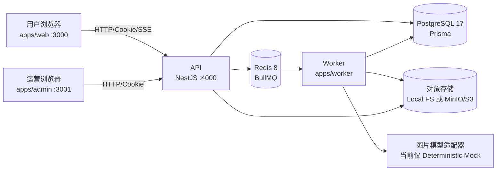

# Dream Space 当前系统设计方案

> 依据当前仓库源码整理，基线提交：`6a5a953`。本文描述现状，不替代产品需求、上线方案或安全规范。

## 1. 系统定位与边界

Dream Space 是面向中文用户的 AI 图片创作平台，主链路为“浏览灵感 -> 复用提示词/参数 -> 提交图片生成 -> 查看、预览和下载结果”。系统同时提供运营管理端，用于维护公开灵感内容、查询生成任务和查看额度对账。

当前已经覆盖：公开灵感瀑布流、作品详情、手机号验证码登录（演示模式）、生成会话与草稿、参考图上传、图片生成任务、BullMQ 异步处理、额度预留/消费/返还、SSE 任务事件、结果图片访问与下载、管理端任务查询、灵感 CRUD/发布、额度对账。

当前明确不属于已交付范围：真实图片模型供应商、真实短信服务、视频、画布编辑、支付/会员、社区发布、完整资产管理、人工审核队列、模型供应商路由、系统配置和审计日志页面。

## 2. 总体架构

### 2.1 运行时职责

| 组件           | 目录               | 职责                                                       | 默认端口/入口      |
| -------------- | ------------------ | ---------------------------------------------------------- | ------------------ |
| 用户端         | `apps/web`         | 灵感浏览、登录、生成工作台、结果展示                       | Next.js 16，`3000` |
| 管理端         | `apps/admin`       | 管理员登录、任务查询、灵感管理、对账摘要                   | Next.js 16，`3001` |
| API            | `apps/api`         | 鉴权、业务校验、数据库读写、队列投递、SSE 和资源代理       | NestJS 11，`4000`  |
| Worker         | `apps/worker`      | 消费生成队列、调用模型、审核、图片处理、结果落盘、额度对账 | BullMQ worker      |
| PostgreSQL     | 外部基础设施       | 持久化用户、会话、任务、额度、内容和事件                   | `5432`             |
| Redis          | 外部基础设施       | BullMQ 队列和任务异步解耦                                  | `6379`             |
| Local/MinIO/S3 | `packages/storage` | 参考图、结果图、缩略图对象存储                             | 本地目录或 `9000`  |

### 2.2 关键数据流

1. 用户端请求 `POST /generation/tasks`。API 校验登录态、提示词/参考图、比例、分辨率和图片数量，计算费用并以幂等键创建任务。
2. 同一事务中预留 `QuotaAccount` 额度、写入 `QuotaLedgerEntry(RESERVE)`、创建 `GenerationTaskEvent`，随后把任务投递到 Redis 的生成队列。
3. Worker 取任务后将状态置为 `GENERATING`，执行输入审核、mock 模型生成、输出审核、Sharp 转 WebP/缩略图并写入对象存储。
4. 成功时写 `GenerationResult` 和 `CONSUME` 流水；失败/取消时释放预留额度并写 `RELEASE`。可重试错误在达到最大次数后进入 `GenerationDeadLetter`。
5. 用户端通过 `GET /generation/tasks/:id/events`（由生成客户端封装）接收状态事件，最终通过结果 content/thumbnail API 读取图片；S3 模式下返回短期签名 URL。

## 3. 技术栈

| 层次          | 技术                                                                                                        |
| ------------- | ----------------------------------------------------------------------------------------------------------- |
| 工程化        | pnpm `11.18.0`、Turborepo `2.10.8`、Node.js `>=22`、TypeScript `5.9`                                        |
| 用户/管理前端 | Next.js `16`、React `19`、App Router、浏览器 Fetch、Lucide React                                            |
| 后端          | NestJS `11`、class-validator 风格 DTO/管道、Cookie 会话、SSE                                                |
| 数据库        | PostgreSQL `17`、Prisma `7`、迁移位于 `packages/db/prisma/migrations`                                       |
| 队列          | Redis `8` 兼容服务、BullMQ `6`、ioredis                                                                     |
| 图片处理      | Sharp：旋转、裁剪、WebP 编码、缩略图、尺寸/像素校验                                                         |
| 存储          | 本地文件系统；AWS SDK S3 客户端兼容 MinIO/AWS S3，支持签名 GET                                              |
| 校验/契约     | Zod 环境变量解析；`packages/contracts` 共享 DTO、枚举、响应类型                                             |
| 测试/质量     | Vitest、Playwright、ESLint、Prettier、TypeScript typecheck                                                  |
| 基础设施      | `infrastructure/docker/compose.yml`；`infrastructure/local` 提供 macOS 本机 PostgreSQL/Redis/MinIO 启停脚本 |

## 4. 代码分层与共享包

### 4.1 应用模块

- `apps/api/src/modules/health`：健康检查。
- `apps/api/src/modules/database`：Prisma 客户端生命周期和数据库模块。
- `apps/api/src/modules/auth`：普通用户验证码、会话、协议确认和登出。
- `apps/api/src/modules/inspirations`：仅返回 `PUBLISHED` 的公开灵感列表和详情。
- `apps/api/src/modules/uploads`：参考图上传、Sharp 校验/归一化、用户资源鉴权。
- `apps/api/src/modules/generation`：选项、额度、会话、草稿、任务提交/查询/取消、SSE、结果资源。
- `apps/api/src/modules/admin`：管理员认证、RBAC、任务/对账查询、灵感 CRUD 与发布。
- `apps/worker/src/generation`：队列任务状态推进、模型调用、审核、结果管线、失败和重试。
- `apps/worker/src/reconciliation`：按时间窗口扫描额度流水与任务状态，自动补偿可安全修复项。

### 4.2 共享包

- `packages/contracts`：前后端共享的生成参数、枚举、分页和响应结构；避免页面与 API 各自定义协议。
- `packages/core`：任务状态机、费用/额度规则、生成尺寸、provider callback 签名等纯业务规则。
- `packages/db`：Prisma schema、生成客户端、数据库工厂、枚举编解码与种子。
- `packages/config`：API/Worker 环境变量 Zod schema、默认值和 S3 凭据约束。
- `packages/storage`：`ObjectStorage` 接口、`LocalObjectStorage` 和 `S3ObjectStorage`。
- `packages/ui`：共享 UI 包骨架；当前用户端/管理端主要使用各自 CSS 和组件。

## 5. 数据库表结构

Prisma schema 定义 18 个 model、12 个 enum。金额/数量均为整数；所有时间字段使用 `DateTime`。下表列出业务字段、关键约束和用途，审计型 `createdAt/updatedAt` 等通用字段不逐表重复展开。

### 5.1 内容、用户与管理员

| 表                      | 主要字段                                                                                                                                                                                                                                                                                 | 关键约束/关系                                                       | 用途                                     |
| ----------------------- | ---------------------------------------------------------------------------------------------------------------------------------------------------------------------------------------------------------------------------------------------------------------------------------------- | ------------------------------------------------------------------- | ---------------------------------------- |
| `Inspiration`           | `id`, `slug`, `title`, `prompt`, `category`, `imagePath`, `thumbnailPath`, `width`, `height`, `modelName`, `ratio`, `resolutionLabel`, `authorDisplayName`, `sourceType`, `sourceName`, `sourceUrl?`, `licenseBasis`, `isAiGenerated`, `likeCount`, `sortOrder`, `status`, `publishedAt` | `slug` 唯一；`status/category/sortOrder`、`status/publishedAt` 索引 | 公开灵感素材、来源和发布状态             |
| `User`                  | `id`, `phone`                                                                                                                                                                                                                                                                            | `phone` 唯一；关联用户会话、协议、生成会话/任务、额度和上传         | 普通用户身份                             |
| `VerificationCode`      | `id`, `phone`, `codeHash`, `expiresAt`, `consumedAt?`, `attempts`                                                                                                                                                                                                                        | `phone/createdAt` 索引                                              | 普通用户验证码挑战                       |
| `UserSession`           | `id`, `tokenHash`, `userId`, `expiresAt`, `lastSeenAt`                                                                                                                                                                                                                                   | `tokenHash` 唯一；用户删除级联                                      | 普通用户 Cookie 会话                     |
| `AgreementAcceptance`   | `id`, `userId`, `version`, `termsAccepted`, `privacyAccepted`, `aiTermsAccepted`, `acceptedAt`                                                                                                                                                                                           | `userId/version` 唯一                                               | 登录时记录协议确认版本                   |
| `AdminUser`             | `id`, `phone`, `displayName`, `role`, `active`                                                                                                                                                                                                                                           | `phone` 唯一；`active/role` 索引                                    | 管理员账号，角色 `VIEWER/OPERATOR/ADMIN` |
| `AdminVerificationCode` | `id`, `phone`, `codeHash`, `expiresAt`, `consumedAt?`, `attempts`                                                                                                                                                                                                                        | `phone/createdAt` 索引                                              | 管理端独立验证码挑战                     |
| `AdminSession`          | `id`, `tokenHash`, `adminUserId`, `expiresAt`, `lastSeenAt`                                                                                                                                                                                                                              | `tokenHash` 唯一；管理员删除级联                                    | 管理端独立 Cookie 会话，与用户会话隔离   |

### 5.2 生成、上传与事件

| 表                     | 主要字段                                                                                                                                                                                                                                             | 关键约束/关系                                       | 用途                           |
| ---------------------- | ---------------------------------------------------------------------------------------------------------------------------------------------------------------------------------------------------------------------------------------------------- | --------------------------------------------------- | ------------------------------ |
| `GenerationSession`    | `id`, `userId`, `title`, `draft?` JSON                                                                                                                                                                                                               | `userId/updatedAt` 索引；删除用户级联任务           | 工作台会话、标题和未提交草稿   |
| `GenerationTask`       | `id`, `sessionId`, `userId`, `status`, `prompt`, `model`, `ratio`, `resolution`, `imageCount`, `referenceImageUrls` JSON, `unitCost`, `totalCost`, `idempotencyKey`, `queueJobId?`, `attempts`, `lastAttemptKey?`, 错误字段、审核状态、开始/完成时间 | `userId/idempotencyKey` 唯一；会话/用户状态时间索引 | 一次生成请求的状态机和费用事实 |
| `GenerationResult`     | `id`, `taskId`, `index`, `imagePath`, `objectKey?`, `thumbnailObjectKey?`, `checksumSha256?`, 尺寸/字节数、`mimeType`, 审核状态、`isAiGenerated`                                                                                                     | `taskId/index` 唯一；对象 key 唯一                  | 生成图片和缩略图元数据         |
| `GenerationDeadLetter` | `id`, `taskId`, `errorCode`, `errorMessage`, `attempts`, `payload`, `resolvedAt?`                                                                                                                                                                    | `taskId` 唯一；`resolvedAt/createdAt` 索引          | 达到重试上限后的失败任务记录   |
| `ReferenceUpload`      | `id`, `userId`, `objectKey`, `originalFilename`, `mimeType`, `byteSize`, `width`, `height`, `checksumSha256`, `deletedAt?`                                                                                                                           | `objectKey` 唯一；用户/时间索引                     | 用户参考图的安全元数据和对象键 |
| `GenerationTaskEvent`  | 自增 `id`, `taskId`, `type`, `status`, `payload` JSON, `createdAt`                                                                                                                                                                                   | `taskId/id` 索引                                    | SSE 重放、状态变更和审计事件   |

### 5.3 额度与对账

| 表                           | 主要字段                                                                                                             | 关键约束/关系                                   | 用途                                         |
| ---------------------------- | -------------------------------------------------------------------------------------------------------------------- | ----------------------------------------------- | -------------------------------------------- |
| `QuotaAccount`               | `userId`, `total`, `available`, `reserved`                                                                           | `userId` 主键；默认总额度 100                   | 用户额度快照                                 |
| `QuotaLedgerEntry`           | `id`, `userId`, `taskId?`, `type`, `amount`, `balanceAfter`, `idempotencyKey`                                        | `idempotencyKey` 唯一；用户时间/任务索引        | `GRANT/RESERVE/CONSUME/RELEASE` 不可重复流水 |
| `QuotaReconciliationRun`     | `id`, `windowKey`, `status`, `startedAt`, `completedAt?`, 扫描/差异/修复计数、`errorMessage?`                        | `windowKey` 唯一；创建时间/状态索引             | 对账窗口和运行汇总                           |
| `QuotaReconciliationFinding` | `id`, `runId`, `userId`, `taskId?`, `kind`, `status`, `idempotencyKey`, 期望/实际金额、`details` JSON、`repairedAt?` | `runId/idempotencyKey` 唯一；运行/用户/任务索引 | 缺失流水、金额漂移和可修复性结论             |

### 5.4 关键枚举和规则

- `GenerationTaskStatus`：`QUEUED -> GENERATING -> SUCCEEDED/PARTIALLY_SUCCEEDED/FAILED/CANCELLED`，由 `packages/core` 状态机限制转换。
- `GenerationRatio`：`smart`、`21:9`、`16:9`、`3:2`、`4:3`、`1:1`、`3:4`、`2:3`、`9:16`。
- `GenerationResolution`：`2K`、`4K`；默认计费为 2K 每张 1 点、4K 每张 2 点。
- 单次图片数量为 1-8；参考图最多 4 张；上传接受 JPG/PNG/WebP，单张最大 10 MB、总像素最大 40 MP，写入前统一转 WebP。

## 6. 后端模块功能详细描述

### 6.1 启动与基础设施

`apps/api/src/main.ts` 解析 API 环境变量、创建 Nest 应用、启用 CORS 和 cookie 读取，并监听 `API_PORT`。`health` 返回服务/数据库可用性；`database` 模块统一管理 Prisma 连接。API 不直接调用模型，生成任务通过 Redis 解耦。

### 6.2 普通用户认证（`auth`）

- `POST /auth/codes` 创建验证码挑战并返回挑战 ID；当前 `EXTERNAL_SERVICES_MODE=mock` 返回演示验证码，真实短信服务尚未配置。
- `POST /auth/login` 校验手机号、挑战 ID、验证码和三类协议确认，创建哈希 token 的 `UserSession`，通过 HttpOnly Cookie 建立登录态。
- `GET /auth/session` 返回脱敏手机号和认证状态；`POST /auth/logout` 删除/失效当前会话。
- 验证码有 TTL、尝试次数和 consumed 状态；用户 Cookie 与管理员 Cookie 使用不同会话表和服务。

### 6.3 公开灵感（`inspirations`）

列表支持 `category` 和 `q`（标题、提示词、来源等查询），只筛选已发布条目；详情按 `slug` 返回图片路径、生成参数、提示词、来源和相邻作品。图片种子来自 `scripts/extract-inspiration-seed.mjs` 和 `apps/web/public/inspiration`，管理员发布后才对公开 API 可见。

### 6.4 参考图上传（`uploads`）

`POST /uploads/references` 要求用户会话，限制 MIME、字节数和像素数，使用 Sharp 读取尺寸、纠正方向、转 WebP、计算 SHA-256 后写入 `references/<user>/<id>.webp`。`GET /uploads/references/:uploadId/content` 只允许资源所有者读取。对象键由 `packages/storage` 的正则和路径逃逸检查保护。

### 6.5 生成会话、任务与结果（`generation`）

- 会话：列出、创建/改名、保存草稿、删除会话；删除会话会级联任务，前端要求确认。
- 选项：返回模型、比例、分辨率、数量上限和当前 `externalServicesMode`，供工作台渲染。
- 任务提交：校验 prompt 或参考图非空、参数组合、幂等键和额度；在事务内创建任务、预留额度、写入队列信息。
- 状态：查询任务/会话、读取事件流、取消排队或生成中的任务；终态支持编辑参数后重跑。
- 结果：根据任务归属检查权限，提供 content 和 thumbnail 资源；本地存储直接代理字节，S3 存储生成短期签名 GET URL。

### 6.6 Worker 生成管线

`apps/worker/src/main.ts` 只允许当前 `EXTERNAL_SERVICES_MODE=mock`，创建 Redis 连接、Prisma、对象存储和 `GenerationProcessor`。`DeterministicMockProvider` 从主题图片池中按 prompt/model 稳定选择素材，可用特殊 prompt 模拟一次性重试或持续可重试错误。

处理顺序为：抢占任务并记录 attempt -> 输入审核 -> mock provider -> 对每张输出审核 -> Sharp 旋转/裁剪/编码 2K/4K WebP -> 生成缩略图 -> 写对象存储 -> 写结果和消费流水。中途失败会清理已经写入的对象；可重试 provider 错误在 BullMQ 尝试耗尽后写 dead-letter，并释放额度。

### 6.7 审核与额度对账

当前 `DeterministicMockContentModerator` 是确定性审核占位；输入或输出被拒绝会让任务失败并返还额度。`QuotaReconciliationService` 按 `QUOTA_RECONCILIATION_INTERVAL_MS` 创建幂等窗口，扫描活跃任务应有的 reserve、成功任务的 consume、失败/取消任务的 release，以及账户 total/available/reserved 漂移。安全的缺失 consume/release 可自动补偿，其余 finding 标为 `BLOCKED`，管理端任务页展示最近运行摘要。

### 6.8 管理端 API 与 RBAC

- `admin/auth`：管理员独立验证码、登录、session、logout；只允许 active 管理员。
- `admin/tasks`：分页、关键字、状态、模型、日期筛选；查询任务详情、审核状态、事件、结果；查询对账 runs/findings。
- `admin/inspirations`：列表筛选、详情、创建、编辑、发布、取消发布。写操作按 `VIEWER/OPERATOR/ADMIN` 角色守卫，公开 API 仅暴露 PUBLISHED。

## 7. 前台页面设计与功能

用户端所有灵感/生成页面由 `InspirationShell` 统一包裹，使用左侧窄导航、右侧设置菜单和可选额度面板；`/login` 为独立登录布局。

### 7.1 视觉基线

- 字体：`Inter, PingFang SC, Microsoft YaHei, system-ui`；正文 14px，紧凑控件多为 12-13px。
- 浅色：背景 `#f7f8f9`、表面 `#ffffff`、强表面 `#f0f2f3`、正文 `#17191c`、次要文字 `#6f747c`、边框 `#e5e8eb`。
- 品牌强调：`#0e8f7c`，浅强调面 `#e7f4f1`；警告 `#b26a16`，错误 `#d04444`。
- 深色：背景 `#0f1012`、表面 `#191b1e`、强表面 `#24272b`、正文 `#f3f5f6`、次要文字 `#a5abb1`、边框 `#30343a`、浅强调面 `#183a35`。
- 形态：8px 主圆角、细边框、低阴影、Lucide 图标；强调信息使用青绿色而不是大面积渐变。支持 `system/light/dark` 主题和中英切换。

### 7.2 `/` 首页

- **功能**：服务端直接重定向到 `/inspiration`，不渲染独立营销首页。
- **风格/配色**：继承灵感页基线。
- **交互/响应式**：由浏览器跟随 307/内部 redirect；移动端同样落到灵感页底部导航。

### 7.3 `/inspiration` 灵感推荐页

- **页面功能**：分类标签（推荐、人像、摄影、动漫、插画、设计）、关键词搜索、搜索历史（LocalStorage，最多 8 条）、清空/重试、语言切换、日期和激励信息；网格/瀑布流展示公开作品，卡片悬停显示标题、分类和“做同款”入口。
- **交互**：输入 220ms 防抖请求 API；结果随机重排并避免首项连续重复；无结果、加载失败和重试有独立状态；点击卡片进入 slug 详情。
- **风格/配色**：浅灰工作区背景，白色搜索框和卡片，青绿色用于品牌标识/强调，文本和边框使用基线变量；大图优先、文字叠加在图片底部，不使用厚重卡片容器。
- **响应式**：桌面顶部工具栏 72px；`<1200px` 压缩搜索和隐藏日期；`<767px` 工具栏换行、隐藏右侧工具条、瀑布流改为两列，底部导航固定 64px。

### 7.4 `/inspiration/[slug]` 作品详情页

- **页面功能**：展示原图、标题、作者/来源、模型、比例、分辨率、提示词；复制提示词、点赞（当前为本地状态）、关注（当前为本地状态）、前后作品翻页、分享/更多入口；“做同款”打开复用生成器并预填 prompt、模型、比例、分辨率。
- **交互**：未登录点击生成会保存意图并跳转登录；登录后返回生成页；复制提示词使用 Clipboard API 并反馈状态；生成器可从详情底部提交。
- **风格/配色**：桌面为左侧大图舞台 + 右侧信息面板，深色/浅色均沿用基线，原图保持视觉中心；面板使用白色/深色表面和 1px 边框。
- **响应式**：`<1200px` 缩小右侧面板和舞台留白；`<767px` 改为上下布局，图片最高约 54vh（无生成器时约 70vh），信息面板取消外框并下移，翻页按钮靠近底部，复用生成器贴近底部导航。

### 7.5 `/login` 普通用户登录页

- **页面功能**：手机号输入、获取验证码倒计时、验证码输入、用户协议/隐私政策/AI 使用条款勾选，提交后创建用户会话；协议内容在模态框中阅读，支持按登录意图返回原页面。
- **当前实现**：验证码由 mock API 返回演示码；真实短信网关尚未接入。
- **风格/配色**：桌面左右分栏；左侧使用 `photography-08.webp` 全幅背景、深蓝黑遮罩 `#08151d` 和白色品牌/引语，右侧为白色或主题表面表单；按钮使用青绿色主色。
- **响应式**：`<767px` 隐藏左侧视觉区，表单全屏居中，保留 22px 左右内边距；协议模态框最大 88dvh、可滚动。

### 7.6 `/generate` 与 `/generate/[sessionId]` 生成工作台

- **页面功能**：会话侧栏（新建、重命名、删除、按更新时间排序）、当前会话任务时间线、搜索/时间/模型/状态筛选、空会话 starter prompts、提示词输入、参考图上传/删除、模型选择、比例/分辨率/图片数量参数弹层、费用预估、提交生成、取消、结果预览/下载、失败任务编辑/重跑。
- **任务状态**：排队中/生成中显示旋转图标与动画进度条；失败/取消显示额度返还提示；成功显示 mock/真实模式标签、消耗额度、结果网格；SSE 事件到达后更新任务，断线通过 API 刷新。
- **风格/配色**：工作台采用三段结构：窄导航（72px）+ 会话栏（280px）+ 中央画布；背景 `#f7f8f9`，composer/弹层为表面色，主按钮使用正文色（深色主题反转为浅色按钮），处理状态使用青绿色，错误使用红色。
- **交互细节**：提交按钮在 prompt/参考图为空或额度不足时禁用；图片结果点击进入全屏预览，下载按钮桌面悬停出现、移动端始终可见；参数弹层显示输出像素尺寸；会话删除要求二次确认。
- **响应式**：`<1199px` 中央 composer 宽度改为视口计算；`<767px` 侧栏隐藏、导航变为底部 64px、顶部筛选可横向滚动、composer 减为视口宽度、参数网格改四列、starter prompts 仅保留前两项、结果默认一列（最多按任务结果数两列）。

## 8. 管理端页面设计与功能

管理端使用独立的浅色运营控制台样式，不共享用户端深色主题。基础颜色：背景 `#f4f6f7`、表面 `#ffffff`、弱表面 `#eef1f2`、边框 `#dfe4e6`、正文 `#1b1f23`、次要文字 `#687178`、强调 `#087f6d`、强调浅色 `#e4f4f0`、危险 `#bb3e46`、警告 `#9a6500`。

### 8.1 `/login` 管理员登录

左侧深灰绿介绍区 `#243033` 展示 ShieldCheck 品牌、运营定位和说明，右侧白色表单提供管理员手机号、验证码获取/倒计时、登录和 mock 提示。`<800px` 改为上下布局，介绍区约 230px；`<520px` 收紧内边距和验证码按钮宽度。管理员 cookie、验证码表和权限与普通用户完全隔离。

### 8.2 `/tasks` 生成任务

认证后由 `AdminShell` 包裹，固定侧栏包含“生成任务”和“灵感管理”，支持折叠为 72px；底部显示当前管理员脱敏手机号和退出按钮。页面提供最近额度对账条（扫描任务、差异、已补偿、待处理）、提示词/会话/手机号搜索、状态/模型/日期筛选、分页表格和刷新。每行可打开右侧抽屉查看参数、审核、事件和结果缩略图；API 401 会触发重新验证。

桌面表格优先，`<1180px` 隐藏用户和消耗列，`<800px` 侧栏变为顶部窄栏、抽屉全宽、详情/结果网格改两列；错误、空数据和加载状态均有独立内联状态。

### 8.3 `/inspirations` 灵感管理

页面提供标题/slug/提示词/来源搜索、状态和分类筛选、创建按钮、分页表格。编辑抽屉可维护标题、slug、prompt、分类、图片路径/缩略图路径、尺寸、模型、比例、分辨率、作者、来源和版权依据；支持新建、编辑、发布/取消发布，发布状态用 published/draft/archived 标签区分。只读角色显示只读提示并由 API 拒绝越权写操作。

编辑器为白色侧抽屉，顶部展示图片预览和状态；`<1180px` 减少表格列，`<800px` 隐藏尺寸/排序等次要列，`<520px` 抽屉全宽、表单多列改单列、预览高度降至 150px。

### 8.4 `/` 管理端首页

仅重定向到 `/tasks`，没有独立 Dashboard。

## 9. 配置文件说明

### 9.1 根目录工程配置

| 文件                                          | 说明                                                                                       |
| --------------------------------------------- | ------------------------------------------------------------------------------------------ |
| `package.json`                                | pnpm/Turbo 命令：开发、构建、lint、类型检查、测试、E2E、数据库、基础设施和 smoke 脚本      |
| `pnpm-workspace.yaml`                         | 工作区为 `apps/*`、`packages/*`；允许 Prisma、Sharp 等原生构建；锁定部分依赖的最小发布等待 |
| `turbo.json`                                  | build 依赖上游包并缓存 `dist/.next`；dev 持久运行且不缓存；lint/typecheck/test 依赖 build  |
| `tsconfig.base.json`                          | 全仓 TypeScript 基础编译选项和路径基线                                                     |
| `eslint.config.mjs`                           | ESLint 9 扁平配置                                                                          |
| `.prettierrc.json`、`.prettierignore`         | 统一格式化和忽略生成物                                                                     |
| `playwright.config.ts`                        | E2E 浏览器、baseURL、应用启动和测试目录配置                                                |
| `.env.example`                                | 本地环境变量模板，禁止填入生产密钥                                                         |
| `AGENTS.md`、`CONTRIBUTING.md`、`SECURITY.md` | 分支/PR、协作和凭据安全约束                                                                |

### 9.2 环境变量

| 变量                                                               | 作用/默认值                                                    |
| ------------------------------------------------------------------ | -------------------------------------------------------------- |
| `NODE_ENV`                                                         | `development/test/production`，默认 development                |
| `API_PORT`                                                         | API 端口，默认 4000                                            |
| `WEB_ORIGIN`、`ADMIN_ORIGIN`、`API_PUBLIC_URL`                     | CORS、回跳和公开 API 地址                                      |
| `NEXT_PUBLIC_API_URL`、`NEXT_PUBLIC_WEB_URL`                       | 两个 Next.js 应用浏览器侧 API/站点地址                         |
| `AUTH_CODE_TTL_SECONDS`、`AUTH_SESSION_DAYS`                       | 验证码有效期（默认 300 秒）和会话有效天数（默认 30）           |
| `DATABASE_URL`、`REDIS_URL`                                        | PostgreSQL 和 Redis 连接串                                     |
| `EXTERNAL_SERVICES_MODE`                                           | `mock` 或 `live`；当前 Worker 的 live provider 未实现          |
| `OBJECT_STORAGE_MODE`                                              | `local` 或 `s3`                                                |
| `LOCAL_STORAGE_DIR`                                                | 本地对象存储根目录，默认 `../../.local/storage`                |
| `S3_ENDPOINT`、`S3_REGION`、`S3_BUCKET`                            | S3/MinIO 连接信息                                              |
| `S3_ACCESS_KEY`、`S3_SECRET_KEY`、`S3_FORCE_PATH_STYLE`            | S3 凭据和 MinIO 兼容选项；s3 模式强制校验凭据长度              |
| `S3_SIGNED_URL_TTL_SECONDS`                                        | 签名下载 URL 有效期，60-3600 秒，默认 300                      |
| `MOCK_ASSET_DIR`、`MOCK_GENERATION_DELAY_MS`                       | mock 图片素材目录和模拟延迟（默认 200ms）                      |
| `QUOTA_RECONCILIATION_ENABLED`、`QUOTA_RECONCILIATION_INTERVAL_MS` | Worker 是否启用对账以及间隔（默认 1 小时，范围 10 秒-24 小时） |

`packages/config/src/index.ts` 使用 Zod 统一解析变量；API 和 Worker 各自拥有 schema。`OBJECT_STORAGE_MODE=s3` 时 `S3_ACCESS_KEY` 至少 3 字符、`S3_SECRET_KEY` 至少 8 字符，否则启动即失败。

### 9.3 基础设施配置

- `infrastructure/docker/compose.yml`：PostgreSQL、Redis、MinIO 本地容器及健康检查。
- `infrastructure/local/redis.conf`：本机 Redis 配置。
- `scripts/docker-compose.sh`：跨平台调用 Compose；`local-services.sh` 管理本机 PostgreSQL/Redis/MinIO；`local-stack.sh` 负责迁移、种子和四个应用进程。
- `packages/db/prisma.config.ts`、`packages/db/prisma/schema.prisma`：Prisma 数据源、生成客户端和 schema。

## 10. 一级目录与文件说明

| 路径                        | 说明                                                                                    |
| --------------------------- | --------------------------------------------------------------------------------------- |
| `apps/`                     | 四个可部署应用：`web` 用户端、`admin` 管理端、`api` API、`worker` 异步处理              |
| `packages/`                 | `config/contracts/core/db/storage/ui` 六个共享包                                        |
| `infrastructure/`           | Docker Compose、本机服务配置和说明                                                      |
| `e2e/`                      | Playwright 用户端/管理端核心流程及测试 helper；`fixtures/`、`tests/.gitkeep` 是预留目录 |
| `scripts/`                  | 基础设施启停、认证/管理/生成/对账 smoke、灵感种子提取                                   |
| `prototype/`                | 阶段 1 高保真静态原型和素材，正式页面不直接依赖其运行时逻辑                             |
| `.env.example`              | 本地安全配置模板                                                                        |
| `package.json`              | 根工作区命令和 Node/pnpm 版本约束                                                       |
| `pnpm-workspace.yaml`       | pnpm monorepo 工作区和原生依赖构建白名单                                                |
| `turbo.json`                | Turbo 任务拓扑和缓存策略                                                                |
| `tsconfig.base.json`        | 共享 TS 配置                                                                            |
| `eslint.config.mjs`         | 根 ESLint 配置                                                                          |
| `playwright.config.ts`      | E2E 配置                                                                                |
| `README.md`                 | 项目定位、启动方式、阶段状态和产品边界                                                  |
| `AGENTS.md`                 | 当前仓库协作规则：main 保护、分支、PR、凭据安全                                         |
| `CONTRIBUTING.md`           | 贡献流程                                                                                |
| `SECURITY.md`               | 安全和敏感信息处理规则                                                                  |
| `造梦空间文生图平台方案.md` | 中文产品/方案背景材料，属于设计输入，不是运行时配置                                     |

## 11. 未实现功能与当前限制

### 11.1 代码明确标记的未实现

- **真实图片模型**：`apps/worker/src/main.ts` 在非 mock 模式直接抛错；provider 目录只有占位结构。
- **真实短信验证码**：普通用户和管理员 auth service 在 live 外部服务缺失时返回服务不可用，mock 模式才提供演示码。
- **人工审核运营闭环**：当前是确定性 mock moderator 和审核状态记录，没有人工队列、申诉、审核工作台。
- **运营工作台扩展**：`apps/admin/README.md` 明确列出工作台、用户管理、管理员角色管理、完整审核队列、模型/供应商/路由管理、系统配置、审计日志尚未交付。

### 11.2 前台可见但仍是原型/本地状态

- 灵感详情的点赞、关注、通知、更新日志和水印开关没有对应持久化 API；刷新后状态不作为业务事实保存。
- “分享/更多”入口和部分设置菜单是 UI 占位；没有社区发布、社交关系或通知中心。
- 生成结果当前来自仓库内 mock 素材池；没有真实模型的 prompt 适配、供应商超时、回调验签和成本同步。

### 11.3 产品边界/工程待补

- 尚未建设视频生成、画布编辑、局部重绘、批量资产管理、支付/会员和完整版权工作流。
- 生产环境仍需补齐密钥托管、短信/模型供应商接入、对象存储生命周期、监控告警、限流和更细粒度审计。
- `packages/ui` 仍是共享 UI 包骨架，两个前端存在各自 CSS 体系；后续若统一设计系统需要单独迁移计划。

## 12. 验证与维护建议

提交文档或代码变更后，至少运行 `pnpm format:check` 和 `git diff --check`；涉及源码时运行 `pnpm check`，涉及用户/管理关键链路时分别运行 `pnpm e2e:user`、`pnpm e2e:admin` 以及对应 smoke 脚本。数据库 schema、路由、环境变量或页面 CSS 发生变化时，应在本文件对应章节同步更新。
