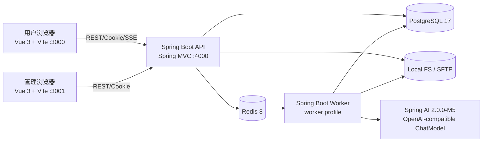

# Vue 3 + Spring Boot 4 重构设计方案

> 本方案基于当前 `docs/knowledge/current-system-design.md` 和 `bak/` 中的现有实现整理。目标是替换前端与后端运行时，而不是重新设计产品；前台功能、交互、页面结构和视觉风格必须与 `bak` 中的现状保持一致。

## 1. 目标与约束

### 1.1 目标

- 用户端和管理端迁移到 Vue 3、TypeScript、Vite 5。
- API 和异步生成处理迁移到 Spring Boot 4.0、Spring MVC。
- 图片模型通过 Spring AI 2.0.0-M5 的 `ChatModel` 接口接入 OpenAI-compatible 服务。
- 保留 PostgreSQL 17、Redis 8、对象键规则、任务状态、额度流水和数据库表语义；远程对象存储统一使用 SFTP，本地模式保留。
- 保留现有用户端和管理端路由、功能状态、错误状态、响应式断点、颜色变量、图片素材和交互文案。

### 1.2 非目标

- 不在本次重构中增加视频、画布、支付、社区、会员或资产管理能力。
- 不把前端 fixture 误认为生产服务；Worker 图片链路只使用真实规划、评估和图片模型，API 不提供演示验证码。
- 不改变现有表的业务含义、任务费用规则、用户/管理员会话隔离和公开灵感发布规则。

### 1.3 必须接受的运行时边界

Prisma Client、BullMQ Node client 和 Sharp 是 Node 运行时组件，不能直接嵌入 Spring Boot。重构保持数据库和基础设施协议不变，但需要 Java 侧适配：

| 现有组件 | 重构处理 | 保持不变的契约 |
| --- | --- | --- |
| Prisma 7 | Java 侧采用 MyBatis 3 + Spring JDBC（或经确认后的 JDBC 实现）访问 PostgreSQL | 表名、列名、枚举值、索引、事务边界和迁移 SQL |
| BullMQ 6 | Java Worker 使用 Spring Data Redis Streams；过渡期可增加 Node BullMQ bridge | Redis 地址、队列业务名、任务幂等键、任务状态事件 |
| Sharp | Java 侧使用 ImageIO/TwelveMonkeys + Thumbnailator，封装成 `ImagePipeline` | JPG/PNG/WebP 校验、EXIF 旋转、裁剪尺寸、WebP 质量、缩略图和 SHA-256 |
| Next.js App Router | Vue Router + Vite SPA | URL 路径、页面状态、API 请求和视觉契约 |

如果“数据库等技术框架保持不变”包含“必须继续使用 Prisma Client”，则与 Spring Boot 后端目标冲突，需要在实施前确认；本方案保持数据库/Redis 协议和业务语义，替换 Node-only 客户端，远程对象存储使用 SFTP。

## 2. 目标总体架构



### 2.1 部署单元

| 单元 | 技术 | 进程职责 |
| --- | --- | --- |
| `dream_web` | Vue 3 + TypeScript + Vite 5 | 用户灵感、登录、生成工作台和结果页，入口 `/dream_web/` |
| `manage_web` | Vue 3 + TypeScript + Vite 5 | 管理员登录、任务查询、灵感管理和额度对账，入口 `/manage_web/` |
| `api` | Spring Boot 4.0 + Spring MVC | REST、Cookie 会话、权限、数据库事务、上传、SSE |
| `worker` | Spring Boot 4.0 + Spring Data Redis | 消费生成任务、调用 ChatModel、审核、图像处理、额度结算和对账 |
| PostgreSQL | 17 | 继续承载 18 张业务表 |
| Redis | 8 | 队列、消费组、短期状态和限流基础 |
| Object Storage | Local FS / SFTP | 参考图、结果图和缩略图 |

API 和 Worker 使用同一 Java 多模块工程更容易共享 DTO、状态机和数据库 Mapper，但部署为两个 profile：`api` 和 `worker`。这样保留原有 API/Worker 的故障隔离和独立扩容能力。

## 3. 技术栈与工程结构

### 3.1 版本基线

| 层次 | 版本/技术 |
| --- | --- |
| 前台 | Vue 3、TypeScript、Vite 5、Vue Router、Pinia、原生 Fetch/EventSource |
| 后台 | Spring Boot 4.0、Spring MVC、Spring Validation、Spring Security（Cookie 会话和 RBAC） |
| 模型 | Spring AI 2.0.0-M5、`ChatModel`、OpenAI-compatible endpoint |
| Java | JDK 21 LTS（Spring Boot 4 的最低运行基线以最终 BOM 要求为准） |
| 数据库 | PostgreSQL 17；保留现有 schema、枚举、索引和事务语义 |
| 缓存/队列 | Redis 8；Spring Data Redis，过渡兼容 BullMQ queue name |
| 对象存储 | SFTP；本地模式保留 |
| 图片 | ImageIO/TwelveMonkeys、Thumbnailator、SHA-256 |
| 构建/测试 | Maven Wrapper、Vitest、Playwright、JUnit 5、Testcontainers；模型人工真实联调 |

### 3.2 建议目录

```text
.
├── docs/                         # 保留现有设计与迁移文档
├── bak/                          # 原工程实现，作为迁移基线和回滚参考
├── dream_web/                          # 独立 Vue 用户端工程
├── manage_web/                        # 独立 Vue 管理端工程
├── dream_service/
│   ├── common/                   # 共享模型、MyBatis Mapper、SQL 和基础设施适配
│   ├── api/                      # Spring MVC Controller、用户业务
│   ├── worker/                   # Redis consumer、AI、图片和对账任务
│   └── pom.xml                   # Maven 多模块入口
└── infrastructure/               # PostgreSQL、Redis、SFTP 配置
```

`bak/` 在迁移期间只读，不在其中继续开发；每个迁移模块完成后以契约测试和截图对比证明等价，再删除 Node 侧临时适配代码。

## 4. 前台等价重构方案

### 4.1 页面与路由保持清单

用户端必须保留：

| 路径 | Vue 页面 | 等价功能 |
| --- | --- | --- |
| `/` | `HomeRedirectView` | 重定向 `/inspiration`，不新增营销首页 |
| `/inspiration` | `InspirationGalleryView` | 分类、搜索、防抖、搜索历史、随机重排、空/错/重试状态 |
| `/inspiration/:slug` | `InspirationDetailView` | 原图、提示词、复制、点赞/关注本地状态、翻页、做同款 |
| `/login` | `LoginView` | 手机号、验证码倒计时、三类协议、登录意图回跳、协议模态框 |
| `/generate` | `GenerationWorkspaceView` | 新会话、starter prompts、提交生成、状态时间线 |
| `/generate/:sessionId` | `GenerationWorkspaceView` | 会话加载、草稿、任务筛选、取消、重跑、结果预览/下载 |

管理端必须保留：

| 路径 | Vue 页面 | 等价功能 |
| --- | --- | --- |
| `/` | `AdminHomeRedirectView` | 重定向 `/tasks` |
| `/login` | `AdminLoginView` | 独立管理员验证码登录和会话检查 |
| `/tasks` | `AdminTasksView` | 对账摘要、筛选、分页、任务详情抽屉、结果和事件 |
| `/inspirations` | `AdminInspirationsView` | 搜索、状态/分类筛选、创建、编辑、发布/取消发布 |

### 4.2 React/Next 组件到 Vue SFC 的映射

| `bak` 现有组件 | Vue 组件 |
| --- | --- |
| `InspirationShell` | `layouts/InspirationShell.vue` + `stores/preferences.ts`、`stores/auth.ts` |
| `InspirationGallery` | `features/inspiration/InspirationGallery.vue` |
| `InspirationDetail` | `features/inspiration/InspirationDetail.vue` |
| `LoginScreen` | `features/auth/LoginScreen.vue` |
| `GenerationWorkspace` | `features/generation/GenerationWorkspace.vue`，拆分 `SessionSidebar`、`Composer`、`TaskTimeline` |
| `AdminShell` | `layouts/AdminShell.vue` + `stores/adminSession.ts` |
| `AdminTasks` | `features/admin-tasks/AdminTasks.vue` + `TaskDetailDrawer.vue` |
| `AdminInspirations` | `features/admin-inspirations/AdminInspirations.vue` + `InspirationEditorDrawer.vue` |

拆分只改变组件边界，不改变 DOM 语义、文案、CSS 类名和交互顺序。复杂组件先按原 CSS 类名迁移，再做可维护性重构。

### 4.3 严格视觉契约

用户端 `bak/apps/web/app/globals.css` 是视觉基线，迁移时应直接提取为 `dream_web/src/styles/tokens.css` 和 `globals.css`，不重新配色。

| 设计项 | 必须保持的值/规则 |
| --- | --- |
| 浅色背景 | `#f7f8f9` |
| 表面/强表面 | `#ffffff` / `#f0f2f3` |
| 正文/次要文字 | `#17191c` / `#6f747c` |
| 边框 | `#e5e8eb` |
| 品牌主色 | `#0e8f7c`，浅色面 `#e7f4f1` |
| 警告/错误 | `#b26a16` / `#d04444` |
| 深色背景/表面 | `#0f1012` / `#191b1e` |
| 深色强表面/正文 | `#24272b` / `#f3f5f6` |
| 深色文字/边框 | `#a5abb1` / `#30343a` |
| 导航/会话栏 | `--nav-width: 72px`，`--session-width: 280px` |
| 圆角/字体 | 主圆角 8px；Inter、PingFang SC、Microsoft YaHei、system-ui |

管理端继续使用 `bak/apps/admin/app/globals.css` 的独立浅色运营主题：背景 `#f4f6f7`、表面 `#ffffff`、边框 `#dfe4e6`、强调 `#087f6d`、危险 `#bb3e46`，侧栏宽度 236px，折叠后 72px。

### 4.4 响应式和交互验收

- 用户端 `767px` 以下保留底部 64px 导航、隐藏会话侧栏、瀑布流两列、详情页上下布局、生成 composer 满宽；`1199px` 和 `1399px` 的工具栏压缩规则保持不变。
- 管理端保留 `1180px`、`800px`、`520px` 三组列隐藏、抽屉宽度和表单重排规则。
- 主题仍支持 `system/light/dark`，语言仍支持中英切换；所有图标继续使用 Lucide Vue 对应图标。
- 搜索防抖、点击外部关闭、Escape 关闭、加载/空/错/禁用状态、键盘焦点轮廓和 `prefers-reduced-motion` 必须等价。
- 结果图预览、下载、参考图删除、会话删除确认、协议弹窗和管理员详情抽屉不得改变交互步骤。

### 4.5 前台实现分层

```text
dream_web/src/
├── app/                 # router、App.vue、全局错误/加载边界
├── layouts/             # InspirationShell、登录布局
├── features/            # auth、inspiration、generation
├── stores/              # auth、preferences、quota、generation
├── api/                 # typed fetch、SSE、上传和下载
├── styles/              # 从 bak 等价迁移的 tokens/global/page CSS
└── assets/              # bak/apps/web/public/inspiration 原样复制
```

API 地址只从 `VITE_API_URL` 读取；不把 token 放进 localStorage。Cookie、SSE `withCredentials`、文件上传 MIME 和错误响应都按旧 API 约定处理。

## 5. Spring Boot 后端设计

### 5.1 模块边界

```text
dream_service/common
├── contract/             # 与前端共享的请求/响应 JSON 结构
├── domain/               # 状态、费用、额度、权限和生成规则
└── error/                # 统一错误码和异常响应
dream_service/api                # Spring MVC Controller + application service
dream_service/worker             # Redis consumer + AI/image/moderation pipeline
```

Controller 只做 HTTP 参数绑定、鉴权上下文和响应映射；业务事务放在 application service；Mapper 不承载业务规则。用户和管理员 Cookie 名、哈希策略、过期时间和会话表保持隔离。

### 5.2 API 模块迁移

| 现有模块 | Spring MVC Controller | 关键职责 |
| --- | --- | --- |
| health | `HealthController` | `/health` 和数据库连通性 |
| auth | `AuthController` | `/dream_web/auth/codes`、`/dream_web/auth/login`、`/dream_web/auth/session`、`/dream_web/auth/logout` |
| inspirations | `InspirationsController` | `/dream_web/inspirations` 列表和 `/:slug` 详情，仅 PUBLISHED |
| uploads | `UploadsController` | `/dream_web/uploads/references` 参考图上传、内容读取、用户资源鉴权 |
| generation | `GenerationController` | `/dream_web/generation/*` 选项、额度、会话、草稿、任务、取消、结果资源 |
| admin auth | `AdminAuthController` | `/manage_web/auth/*`，独立管理员会话 |
| admin tasks | `AdminTasksController` | 分页筛选、任务详情、结果、对账 runs |
| admin inspirations | `AdminInspirationsController` | CRUD、发布和取消发布、RBAC |

### 5.3 SSE

Spring MVC 使用 `SseEmitter` 实现 `GET /dream_web/generation/tasks/:taskId/events`：

1. 校验用户对 task/session 的归属。
2. 从 `after`/`Last-Event-ID` 读取 `GenerationTaskEvent`，先回放再订阅 Redis 事件。
3. 发送 `id`、`event`、`data`，终态后发送完成事件并关闭 emitter。
4. 连接断开只释放订阅，不改变任务状态；客户端按旧行为重新连接并用 cursor 去重。

### 5.4 Spring AI 模型适配

`OpenAiCompatibleGenerationModel` 实现领域层 `GenerationModel` 接口，内部依赖 Spring AI `ChatModel`：

```text
GenerationService
  -> GenerationModel (domain port)
    -> OpenAiCompatibleGenerationModel
      -> ChatModel (Spring AI 2.0.0-M5)
        -> OpenAI-compatible /chat/completions
```

模型配置至少包含 `base-url`、`api-key`、`model`、超时、最大重试和温度。prompt、参考图描述、输出数量和比例/分辨率通过 `ChatOptions`/请求 metadata 传递；若供应商返回图片 URL 或 base64，由 `ProviderOutputDecoder` 统一转换为 `ProviderImage`。模型不可用、超时、限流和响应格式错误映射为可重试/不可重试的领域错误码。

图片生成 Worker 不保留 `DeterministicMockProvider` 或确定性规划/审核实现；真实规划/评估 ChatModel 与独立图片模型必须通过环境变量配置，未配置时 Worker 启动失败。

### 5.5 Worker 与状态机

Worker 保留现有处理顺序：抢占 attempt -> 输入审核 -> 模型调用 -> 输出审核 -> 图像转换/缩略图 -> 对象存储 -> `GenerationResult` -> consume/release。每一步写入 `GenerationTaskEvent`，失败时清理已经落盘的对象。

Redis Streams 设计：

- stream：`generation`（名称与旧业务队列常量建立映射）。
- consumer group：`generation-workers`。
- message：`taskId`、`attemptKey`、`attemptNumber`、`maxAttempts`、schemaVersion。
- pending 超时由定时 reclaim 任务接管；达到次数后写 `GenerationDeadLetter`。

如果切换期仍有 BullMQ 生产者，增加 `bullmq-to-stream-bridge`，只负责消息格式转换，业务 Worker 不直接依赖 Node。

## 6. 数据库、Redis 和对象存储保持方案

### 6.1 PostgreSQL

- 保留 `bak/packages/db/prisma/schema.prisma` 中的 18 个 model、enum、唯一索引和关联级联规则。
- 保留现有 migration SQL 的字段和执行顺序；Java 运行时不重新命名表或把 JSON 字段拆成不同结构。
- MyBatis Mapper 对应现有 repository 查询；复杂 JSON、分页、状态过滤和事务更新用显式 SQL，避免 ORM 隐式改变结果。
- 额度预留、消费、释放和对账修复必须继续使用数据库事务与幂等键。

### 6.2 Redis

保留 Redis URL、连接池、队列业务名、事件 cursor 和分布式互斥语义。Spring Data Redis 只替换客户端实现；不会把任务状态迁移到本地内存。

### 6.3 对象存储

继续使用 `references/`、`results/`、`thumbnails/` 三类对象键；local 和 SFTP 模式均由 Spring MVC 代理字节，不向前端返回存储地址。路径逃逸校验、MIME、大小、WebP 输出和删除补偿必须与 `packages/storage` 行为一致。

## 7. 配置设计

### 7.1 Spring 配置

```yaml
spring:
  profiles:
    active: ${SPRING_PROFILES_ACTIVE:api}
  datasource:
    url: ${DATABASE_URL}
  data:
    redis:
      url: ${REDIS_URL}
  ai:
    openai:
      base-url: ${OPENAI_BASE_URL}
      api-key: ${OPENAI_API_KEY}
      chat:
        options:
          model: ${OPENAI_MODEL}
```

业务配置继续支持 `WEB_ORIGIN`、`ADMIN_ORIGIN`、`AUTH_CODE_TTL_SECONDS`、`AUTH_SESSION_DAYS`、`OBJECT_STORAGE_MODE`、`LOCAL_STORAGE_DIR` 和 `SFTP_*` 参数、`MOCK_GENERATION_DELAY_MS`、对账开关和间隔。生产密钥只通过环境变量/密钥管理系统注入，不进入 `application.yml`。

### 7.2 Vite 配置

- `VITE_API_URL`：API 基地址。
- `VITE_WEB_URL`、`VITE_ADMIN_URL`：回跳和跨应用链接。
- Cookie 安全属性由 API 的 `COOKIE_SECURE` 显式配置；前端不显示外部服务运行模式。
- Vite dev server 用 proxy 转发 `/api` 或完整 API URL，生产构建使用反向代理统一域名和 Cookie。

## 8. 迁移步骤

1. **契约冻结**：从 `bak` 固化路由、JSON、错误码、任务状态、额度规则、CSS token 和图片素材清单；建立 API contract tests。
2. **前台壳迁移**：先迁移两个 Vue/Vite 应用的布局、路由、颜色变量和静态页面，截图对比通过后接入 API。
3. **Java 基础层**：建立 Maven 多模块、统一异常、Cookie 会话、MyBatis Mapper、Redis 和对象存储 adapter；先接 health/inspirations/auth。
4. **生成链路**：接入会话/任务/额度事务、SSE、Redis consumer、真实多模态规划/评估模型和独立图片模型。
5. **管理端迁移**：接入管理员 RBAC、任务详情/对账、灵感 CRUD 和发布。
6. **双栈验收**：旧 Node API 与 Java API 对同一测试 fixture 返回结构对比；前台 Playwright 同一用例执行桌面/移动端截图对比。
7. **切换与回滚**：按 API 网关流量切换，保留 Node 服务和 Redis bridge 一个发布周期；发现任务状态、额度或图片差异时立即切回。
8. **清理**：Java 稳定后再从部署和仓库移除 Node 应用；`bak` 作为历史归档保留，不作为运行目录。

## 9. 验收标准

### 9.1 前台等价

- 所有用户端/管理端路径、跳转、错误页、空状态、加载状态和模态框与 `bak` 对应页面一致。
- 浅色、深色、跟随系统三种主题的关键 token 与截图像素差异在约定阈值内；中英文文本不溢出。
- 767px、800px、1180px、1199px、1399px 断点下布局、导航、抽屉、瀑布流和结果网格一致。
- 搜索防抖、历史记录、SSE 重连、任务取消、额度不足禁用、下载和会话删除确认均通过 Playwright。

### 9.2 后端等价

- 普通用户与管理员 Cookie、会话表和权限完全隔离。
- 相同请求的幂等键只能创建一个任务，状态转换不允许跳跃。
- 2K/4K、1-8 张图片、参考图上限、输入/输出审核失败和 provider 重试行为一致。
- 成功 consume、失败/取消 release、dead-letter 和对账补偿的金额与原实现一致。
- OpenAI-compatible ChatModel 的超时、限流、空响应和格式错误都有稳定错误码与重试策略。
- 本地对象存储和 SFTP 的 content、thumbnail、HTTP 二进制代理行为一致。

## 10. 风险与待确认项

| 风险/问题 | 处理建议 |
| --- | --- |
| Spring Boot 4.0 与 Spring AI 2.0.0-M5 的最终 BOM/API 兼容性 | 在脚手架阶段锁定 BOM，使用真实供应商配置人工验证 |
| Prisma 不能在 Java 中运行 | 保留 schema/SQL，采用 MyBatis/JDBC；若必须 Prisma，需要保留 Node persistence service，不建议嵌入 Java |
| BullMQ 与 Spring Data Redis 消费协议不同 | 过渡期使用 bridge；新任务切 Streams，旧 pending 任务由 bridge 清空 |
| Sharp 与 Java 图像编码差异 | 用固定输入 fixture 对比尺寸、方向、WebP 字节属性和缩略图；必要时保留独立图像处理服务 |
| 旧前端的本地状态/占位入口 | 先按现状复刻，不在重构中擅自补充点赞、通知、分享等后端能力 |
| 迁移后根目录只有 `docs` 和 `bak` | 新代码应建立在明确的 `dream_web/`、`manage_web/`、`dream_service/` 目录，不直接修改 `bak`；完成后补根目录 README 和忽略规则 |

## 11. 结论

本次重构的核心不是重做页面，而是以 `bak` 为可观察行为基线，将 Next.js/NestJS/Node Worker 替换为 Vue 3/Vite 5 和 Spring Boot 4/Spring MVC/Spring AI。数据库、Redis、对象存储、表结构、任务状态和额度账本保持稳定；Node-only 的 Prisma、BullMQ、Sharp 通过明确的 Java adapter 或过渡 bridge 替换。只有在前台截图、交互、API 契约和额度/任务不变量全部通过后，才允许关闭旧栈。
